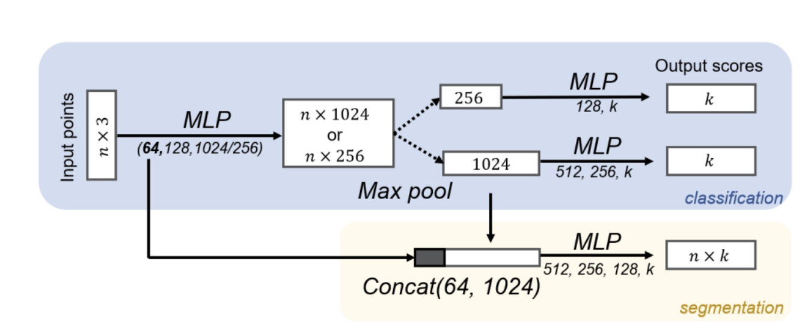

# Assignment 2

In this assignment, you are required to grasp a known object (power drill). We provide some grasping poses in the object frame (that is we know the grasping pose relative to the object pose), and your task is to transform the grasping poses into the robot frame so that the robot can grasp it.

## Environment

You can install the environment as follows:

```sh
conda create -n hw2 python=3.10
conda activate hw2
conda install conda-forge::roboticstoolbox-python==1.0.3

# if you can use Nvidia GPU
conda install pytorch==2.5.1 torchvision==0.20.1 torchaudio==2.5.1 pytorch-cuda=12.4 -c pytorch -c nvidia # you might need to change the cuda version here
# if you can only use CPU
conda install pytorch==2.5.1 torchvision==0.20.1 torchaudio==2.5.1 cpuonly -c pytorch 

pip install tqdm h5py wandb plotly pygments ikpy transforms3d pyyaml opencv-python pillow matplotlib trimesh dm_control
pip install numpy==1.26.4 scipy==1.11.4 sympy==1.13.1
```

We will also provide one remote server for each group.

## Part I: Directly Estimate the Object Pose (30%)

In this part, you need to complete the EstPoseNet in ```src/model/est_pose.py```. You can use PointNet, a widely used backbone for point cloud input, to directly estimate the translation and rotation of the object. This task is similar to "classification" in the image below. (Note that you don't need two branches here)



Specifically, you need to complete  ```__init__``` to initialize the module, ```forward``` to calculate the loss in training time, and ```est``` to get the estimated translation and rotation matrix.

Note that you need to consider what rotation representation and loss function should be used if we want the model to estimate it directly, and finally convert the rotation into rotation matrix in the ```est``` function if you don't use rotation matrix as the representation.

We wrote a basic framework for training in the code. You need to first initialize this as a git repo and make an initial commit.
Then you can run it as ```python train.py --model_type=est_pose --exp_name=my_exp``` and add ```--device=cuda``` if you can use Nvidia GPU. You can change the hyperparameters such as batch size according to your need (you can read train.py for details).

You can test your model with ```python test.py --checkpoint=exps/.../checkpoint_xxx.pth --mode=val```. You can add ```--device=cuda``` if you can use Nvidia GPU.

You will get 30% if the mean translation error is smaller than 0.025 m and the mean rotation error is smaller than 0.25 rad.

## Part II: Estimate the Object Pose by Fitting (40%)

You might find that the performance of the above method is not satisfying. To better estimate the object pose, we can estimate the coordinate of each object point in the object frame, and use fitting to get the object pose. 

The network structure is similar to the segmentation branch in the image above since we need to output coordinates for each object point. You can refer to the "Rotation Fitting" part in Lec. 5 for how to fit the rotation and translation here. 

The training and testing process is the same as Part I, except that you need to change ```--model_type=est_pose``` to ```--model_type=est_coord```.

In this part, you will get 40% if the mean translation error is smaller than 0.01 m and the mean rotation error is smaller than 0.25 rad.

## Part III: Grasp the Object in the Simulation (30%)

The final part is to use the estimated object pose to convert the grasping poses in the object frame into the robot frame. You need to implement ```src.utils.transform_grasp_pose``` here.

You can run ```python eval.py --checkpoint=exps/.../checkpoint_xxx.pth --mode=val``` to run the evaluation (use ```mjpython``` instead of ```python``` if you use Mac). Plotly will show the estimated object pose and point cloud in the camera frame with ```--vis=1``` and Mujoco will show the grasping process with ```--headless=0```. You can add custom visualization (with the help of src/vis.py and vis function in RobotModel and Grasp) for debugging and use ```--vis=0 --headless=1``` after debugging to speed up evaluation.

You will get 15% for each part above if you get a success rate >= 80%.

## Testing & Uploading

For fairness, we will not release the test set, but you can use the validation set to test your model's performance. The training, validation, and test set come from the same distribution. We will still give you most of the score if your implementation is generally correct but the evaluation result is not good enough.

You need to zip the whole project excluding the data and wandb (but with the final checkpoints with their configs of each part) and name the zip file as ```<student_id>_<pinyin_of_your_name>.zip``` and upload it into ```course.pku.edu.cn```.

You can modify the codebase according to your need but don't change the input and output of ```est``` in each module.

If you install some packages that are not in the ```Environment``` part, please add an ```Install.md``` to show how to install them. Note that we can't ensure that additional packages can be used in the real world environment if the installation process is too complex (you might need to figure out how to install them by yourself).

## Bonus

You will get 1% bonus on the final score if you have any model with success rate >= 92.5%

When the point cloud is noisy, you might not be able to fit well if you simply fit using all object points due to the outliers. We can use RANSAC to solve this problem, and you will get 2% bonus on the final score if you implement RANSAC in Part II using only numpy or torch.
