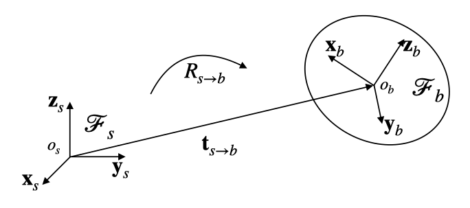

# 02 Robotics-I

## 基础概念

**Link**：按照顺序连接的刚体。

**Joint**：连接连杆的部件，决定了相邻连杆之间的运动自由度（DoF，Degree of Freedom）。

**DoF**：机械臂的自由度（DoF，Degree of Freedom）是指机械臂能够自由运动的维度。

## 刚性变换

### 点的表示与坐标系

-   任意点 $p$ 的位置由一个参考系 $\mathcal{F}_s$ 记录。
-   点的坐标记为普通字母 （如 $p$），向量用粗体字母表示 （如 $\mathbf{v}$）。

记录公式包含参考系的上标，例如：

$$
o_b^s = o_s^s + \mathbf{t}_{s \to b}^s
$$

这个公式表示：在坐标系 $\mathcal{F}_s$ 中，点 $o_b$ 的位置是 $o_s$ 的位置加上平移向量 $\mathbf{t}_{s \to b}^s$。

### 刚体的位姿变换

对于刚体，他们会绑定一个坐标系 $\mathcal{F}_b$，当刚体移动时，此坐标系也会移动。

所以，刚体的 **位姿（位置与姿态，pose）** 变化，就是通过 **坐标系变换** 来对齐两个坐标系。也即将 $\mathcal{F}_s$ 通过旋转和平移变换，使其与 $\mathcal{F}_b$ 重合。

-   转动矩阵（rotation）：$R_{s \to b}$，用于对齐坐标轴 $\{x_i, y_i, z_i\}$，代表 “朝向”
-   平动向量（translation）：$\mathbf{t}_{s \to b}$，用于对齐原点 $o_s$ 和 $o_b$，代表 “位置”

$(R_{s \to b}^s, \mathbf{t}_{s \to b}^s)$ 合在一起，就描述了一个刚体的位姿，其拥有 6 个自由度，转动和平动各自拥有 3 个自由度。

-   原点变换：
    $$
    o_b^s = o_s^s + \mathbf{t}_{s \to b}^s
    $$
-   坐标轴变换：
    $$
    [\mathbf{x}_b^s, \mathbf{y}_b^s, \mathbf{z}_b^s] = R_{s \to b} [\mathbf{x}_s^s, \mathbf{y}_s^s, \mathbf{z}_s^s]
    $$

如果观察者使用 $\mathcal{F}_s$：

$$
o_s^s = 0, \quad [\mathbf{x}_s^s, \mathbf{y}_s^s, \mathbf{z}_s^s] = I_{3 \times 3}
$$

则：

$$
\mathbf{t}_{s \to b}^s = o_b^s, \quad R_{s \to b} = [\mathbf{x}_b^s, \mathbf{y}_b^s, \mathbf{z}_b^s] \in \mathbb{R}^{3 \times 3}
$$

相对的，如果观察者使用 $\mathcal{F}_b$：

假设刚体上的点 $p$ 在 $\mathcal{F}_b$ 中的坐标为 $p^b$（随刚体运动，所以相对于坐标系 $\mathcal{F}_b$ 固定不变），其在 $\mathcal{F}_s$ 中的坐标为 $p^s$，则有：

1. 初始时，$\mathcal{F}_s = \mathcal{F}_b$，$p^s = p^b$。
2. 刚体发生运动，相对于参考系 $\mathcal{F}_s$，此运动可以描述为 $(R_{s \to b}^s, \mathbf{t}_{s \to b}^s)$，则：

$$
p^s = R_{s \to b} p^b + \mathbf{t}_{s \to b}
$$

同理，对于任意点 $x^s$，变换后的点 $x'^s$ 表示为：

$$
x'^s = R_{s \to b} x^s + \mathbf{t}_{s \to b}
$$

值得注意的是，当 $\mathbf{t}_{s \to b}^s \neq 0$ 时， $(R_{s \to b}^s, \mathbf{t}_{s \to b}^s)$ 这个变换并不是线性的。反之，当 $\mathbf{t}_{s \to b}^s = 0$ 时，变换是线性的。

### 齐次坐标

在三维空间中，齐次坐标系将一个点 $x \in \mathbb{R}^3$ 表示为：

$$
\tilde{x} := \begin{bmatrix} x \\ 1 \end{bmatrix} \in \mathbb{R}^4
$$

对应的，齐次变换矩阵具有以下形式：

$$
T^s_{s\rightarrow b} = \begin{bmatrix} R^s_{s\rightarrow b} & t^s_{s\rightarrow b} \\ 0 & 1 \end{bmatrix}
$$

其中 $R^s_{s\rightarrow b}$ 是旋转矩阵，$t^s_{s\rightarrow b}$ 是平移向量。

这么做的原因是，在传统的笛卡尔坐标系中，平移和旋转是两种不同性质的变换：

-   旋转是线性变换：$x' = Rx$
-   平移是仿射变换：$x' = x + t$

这导致无法用单一矩阵乘法表示同时包含旋转和平移的变换。而在齐次坐标系中，两种变换统一为：

$$
\begin{bmatrix} x' \\ 1 \end{bmatrix} = \begin{bmatrix} R & t \\ 0 & 1 \end{bmatrix} \begin{bmatrix} x \\ 1 \end{bmatrix} = \begin{bmatrix} Rx + t \\ 1 \end{bmatrix}
$$

注意，这种变换保持刚体的形状和大小不变，只改变其位置和方向。

通过引入齐次坐标，我们恢复了线性，此时多个变换的组合可以通过矩阵乘法简洁表示，且满足传递性、可逆性：

$$
T_3 = T_2 \cdot T_1 \\
T_{2\to1}^2=\left(T_{1\to2}^1\right)^{-1}
$$

这极大地简化了计算复杂变换序列的过程，现在，坐标变换遵循一般规则：

$$
x^1 = T^1_{1\rightarrow 2}x^2
$$

直观上容易记混淆这个公式。请记住，这个 $x$ 是随着刚体变动的，$x^2$ 是其在变换后坐标系下的坐标，亦是变换前的坐标，经过固定坐标系下的变换矩阵 $T^1_{1\to2}$ ，就得到了变换后的、在原始固定坐标系下的坐标 $x^1$。

同时，我们显然有：

$$
x^{2}=(T_{1\to2}^{1})^{-1}x^{1}=T_{2\to1}^{2}x^{1}
$$

在后文中，我们忽略 $\tilde{}$ ，默认在齐次坐标系下写公式。

## 多连杆刚体几何

### 基本关节类型

1. **Revolute Joint（旋转关节 / 铰链关节）**

    - **描述**：允许绕单一轴线的旋转运动。

    - **自由度**：1 DoF

    - **示例图**：

        

2. **Prismatic Joint（滑动关节 / 平移关节）**

    - **描述**：允许沿单一方向的平移运动。
    - **自由度**：1 DoF
    - **示例图**：

        

3. **Helical Joint（螺旋关节）**

    - **描述**：螺旋运动，即旋转与平移的组合运动。
    - **自由度**：1 DoF
    - **特点**：旋转和平移之间存在固定比率。
    - **示例图**：

        

4. **Spherical Joint（球形关节 / 球窝关节）**

    - **描述**：允许绕球心进行任意方向的旋转。

    - **自由度**：3 DoF

    - **示例图**：

        

总结：

| 关节类型 | 英文名称      | 自由度（DoF） | 运动描述                |
| -------- | ------------- | ------------- | ----------------------- |
| 旋转关节 | Revolute (R)  | 1             | 绕单一轴线旋转          |
| 滑动关节 | Prismatic (P) | 1             | 沿单一方向平移          |
| 螺旋关节 | Helical (H)   | 1             | 螺旋运动（旋转 + 平移） |
| 球形关节 | Spherical (S) | 3             | 任意方向旋转            |

### 基座连杆和末端执行器

#### 基座连杆 (Base link / Root link)

-   **定义**：第 0 号连杆。
-   **特点**：
    -   被视为 “固定” 参考。
    -   空间坐标系 $\mathcal{F}_s$ 附着于此。

#### 末端执行器连杆 (End-effector link)

-   **定义**：最后一个连杆。
-   **特点**：
    -   通常为抓手（gripper）。
    -   末端坐标系 $\mathcal{F}_e$ 附着于此。

如何看坐标系：

-   $\color{red}{x}$ 是红
-   $\color{green}{y}$ 是绿
-   $\color{blue}{z}$ 是蓝

#### 变换矩阵

$$
T_{0\to1}^0=\begin{bmatrix}\cos\theta_1&-\sin\theta_1&0&-l_2\sin\theta_1\\\sin\theta_1&\cos\theta_1&0&l_2\cos\theta_1\\0&0&1&l_1\\0&0&0&1\end{bmatrix}
$$

要点：转动矩阵没影响 $z$ 轴；平动向量在平面上也有变动，因为绕着 $l_2$ 左端点转了一下。

$$
T_{1\to2}^1=\begin{bmatrix}1&0&0&0\\0&1&0&l_3\\0&0&1&\theta_2\\0&0&0&1\end{bmatrix}
$$

要点：转动矩阵为 $I$；平动向量只改了 $y,z$。

$$
T_{2\to3}^2=\begin{bmatrix}1&0&0&0\\0&1&0&0\\0&0&1&-l_4\\0&0&0&1\end{bmatrix}
$$

要点：转动矩阵为 $I$；平动向量只改了 $z$。

$$
T_{0\to3}^{0}=T_{0\to1}^{0}T_{1\to2}^{1}T_{2\to3}^{2}=\begin{bmatrix}\cos\theta_{1}&-\sin\theta_{1}&0&-\sin\theta_{1}(l_{2}+l_{3})\\\sin\theta_{1}&\cos\theta_{1}&0&\cos\theta_{1}(l_{2}+l_{3})\\0&0&1&l_{1}-l_{4}+\theta_{2}\\0&0&0&1\end{bmatrix}=\begin{bmatrix}R_{s\to e}^{s}&\mathbf{t}_{s\to e}^{s}\\0&1\end{bmatrix}
$$

### 旋转矩阵

看了以上三个例子，接下来我们给出更一般的情况。

对于一个单位轴向量（axis）$\mathbf{u} = [x, y, z]^\top$，其对应的叉乘矩阵（cross product matrix）$K$ 定义为：

$$
K = \begin{bmatrix}
0 & -z & y \\
z & 0 & -x \\
-y & x & 0
\end{bmatrix}
$$

其具有性质：当 $K$ 与任意向量 $\mathbf{v}$ 相乘时，运算结果等同于 $\mathbf{u}$ 和 $\mathbf{v}$ 的叉乘：

$$
K\mathbf{v} = \begin{bmatrix}
0 & -z & y \\
z & 0 & -x \\
-y & x & 0
\end{bmatrix}
\begin{bmatrix}
v_1 \\ v_2 \\ v_3
\end{bmatrix} =
\begin{bmatrix}
-z v_2 + y v_3 \\
z v_1 - x v_3 \\
-x v_2 + y v_1
\end{bmatrix} = \mathbf{u} \times \mathbf{v}
$$

那么，绕单位轴 $\mathbf{u}$ 旋转 $\theta$ 的旋转矩阵 $R_\theta$ 可以表示为：

$$
R_\theta = \cos\theta \cdot I + (1-\cos\theta)(\mathbf{u}\mathbf{u}^\top) + \sin\theta \cdot K
$$

这就是 **Rodrigues 旋转公式（矩阵形式）**。

为了证明它，我们先证明向量形式：

**Rodrigues 旋转公式（向量形式）**：在 3D 空间中，任意一个向量 $\mathbf{v}$ 沿着单位向量 $\mathbf{u}$ 旋转 $\theta$ 角度之后的向量 $\mathbf{v}'$ 为：

$$
\mathbf{v}' = \cos(\theta)\mathbf{v} + (1 - \cos(\theta))(\mathbf{u} \cdot \mathbf{v})\mathbf{u} + \sin(\theta)(\mathbf{u} \times \mathbf{v})
$$

其详细证明参见 [Krasjet / Quaternion](https://krasjet.github.io/quaternion/quaternion.pdf) 第 2 节 · 三维空间中的旋转（第 11 页）。

从向量形式稍加变形，我们就能得到矩阵形式：

$$
\begin{aligned}
\mathbf{v}^{\prime}&=\cos(\theta)\mathbf{v}+(1-\cos(\theta))(\mathbf{u}\cdot\mathbf{v})\mathbf{u}+\sin(\theta)(\mathbf{u}\times\mathbf{v}) \\
&=\cos(\theta)\mathbf{v}+(1-\cos(\theta))(\mathbf{u}^\top\mathbf{v})\mathbf{u}+\sin(\theta)(\mathbf{u}\times\mathbf{v}) \\
&=\cos(\theta)\mathbf{v}+(1-\cos(\theta))\mathbf{u}(\mathbf{u}^\top\mathbf{v})+\sin(\theta)(\mathbf{u}\times\mathbf{v}) \\
&=\begin{bmatrix}\cos(\theta)I+(1-\cos(\theta))(\mathbf{u}\mathbf{u}^\top)+\sin(\theta)K\end{bmatrix}\mathbf{v} \\
&=R_\theta\mathbf{v}
\end{aligned}
$$

旋转矩阵 $R_\theta$ 也可以写成：

$$
R_\theta = e^{\theta K}
$$

我们可以证明后者和前者是等价的：
$$
e^{\theta K} = I + \theta K + \frac{(\theta K)^2}{2!} + \frac{(\theta K)^3}{3!} + \cdots
$$

而我们又有：

$$
K^2 = \begin{bmatrix}
-z^2 - y^2 & xy & xz \\
xy & -x^2 - z^2 & yz \\
xz & yz & -x^2 - y^2
\end{bmatrix}
$$

利用 $\mathbf{u}$ 是单位向量的性质（$x^2 + y^2 + z^2 = 1$），可简化为：

$$
K^2 = \mathbf{u}\mathbf{u}^\top - I
$$

所以：

$$
K^3 = K \cdot K^2 = K (\mathbf{u}\mathbf{u}^\top - I) = K \mathbf{u}\mathbf{u}^\top - K = -K
$$

这里利用了叉乘性质 $K\mathbf{u} = \mathbf{u} \times \mathbf{u} = \mathbf{0}$。

所以：

$$
K^3 = -K, \quad K^4 = -K^2, \quad K^5 = K, \quad \dots
$$

带回展开形式，合并同类项：
$$
\begin{aligned}
e^{\theta K} &= I + \left(\theta - \frac{\theta^3}{3!} + \frac{\theta^5}{5!} - \cdots\right)K + \left(\frac{\theta^2}{2!} - \frac{\theta^4}{4!} + \cdots\right)K^2 \\
&= I + \sin\theta K + (1 - \cos\theta)K^2 \\
&= I + \sin\theta K + (1 - \cos\theta)(\mathbf{u}\mathbf{u}^\top - I) \\
&= \cos\theta I + (1 - \cos\theta)\mathbf{u}\mathbf{u}^\top + \sin\theta K \\
&= R_\theta
\end{aligned}
$$

### SE (3) 群与空间变换

**SE (3)** 是 Special Euclidean group in 3 dimensions 的缩写，代表三维特殊欧几里得群。**它描述了三维空间中所有的刚体变换（rigid transformations）**，包括旋转和平移，但不包括缩放、切变等变形。

SE (3) 群可以数学表示为：

$$
\mathbb{SE}(3):=\left\{T=\begin{bmatrix}R&\mathbf{t}\\0&1\end{bmatrix},R\in\mathbb{SO}(3),\mathbf{t}\in\mathbb{R}^3\right\}
$$

其中：

-   $\mathbb{SO}(3)$ 是三维特殊正交群，表示所有的三维旋转
-   $t$ 是三维空间中的平移向量

注意这里：

-   所有三维正交矩阵是 $\mathbb{O}(3)$
-   旋转矩阵是 $\mathbb{SO}(3) \subset \mathbb{O}(3)$，其满足行列式是 1，因为这样可以保证应用后手性不变，如果行列式是 -1，那么实际上是一个旋转加镜像的操作。

延伸：

-   $\mathbb{SO}(2)$ 是二维旋转矩阵，有 1 个自由度
-   $\mathbb{SO}(3)$ 是三维旋转矩阵，有 3 个自由度

**欧拉角（Euler Angles）**：描述三维旋转的一种方法，通过三个连续的旋转来表示任意旋转。

-   绕 X 轴旋转 $\phi$（roll）
-   绕 Y 轴旋转 $\theta$（pitch）
-   绕 Z 轴旋转 $\psi$（yaw）

应用：相较于旋转矩阵 $R$，所需数值表示从 9 个降低到了 3 个。

$$
\begin{gathered}
R_{x}(\alpha):=\begin{bmatrix}1&0&0\\0&\cos\alpha&-\sin\alpha\\0&\sin\alpha&\cos\alpha\end{bmatrix}\\
R_{y}(\beta):=\begin{bmatrix}\cos\beta&0&\sin\beta\\0&1&0\\-\sin\beta&0&\cos\beta\end{bmatrix}\\
R_{z}(\gamma):=\begin{bmatrix}\cos\gamma&-\sin\gamma&0\\\sin\gamma&\cos\gamma&0\\0&0&1\end{bmatrix}
\end{gathered}
$$

任意旋转均可拆为 $R=R_{z}(\alpha)R_{y}(\beta)R_{x}(\gamma)$。这个顺序可以变，但一般默认是这个顺序。

问题：

1.  对于一个旋转矩阵，其欧拉角可能不唯一。

    $$
    \begin{aligned}R_z(45°)R_y(90°)R_x(45°)&=R_z(90°)R_y(90°)R_x(90°)\\&=\begin{bmatrix}0&0&1\\0&1&0\\-1&0&0\end{bmatrix}\end{aligned}
    $$

2.  Gimbal Lock：如果三次旋转中第二次旋转 $\beta$ 的角度为 $\pi/2$，那么剩下 2 个自由度会变成 1 个

    $$
    \begin{aligned}E(\alpha,\frac\pi2,\beta)&=R_z(\beta)R_y(\frac\pi2)R_x(\alpha)\\&=\begin{bmatrix}0&\cos(\beta)\cdot\sin(\alpha)-\cos(\alpha)\cdot\sin(\beta)&\sin(\alpha)\cdot\sin(\beta)+\cos(\alpha)\cdot\cos(\beta)\\0&\sin(\alpha)\cdot\sin(\beta)+\cos(\alpha)\cdot\cos(\beta)&\cos(\alpha)\cdot\sin(\beta)-\cos(\beta)\cdot\sin(\alpha)\\-1&0&0\end{bmatrix}\\&=\begin{bmatrix}0&\sin(\alpha-\beta)&\cos(\alpha-\beta)\\0&\cos(\alpha-\beta)&-\sin(\alpha-\beta)\\-1&0&0\end{bmatrix}\\&=R_y(\frac\pi2)R_x(\alpha-\beta)\end{aligned}
    $$

### 欧拉定理

欧拉定理：任意三维空间中的旋转都可以表示为绕一个固定轴 $\hat{\omega} \in \mathbb{R}^3$（单位向量，满足 $\|\hat{\omega}\| = 1$）旋转一个正角度 $\theta$ 的结果。

其中：

-   $\hat{\omega}$：旋转轴的单位向量。
-   $\theta$：旋转角度（正方向遵循右手定则）。
-   $R\in\mathbb{SO}(3):=\mathrm{Rot}(\hat{\omega},\theta)$：三维旋转矩阵，必然可以表示为绕 $\hat{\omega}$ 旋转角度 $\theta$ 的变换。

由此，我们可以定义两个旋转矩阵之间的 **旋转距离**。

**旋转距离**：从姿态 $R_1$ 转到姿态 $R_2$ 所需的最小旋转角度。

易知，两个旋转的关系是：

$$
(R_2 R_1^\top) R_1 = R_2
$$

那么，旋转距离 $\text{dist}(R_1, R_2)$ 由以下公式给出（注意 $\theta(\cdot)$ 是上述欧拉定理中的函数）：

$$
\text{dist}(R_1, R_2) = \theta(R_2 R_1^\top) = \arccos\left(\frac{1}{2} \big[\text{tr}(R_2 R_1^\top) - 1\big]\right)
$$

### 参数化

**参数化**：用一组简单的数值参数来完整描述一个复杂系统或对象的过程。

假设我们已经为 Robot 的每个连杆（Link）分配了坐标系，那么我们可以使用相邻坐标系之间的 **相对角度** 和 **平移** 来参数化每个关节。

而对于末端执行器（End-Effector），我们又有如下两种方式来表征其位姿：

#### 关节空间表示（Joint space）

-   这是一个向量空间，其中每个坐标是关节位姿的向量
-   具体来说，是关节围绕关节轴的 **角度** 向量
-   例如，一个 6 自由度机器人会有 6 个关节角度值 $(θ_1, θ_2, θ_3, θ_4, θ_5, θ_6)$

#### 笛卡尔空间表示（Cartesian space）

-   这是末端执行器刚体变换的空间
-   用数学符号表示为：$(R_{s→e}, t_{s→e})$
    -   其中 $R_{s→e}$ 表示从基座坐标系到末端执行器坐标系的旋转矩阵
    -   $t_{s→e}$ 表示从基座坐标系到末端执行器坐标系的平移向量
-   $\mathcal{F}_e$ 表示末端执行器的坐标系

#### 对比

-   **关节空间** 直观地反映了机器人各关节的实际物理状态，强调关节。
-   **笛卡尔空间** 则描述了机器人末端在三维空间中的实际位置和方向，更符合人类思考方式，容易进行判断目标是否达成，强调末态。

#### 联系

##### 正向运动学 (Forward Kinematics，FK)

正向运动学将关节空间坐标 $\theta \in \mathbb{R}^n$ 映射到变换矩阵 $T$：

$$
T_{s \rightarrow e} = f(\theta)
$$

也即，给定关节角度，计算末端执行器的位置和姿态。

这一映射可以简单地通过沿着运动链组合各个变换矩阵计算得出。

##### 逆向运动学 (Inverse Kinematics，IK)

逆向运动学解决的问题：给定正向运动学 $T_{s \rightarrow e}(\theta)$ 和目标姿态 $T_{target} = \mathbb{SE}(3)$，求解满足以下条件的关节角度 $\theta$：

$$
T_{s \rightarrow e}(\theta) = T_{target}
$$

过程：给定末端执行器的目标位置和姿态，计算需要的关节角度

逆向运动学比正向运动学更复杂，因为 $T^{-1}$ 可能很难计算，所以 **通常可能有多个解或无解**。

根据前文所述，三维空间中，任何刚体的完整位姿可以用 6 个独立参数完全描述，即 $(R,t)$。

因此，6 自由度是机械臂实现空间中任意位置和姿态所需的最小自由度数量。这也称为 "完全自由度" 配置。

至少 6 个自由度可以保证覆盖此空间，从而 IK 的方程有解（但有时候可能得不到解析解，只能得到数值解）。

> 引理：如果机械臂构型满足 Pieper Criterion，则有解析解（闭式解）。
>
> 实例：UR5 机械臂。

虽然 6 自由度保证了有解，但是这个解可能超出了可行空间（如碰撞解），所以额外增加 1 个冗余自由度形成 7 自由度，可以扩大解空间，更有可能找到可行解（非碰撞解）。

但我们不能一味增加自由度，因为这会带来工程复杂性并延长反应时间，所以目前工业界一般是 6 或者 7 DoF。

一个 IK 求解方式（cuRobo）：

1. 选定一个初始值 $\theta_0$
2. 目标：最小化能量函数（Energy Function）
    $$
    \arg \min_{\theta} ||T_{s \rightarrow e}(\theta) - T_{target}||_2
    $$
3. 迭代直到收敛
4. 可以使用 GPU 并行迭代多个随机选定的初始值，加快速度，并尝试找到最优解

#### 应用

假设我们已知机械臂现在状态，我们想要略微移动一点到达新的状态，我们该选择何种表征进行预测？

1. 使用笛卡尔空间，优点是 $(\Delta R, \Delta t)$ 直观，容易预测，缺点是执行操作所需的 $\Delta \theta$ 难以计算（需要 IK），RT-2 选用的是这种。
2. 使用关节空间，优点是预测得到 $\Delta \theta$ 后很容易操作，并计算移动后的 $(R, t)$ 以及 $(\Delta R, \Delta t)$ 易于计算（FK），缺点是 $\Delta \theta$ 难以求解，$\pi0$ 选用的是这种。

## 四元数（Quaternion）

扩展内容。

参考：

1. [Krasjet / Quaternion](https://krasjet.github.io/quaternion/quaternion.pdf)
2. [Wiki / Quaternion](https://www.wikiwand.com/en/articles/Quaternion)
