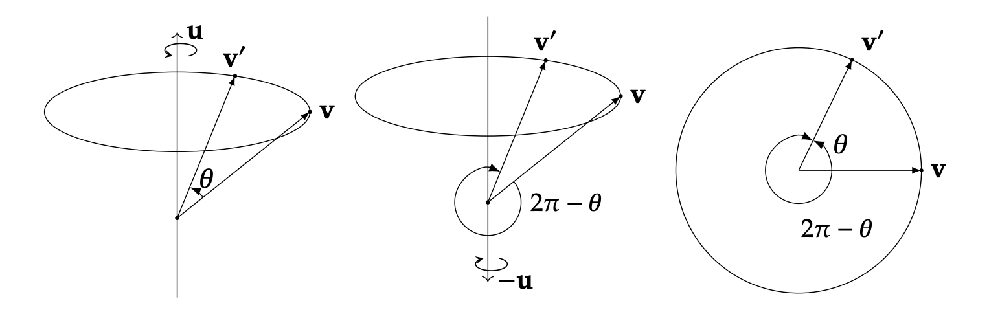
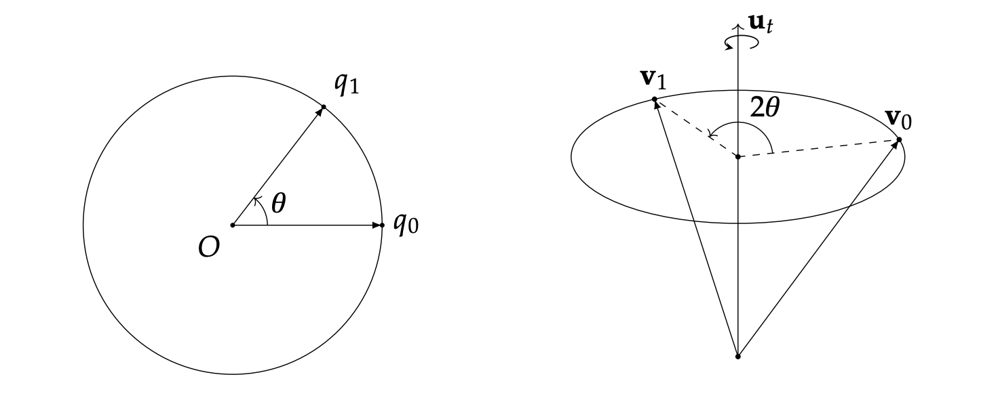
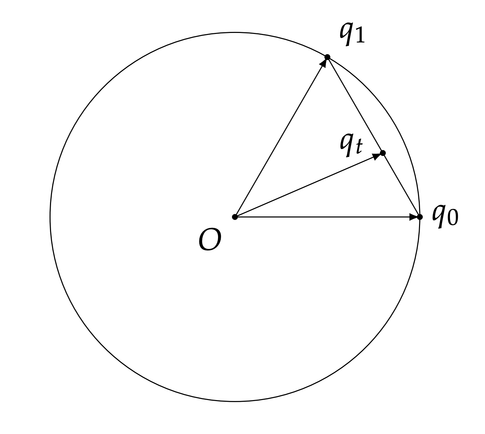
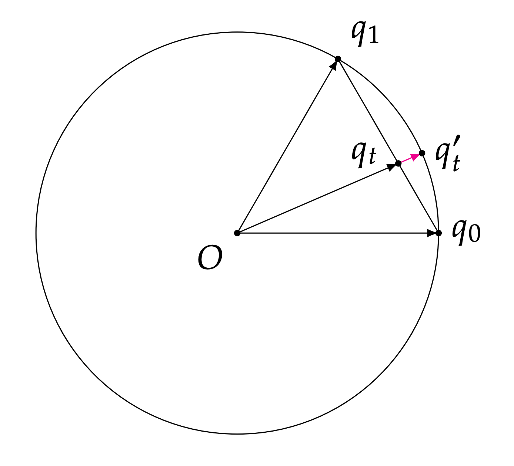
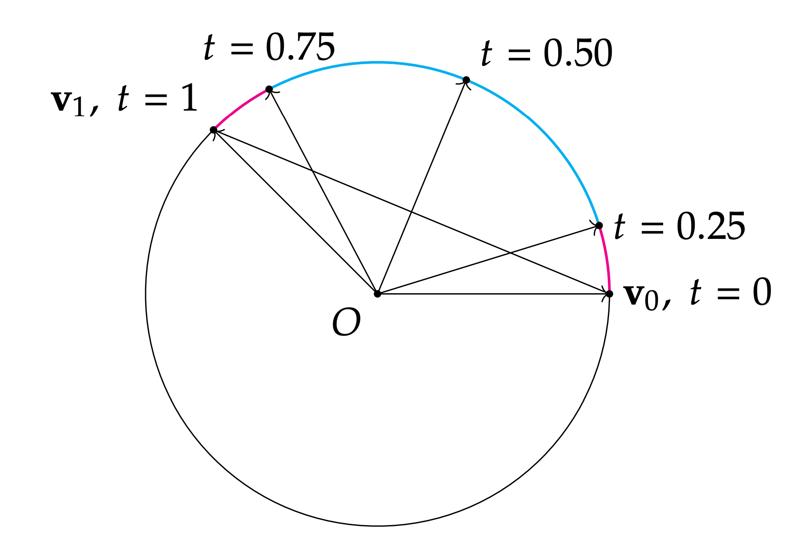
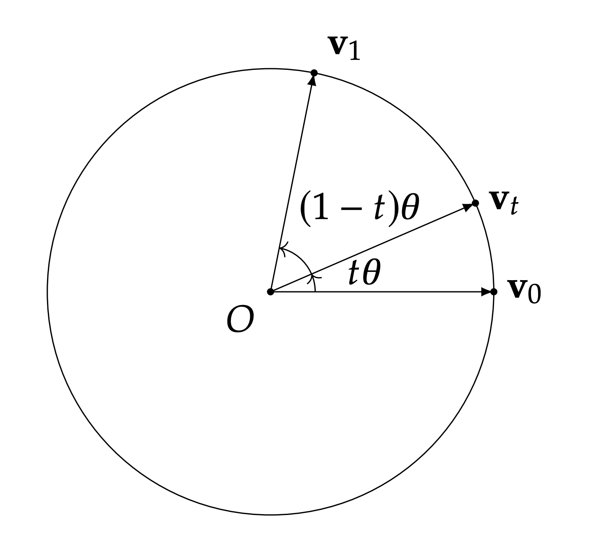
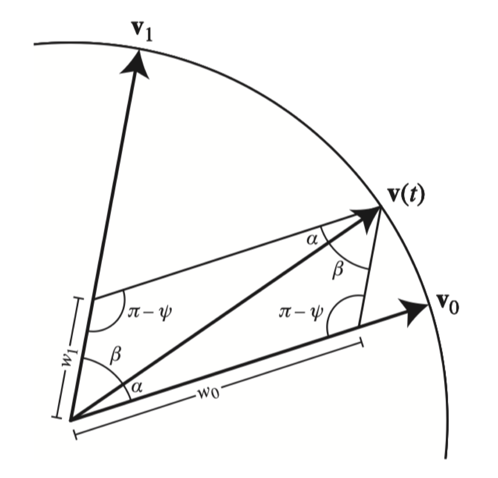
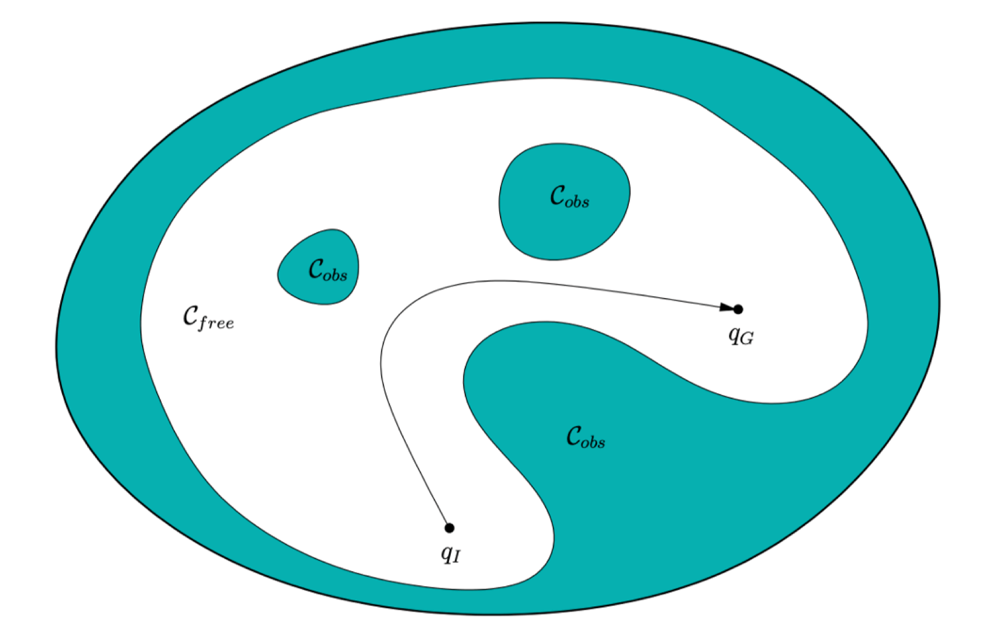

# 03 Robotics-II

## 四元数

> [!TIP]
>
> **强烈推荐参考 [Krasjet / Quaternion](https://krasjet.github.io/quaternion/quaternion.pdf) 以获得直观且详细的性质证明推导。**
>
> 小小的吐槽：王老师上节课明明刚说四元数不重要不要求掌握，结果这节课花了绝大部分时间来推导 hhh。

### 定义

四元数是复数的推广，表示为：

$$
q = w + xi + yj + zk
$$

其中：

-   $w$ 是实数部分；
-   $x, y, z$ 是虚数部分；

$i, j, k$ 是虚数单位，满足以下关系：

$$
i^2 = j^2 = k^2 = ijk = -1
$$

反交换性质：

$$
ij = k = -ji, \quad jk = i = -kj, \quad ki = j = -ik
$$

**向量形式**：

$$
q = (w, \bold{v}), \quad \bold{v} = (x, y, z)
$$

### 运算性质

**乘法**：对于两个四元数 $q_1 = (w_1, \bold{v}_1)$ 和 $q_2 = (w_2, \bold{v}_2)$，其乘法定义为：

$$
\begin{aligned}
q_1 q_2 &= (w_1 w_2 - \bold{v}_1^{\top} \bold{v}_2, \, w_1 \bold{v}_2 + w_2 \bold{v}_1 + \bold{v}_1 \times \bold{v}_2) \\
&= (w_1 w_2 - \bold{v}_1 \cdot \bold{v}_2, \, w_1 \bold{v}_2 + w_2 \bold{v}_1 + \bold{v}_1 \times \bold{v}_2)
\end{aligned}
$$

这被称为 Graßmann 积。

注意：四元数的乘法 **不可交换**，即 $q_1 q_2 \neq q_2 q_1$。

**共轭**：

$$
q^* = (w, -\bold{v})
$$

**模长**：

$$
\|q\|^2 = w^2 + \bold{v}^{\top} \bold{v} = qq^* = q^*q
$$

**逆**：

$$
q^{-1} = \frac{q^*}{\|q\|^2}
$$

这是模长的直接推论。

### 几何意义与应用

**单位四元数**：若四元数的模长为 $1$，即 $\|q\| = 1$，则称其为单位四元数。单位四元数可表示三维空间中的旋转。其还具有性质 $q^{-1} = q^*$。

**纯四元数**：若四元数的实部为 $0$，即 $q = (0, \bold{v})$，则称其为纯四元数。纯四元数可以表示三维空间中的向量。

**旋转表示**：任何一个旋转，都可以表示为绕某个单位向量 $\hat{\omega}$ 旋转 $\theta$ 角度（证明见后）。

那么，对应的四元数可以表示为：

$$
q = \left[\cos\frac{\theta}{2}, \sin\frac{\theta}{2} \hat{\omega}\right]
$$

注意，旋转到四元数存在 “双重覆盖” 关系，我们可以很容易地发现：

$$
\begin{aligned}
q &= \left[\cos\frac{\theta}{2}, \sin\frac{\theta}{2} \hat{\omega}\right] \\
-q &= \left[-\cos\frac{\theta}{2}, -\sin\frac{\theta}{2}\hat{\omega}\right] \\
&= \left[\cos(\pi - \frac{\theta}{2}), \sin(\pi - \frac{\theta}{2}) (-\hat{\omega})\right]
\end{aligned}
$$

是等价的（$-q$ 意味着同一旋转轴但是翻转正方向，然后旋转 $2\pi - \theta$）。

相应地，从四元数恢复轴角表示：

$$
\theta = 2 \arccos(w), \quad \hat{\omega} =
\begin{cases}
\frac{\bold{v}}{\sin(\theta/2)}, & \theta \neq 0 \\
0, & \theta = 0
\end{cases}
$$

其中，$w$ 是单位四元数的实部，四元数的一种常见表示就是 $(w,x,y,z)$。

### 四元数与旋转

**向量旋转**：任意向量 $\mathbf{v}$ 沿着以 **单位向量** 定义的旋转轴 $\mathbf{u}$ 旋转 $\theta$ 度得到 $\mathbf{v}'$，那么：

令向量 $\mathbf{v}$ 的四元数形式 $v = [0, \mathbf{v}]$，旋转四元数 $q = \left[\cos\left(\frac{\theta}{2}\right), \sin\left(\frac{\theta}{2}\right)\mathbf{u}\right]$

则旋转后的向量 $\mathbf{v}'$ 可表示为：

$$
\mathbf{v}' = qv q^* = qv q^{-1}
$$

如果是给定四元数 $q$ 旋转向量 $\mathbf{v}$ ，那么设 $q = [w, \mathbf{r}]$ 是单位四元数（即 $w^2 + \|\mathbf{r}\|^2 = 1$），向量 $\mathbf{v}$ 的四元数形式为 $v = [0, \mathbf{v}]$。

则：

$$
\begin{aligned}
qvq^* &= [w, \mathbf{r}][0, \mathbf{v}][w, -\mathbf{r}] \\
&= [ - \mathbf{r} \cdot \mathbf{v}, w\mathbf{v} + \mathbf{r} \times \mathbf{v} ][w, -\mathbf{r}] \\
&= [0, (1-2\|\mathbf{r}\|^2)\mathbf{v} + 2(\mathbf{r} \cdot \mathbf{v})\mathbf{r} + 2w(\mathbf{r} \times \mathbf{v})]
\end{aligned}
$$

最后一个等式的展开计算如下

实部：

$$
\begin{aligned}
&= (- \mathbf{r} \cdot \mathbf{v})w - (w\mathbf{v} + \mathbf{r} \times \mathbf{v}) \cdot (-\mathbf{r}) \\
&= -w (\mathbf{r} \cdot \mathbf{v}) + w (\mathbf{v} \cdot \mathbf{r}) + (\mathbf{r} \times \mathbf{v}) \cdot \mathbf{r} \\
&= 0 \quad
\end{aligned}
$$

虚部：

$$
\begin{aligned}
&= (- \mathbf{r} \cdot \mathbf{v})(-\mathbf{r}) + w (w\mathbf{v} + \mathbf{r} \times \mathbf{v}) + (w\mathbf{v} + \mathbf{r} \times \mathbf{v}) \times (-\mathbf{r}) \\
&= (\mathbf{r} \cdot \mathbf{v})\mathbf{r} + w^2 \mathbf{v} + w (\mathbf{r} \times \mathbf{v}) - w (\mathbf{v} \times \mathbf{r}) - (\mathbf{r} \times \mathbf{v}) \times \mathbf{r} \\
&= (\mathbf{r} \cdot \mathbf{v})\mathbf{r} + w^2 \mathbf{v} + 2w (\mathbf{r} \times \mathbf{v}) - \big[ (\mathbf{r} \cdot \mathbf{r})\mathbf{v} - (\mathbf{v} \cdot \mathbf{r})\mathbf{r} \big] \\
&= (1 - 2\|\mathbf{r}\|^2)\mathbf{v} + 2(\mathbf{r} \cdot \mathbf{v})\mathbf{r} + 2w (\mathbf{r} \times \mathbf{v})
\end{aligned}
$$

其中利用了叉乘展开式：

$$
a \times b \times c = (a \cdot c)b - (a \cdot b)c
$$

以及单位四元数约束条件 $w^2 + \|\mathbf{r}\|^2 = 1$，将 $w^2 = 1 - \|\mathbf{r}\|^2$ 代入后合并同类项。

接下来证明这个结果与罗德里格旋转公式等价即可。

$$
qvq^* = [0, (1-2\|\mathbf{r}\|^2)\mathbf{v} + 2(\mathbf{r} \cdot \mathbf{v})\mathbf{r} + 2w(\mathbf{r} \times \mathbf{v})]
$$

我们有：

-   $w = \cos(\frac{\theta}{2})$
-   $\mathbf{r} = \sin(\frac{\theta}{2})\mathbf{u}$，且 $\mathbf{u}$ 是单位向量，$\|\mathbf{u}\| = 1$。

所以：

$$
\begin{aligned}
1 - 2\|\mathbf{r}\|^2 &= 1 - 2\sin^2\left(\frac{\theta}{2}\right) = \cos(\theta) \\
\\
2(\mathbf{r} \cdot \mathbf{v})\mathbf{r} &= 2 \left(\sin\left(\frac{\theta}{2}\right)(\mathbf{u} \cdot \mathbf{v})\right) \left(\sin\left(\frac{\theta}{2}\right)\mathbf{u}\right) \\
&= 2 \sin^2\left(\frac{\theta}{2}\right) (\mathbf{u} \cdot \mathbf{v}) \mathbf{u} \\
&= (1 - \cos(\theta)) (\mathbf{u} \cdot \mathbf{v}) \mathbf{u} \\
\\
2w(\mathbf{r} \times \mathbf{v}) &= 2 \cos\left(\frac{\theta}{2}\right) \left(\sin\left(\frac{\theta}{2}\right)(\mathbf{u} \times \mathbf{v})\right) \\
&= \left(2 \sin\left(\frac{\theta}{2}\right) \cos\left(\frac{\theta}{2}\right)\right) (\mathbf{u} \times \mathbf{v}) \\
&= \sin(\theta) (\mathbf{u} \times \mathbf{v})
\end{aligned}
$$

将以上结果代回到 $\mathbf{v}'$ 的表达式中：

$$
\begin{aligned}
\mathbf{v}' &= (1-2\|\mathbf{r}\|^2)\mathbf{v} + 2(\mathbf{r} \cdot \mathbf{v})\mathbf{r} + 2w(\mathbf{r} \times \mathbf{v}) \\
&= (\cos(\theta))\mathbf{v} + (1 - \cos(\theta)) (\mathbf{u} \cdot \mathbf{v}) \mathbf{u} + (\sin(\theta)) (\mathbf{u} \times \mathbf{v})
\end{aligned}
$$

正是罗德里格旋转公式的结果。

**旋转组合**：两个旋转 $q_1$ 和 $q_2$ 的组合等价于四元数的乘法：

$$
 q_2 (q_1 x q_1^*) q_2^* = (q_2 q_1) x (q_1^* q_2^*)
$$

虽然四元数不满足交换律，但其满足结合律（可以证明四元数存在对应的四维矩阵，所以矩阵的性质也是四元数的性质）。

注意：

-   四元数的旋转表示具有 $3$ 个自由度（四个参数加一个单位模长约束）。
-   几何上，单位四元数可以看作 $4$ 维球面 $S^3$ 的壳。

### 四元数与旋转矩阵

#### 从四元数到旋转矩阵

因为我们有 $\mathbf{v}' = q \mathbf{v} q^{-1}$ （这里假设 $\mathbf{v}$ 是向量， $q$ 是单位四元数， $\mathbf{v}'$ 是旋转后的向量，并且我们将向量 $\mathbf{v}$ 视为纯四元数 $[0, \mathbf{v}]$ 进行运算），我们可以计算出对应的旋转矩阵为：

令单位四元数 $q = w + x\mathbf{i} + y\mathbf{j} + z\mathbf{k} = [w, (x, y, z)]$，则旋转矩阵 $R(q)$ 为：

$$
R(q) = \begin{bmatrix} 1 - 2y^2 - 2z^2 & 2xy - 2zw & 2xz + 2yw \\ 2xy + 2zw & 1 - 2x^2 - 2z^2 & 2yz - 2xw \\ 2xz - 2yw & 2yz + 2xw & 1 - 2x^2 - 2y^2 \end{bmatrix}
$$

> 证明：使用三个基向量挨个求就行。
>
> 令 $\mathbf{r} = (x, y, z)$。
>
> 令 $\mathbf{v} = \mathbf{e}_1 = (1, 0, 0)$。
>
> -   $\|\mathbf{r}\|^2 = x^2 + y^2 + z^2$
> -   $\mathbf{r} \cdot \mathbf{e}_1 = x$
> -   $\mathbf{r} \times \mathbf{e}_1 = (x, y, z) \times (1, 0, 0) = (0, z, -y)$
>
> $$
> \begin{aligned}
> \mathbf{v}'_1 &= (1-2(x^2+y^2+z^2))\mathbf{e}_1 + 2x\mathbf{r} + 2w(\mathbf{r} \times \mathbf{e}_1) \\
> &= (1-2x^2-2y^2-2z^2)(1, 0, 0) + 2x(x, y, z) + 2w(0, z, -y) \\
> &= (1-2x^2-2y^2-2z^2 + 2x^2, 2xy + 2wz, 2xz - 2wy) \\
> &= (1 - 2y^2 - 2z^2, 2xy + 2zw, 2xz - 2yw)
> \end{aligned}
> $$
>
> 这就是矩阵 $R$ 的第一列。
>
> 令 $\mathbf{v} = \mathbf{e}_2 = (0, 1, 0)$。
>
> -   $\mathbf{r} \cdot \mathbf{e}_2 = y$
> -   $\mathbf{r} \times \mathbf{e}_2 = (x, y, z) \times (0, 1, 0) = (-z, 0, x)$
>
> $$
> \begin{aligned}
> \mathbf{v}'_2 &= (1-2(x^2+y^2+z^2))\mathbf{e}_2 + 2y\mathbf{r} + 2w(\mathbf{r} \times \mathbf{e}_2) \\
> &= (1-2x^2-2y^2-2z^2)(0, 1, 0) + 2y(x, y, z) + 2w(-z, 0, x) \\
> &= (2xy - 2wz, 1-2x^2-2y^2-2z^2 + 2y^2, 2yz + 2wx) \\
> &= (2xy - 2zw, 1 - 2x^2 - 2z^2, 2yz + 2xw)
> \end{aligned}
> $$
>
> 这就是矩阵 $R$ 的第二列。
>
> 令 $\mathbf{v} = \mathbf{e}_3 = (0, 0, 1)$。
>
> -   $\mathbf{r} \cdot \mathbf{e}_3 = z$
> -   $\mathbf{r} \times \mathbf{e}_3 = (x, y, z) \times (0, 0, 1) = (y, -x, 0)$
>
> $$
> \begin{aligned}
> \mathbf{v}'_3 &= (1-2(x^2+y^2+z^2))\mathbf{e}_3 + 2z\mathbf{r} + 2w(\mathbf{r} \times \mathbf{e}_3) \\
> &= (1-2x^2-2y^2-2z^2)(0, 0, 1) + 2z(x, y, z) + 2w(y, -x, 0) \\
> &= (2xz + 2wy, 2yz - 2wx, 1-2x^2-2y^2-2z^2 + 2z^2) \\
> &= (2xz + 2yw, 2yz - 2xw, 1 - 2x^2 - 2y^2)
> \end{aligned}
> $$
>
> 这就是矩阵 $R$ 的第三列。
>
> 将 $\mathbf{v}'_1, \mathbf{v}'_2, \mathbf{v}'_3$ 作为列向量组合起来，就得到了图片中给出的旋转矩阵 $R(q)$：
>
> $$
> R(q) = \begin{bmatrix} 1 - 2y^2 - 2z^2 & 2xy - 2zw & 2xz + 2yw \\ 2xy + 2zw & 1 - 2x^2 - 2z^2 & 2yz - 2xw \\ 2xz - 2yw & 2yz + 2xw & 1 - 2x^2 - 2y^2 \end{bmatrix}
> $$
>
> 证毕。

#### 从旋转矩阵到四元数

根据上一步结果，旋转矩阵 $R$ 的迹（trace）满足：

$$
\text{tr}(R) = 3 - 4(x^2 + y^2 + z^2) = 4w^2 - 1
$$

我们可以计算四元数的分量为：

$$
\begin{aligned}
w &= \frac{\sqrt{\text{tr}(R)+1}}{2} \\
x &= \frac{R_{32}-R_{23}}{4w} \\
y &= \frac{R_{13}-R_{31}}{4w} \\
z &= \frac{R_{21}-R_{12}}{4w}
\end{aligned}
$$

其中 $R_{ij}$ 表示矩阵 $R$ 的第 $i$ 行第 $j$ 列的元素。这些公式在 $w \neq 0$ 时有效。

### 四元数的距离

这部分证明亦可参见 [Krasjet / Quaternion](https://krasjet.github.io/quaternion/quaternion.pdf) 第 4 节・四元数插值（第 37 页）。

在单位三维球面 $S^3$ 上，或两个四元数 $(q_1, q_2)$ 之间的角度：

$$
\langle p, q \rangle = \arccos(p \cdot q)
$$

证明：设 $p = (p_w, \mathbf{p}_v)$ 和 $q = (q_w, \mathbf{q}_v)$，那么显然，从 $p$ 旋转到 $q$ 的相对旋转可以由四元数乘法 $\Delta q = q p^*$ 表示。

$$
\begin{aligned}
\Delta q &= q p^* \\
&= (q_w, \mathbf{q}_v)(p_w, -\mathbf{p}_v) \\
&= (q_w p_w - \mathbf{q}_v \cdot (-\mathbf{p}_v), q_w(-\mathbf{p}_v) + p_w \mathbf{q}_v + \mathbf{q}_v \times (-\mathbf{p}_v)) \\
&= (q_w p_w + \mathbf{q}_v \cdot \mathbf{p}_v, \dots)
\end{aligned}
$$

所以，$\Delta q$ 的实部 $\text{Re}(\Delta q) = q_w p_w + \mathbf{q}_v \cdot \mathbf{p}_v$。

这正好是 $p$ 和 $q$ 作为 4D 向量的点积 $p \cdot q$。

$$
\text{Re}(\Delta q) = p \cdot q = \cos \langle p, q \rangle\\
\langle p, q \rangle = \arccos(p \cdot q)
$$

对应旋转之间的距离：

$$
\text{dist}(p, q) = 2 \arccos(|p \cdot q|)
$$

或等价地：

$$
\text{dist}(p, q) = 2 \min \{\langle p, q \rangle, \langle p, -q \rangle\}
$$

这里需要在两个值之间取最小值的原因也可以参见 [Krasjet / Quaternion](https://krasjet.github.io/quaternion/quaternion.pdf) 第 5.4 节・双倍覆盖带来的问题（第 46 页）。

回顾之前四元数与旋转的关系，不难得知两个旋转 $(R_1, R_2)$ 的距离与其对应四元数 $q(R_1)$ 和 $q(R_2)$ 在球面上的距离成线性关系（前者是后者的两倍）。

### 四元数插值

这部分证明可以参见 [Krasjet / Quaternion](https://krasjet.github.io/quaternion/quaternion.pdf) 第 5 节・四元数插值（第 41 页）。

#### 线性插值（Linear Interpolation, Lerp）

$$
q(t) = (1-t)q_1 + tq_2
$$

#### 归一化线性插值（Normalized Linear Interpolation, Nlerp）

$$
q(t) = \frac{(1-t)q_1 + tq_2}{\|(1-t)q_1 + tq_2\|}
$$

省流：就是除个模长，让他恢复为单位四元数。

#### 球面线性插值（Spherical Linear Interpolation, Slerp）

以上两种插值都有问题，他们实际上是线性切分了弦长，而不是弧长，这会导致在转动的时候的角速度不均匀：

所以，我们要引入新的插值方式，这就是球面线性插值（Spherical Linear Interpolation, Slerp）：

$$
q(t) = \frac{\sin((1-t)\theta)}{\sin(\theta)} q_1 + \frac{\sin(t\theta)}{\sin(\theta)} q_2
$$

其中 $\theta$ 是 $q_1$ 和 $q_2$ 之间的夹角，$\theta = \arccos(q_1 \cdot q_2)$。

证明的一个方法在 [Krasjet / Quaternion](https://krasjet.github.io/quaternion/quaternion.pdf) 第 5.3 节・球面线性插值（第 43 页）。

不过老师的 Slide 上有另一种更简单直观的利用三角函数性质的证明方法：

$$
\begin{aligned}
\alpha+\beta&=\psi\\
\mathbf{v}(t)&=w_0\mathbf{v}_0+w_1\mathbf{v}_1\\
\frac{\sin\alpha}{w_1}&=\frac{\sin\beta}{w_0}=\frac{\sin(\pi-\psi)}1=\sin\psi\\
w_{0}&=\frac{\sin\beta}{\sin\psi}\\
w_{1}&=\frac{\sin\alpha}{\sin\psi}\\
\psi&=\cos^{-1}(\mathbf{v}_0\cdot\mathbf{v}_1)
\end{aligned}
$$

第三个式子利用了三角形的性质：

$$
\frac{A}{\sin\alpha}=\frac{B}{\sin\beta}=\frac{C}{\sin\gamma}
$$

### 球面均匀采样

考虑我们如何随机采样一个旋转。

**引理**：在 $\mathbb{SO}(3)$ 中均匀采样旋转矩阵等价于从单位四元数的集合 $\mathbb{S}(3)$ 中均匀采样。

原因：两个旋转之间的距离与对应的四元数在单位球面上的距离成线性关系。

那么，如何均匀采样 $\mathbb{S}(3)$ 呢？

**方法**：从四维标准正态分布 $\mathcal{N}(0, I_{4 \times 4})$ 中随机采样一个变量，并将其归一化，从而得到（直接解释为）单位四元数。

原因：由于标准正态分布是各向同性的（即在所有方向上均匀分布），所以采样得到的单位四元数在 $\mathbb{S}(3)$ 中也是均匀分布的。

随后，采样得到的单位四元数也就可以转换为对应的旋转矩阵（如果需要）。

### 有趣的事实

对于神经网络来讲，最好的旋转表示方法是 9 个数的旋转矩阵。因为其他的表示方法均可能出现对于输入的微小扰动，即一个小的旋转，出现一个跳变，而只有最初最冗余的 $\mathbb{R}^{3\times3}$ 旋转矩阵保证其必然是连续的（ **即连续性** ），而这对于神经网络是很好的性质。

### 各旋转表示方式对比

| Representation  | Inverse?    | Composing?  | Any local movement in SO(3) can be achieved by local movement in the domain? |
| --------------- | ----------- | ----------- | ---------------------------------------------------------------------------- |
| Rotation Matrix | ✔️          | ✔️          | N/A                                                                          |
| Euler Angle     | Complicated | Complicated | No                                                                           |
| Angle-axis      | ✔️          | Complicated | ?                                                                            |
| Quaternion      | ✔️          | ✔️          | ✔️                                                                           |

-   旋转矩阵：可逆、可组合（矩阵连乘）、但在 $\mathbb{SO}(3)$ 上移动不直接（9 D - 6 约束 = 3DoF）
-   欧拉角：逆向复杂、组合复杂、因为 Gimbal lock 的存在，与 $\mathbb{SO}(3)$ 不能平滑映射
-   轴角：可逆、组合复杂、大部分情况下可以与 $\mathbb{SO}(3)$ 平滑映射，但是在边界情况（如旋转 $0$ 度时）不行
-   四元数：完美

## 运动规划

### 形式化表述

#### 配置空间 (Configuration Space)

**定义**：配置空间（Configuration spcae，C-space）是 $ \mathbb{R}^n $ 的一个子集，包含系统的所有可能状态（即状态空间）。

-   $C$：配置空间，表示所有可能状态的集合。
-   $C_{\text{free}} \subseteq C$：**自由空间**，包含所有有效状态（无碰撞）。
-   $C_{\text{obs}} \subseteq C$：**障碍空间**，表示有障碍的无效状态。
-   $C_{\text{free}} \cup C_{\text{obs}} = C$
-   $C_{\text{free}} \cap C_{\text{obs}} = \varnothing$

#### 问题定义

给定：

-   自由空间 $C_{\text{free}}$。
-   起始状态 $q_{\text{start}} \in C_{\text{free}}$。
-   目标状态 $q_{\text{goal}} \in C_{\text{free}}$。

**目标**：计算一系列动作，使机器人从 $q_{\text{start}}$ 移动到 $q_{\text{goal}}$。

注意，这里的符号 $q$ 不是四元数（quaternion）的意思，其是配置空间中的一个点，即状态。

例如，对于一个机械臂，其配置空间可能是 $\mathbb{R}^n$，那么 $q$ 就是关节的角度组合之一 $(\theta_1, \theta_2, \dots, \theta_n)$。

#### 挑战

1. **避免障碍物**：确保路径始终在 $C_{\text{free}}$ 内。
2. **长规划时间**：路径可能较长，需要优化。
3. **高维空间**：配置空间维度可能很高（例如多关节机器人）。
