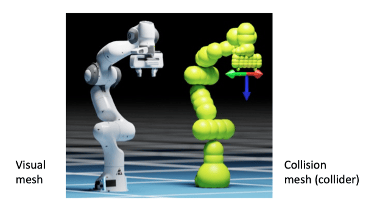

# 04 Robotics-III

## 运动规划

### 配置空间（Configuration Space）

定义：机器人的所有可能关节状态构成的抽象空间，记为 $\mathcal{C}-\text{space}$。

-   Q 表示法：$Q = (q_1, q_2, \ldots, q_n)$，其中 $q_i$ 为第 $i$ 个关节的位置参数（如角度或位移）。
-   自由空间（Free Space）$\mathcal{C}_{\text{free}}$：不与障碍物碰撞的合法配置集合。
-   障碍空间（Obstacle Space）$\mathcal{C}_{\text{obs}}$：与障碍物发生碰撞的非法配置集合。

路径规划问题：在 $\mathcal{C}_{\text{free}}$ 中寻找从起点 $Q_{\text{start}}$ 到目标 $Q_{\text{goal}}$ 的连续路径。

### 碰撞检测（Collision Detection）

#### 基本挑战

问题定义：给定一个 $q_{\text{pose}}$，判断机械臂是否与环境发生碰撞（collision）。也即判断其是在 $\mathcal{C}_{\text{free}}$ 中还是在 $\mathcal{C}_{\text{obs}}$ 中。

几何复杂度：机械臂与环境的高精度三维模型（如三角网格 / 面片，mesh）直接检测碰撞计算量很大。

> 计算瓶颈：检测两个含 $10^5$ 三角面片的模型是否碰撞需 $O(10^{10})$ 次面片相交判断。

#### 球体包裹法（Bounding Spheres）

思想：用球体序列近似机械臂连杆（如下图）。

碰撞检测公式：两球体中心 $\mathbf{p}_i, \mathbf{p}_j$ 满足 $\|\mathbf{p}_i - \mathbf{p}_j\| \leq (r_i + r_j)$ 时碰撞。

优缺点：

-   优点：计算高效（$O(n^2)$ 复杂度，$n$ 为球体数）。
-   缺点：**保守性导致可行解丢失**，限制了模型对于更精细物体的操作能力
    -   你不能通过球体近似抓起来一个很小的面片
    -   球体近似还可能导致虚假自碰撞（self-collision，即不同连杆之间的碰撞）

#### 凸包分解（Convex Decomposition）

思想：将凹几何体分解为多个凸包（Convex Hull），利用凸包相交检测算法加速。

原因：检测多个凸起来的物体之间是否发生碰撞是很很高效的（类似之前的球体近似），但是检测凸起来的物体和凹进去的物体之间是否发生碰撞是比较困难的。

分类：

-   凸包（Convex-Hull）：生成单一的凸网格，效率最高但精度较低。
-   精确凸分解（Exact Convex Decomposition）：属于 **NP-hard** 问题，不实用，因为会产生大量的聚类。
-   近似凸分解（Approximate Convex Decomposition, ACD）：确定网格三角形的划分，使用最少的聚类数量，同时确保每个聚类的凹度低于用户定义的阈值。

优缺点：

-   优势：比球体更精确，减少保守性误差。
-   缺点：凹形物体的高效凸分解仍是几何处理中的待研究问题。

insight：问题做不出来不一定是自己的问题，也有可能是更底层的 simulation 有问题。

## 运动规划算法

问题定义：既然已经有了检测 $q_{\text{pose}}$ 是否与环境发生碰撞的算法，那么接下来的任务就是在 $\mathcal{C}_{\text{free}}$ 中找到一条从 $Q_{\text{start}}$ 到 $Q_{\text{goal}}$ 的路径（路径上所有点都在 $\mathcal{C}_{\text{free}}$ 中）。

### 局限性

运动规划具有局限性，因为有些情况我们是可以容忍的，但会被之排除。

比如，我们的操作是具有弹性的，如用手去抓东西，尽管手会变形，但不影响可行性，然而基于碰撞检测的方法会将解排除。

即便如此，运动规划算法仍然具有其价值，因为对于很多基础问题，基于模拟的采样效率优于去真实环境中采集数据（RL），这能提供大量可行的轨迹数据，从而为 RL 提供数据来源。

### 概率路图法（Probabilistic Roadmap, PRM）

步骤：

1. 采样：在 $\mathcal{C}_{\text{free}}$ 中随机生成 $N$ 个配置点 $\{Q_1, Q_2, \ldots, Q_N\}$。通常会在 $\mathcal{C}-\text{space} \subset \mathbb{R}^n$ 中对各个维度进行均匀离散化，然后随机采样。

    注意，这里暗含了对 $\mathcal{C}-\text{space}$ 的均匀采样必然也是对 $\mathcal{C}_{\text{free}}$ 的均匀采样（因为概率密度函数 PDF 恒为常数）。

2. 建图：连接邻近点形成图结构，剔除与 $\mathcal{C}_{\text{obs}}$ 碰撞的边。

3. 查询：在图搜索（如 A\* 算法）中寻找 $Q_{\text{start}}$ 到 $Q_{\text{goal}}$ 的路径。

特点：预计算路图可复用，适合多查询场景。

伪代码（注意符号 $N,n$ 的定义与上文有所出入）：

$$
\begin{array}{l}
\textbf{function} \ \text{概率路线图}(n, k, q_{start}, q_{goal}) \ \textbf{returns} \ \text{一条从起点到目标的路径} \\
\quad \text{// 输入：} n: \text{路线图中采样节点的数量}, k: \text{为每个配置检查的最近邻居数量}, q_{start}, q_{goal} \\
\quad V \leftarrow \{q_{start}, q_{goal}\} \\
\quad E \leftarrow \varnothing \\
\quad \textbf{while} \ |V| < n \ \textbf{do} \\
\quad \quad \textbf{repeat} \\
\quad \quad \quad q \leftarrow \text{在}\ C \ \text{中的一个随机配置} \\
\quad \quad \textbf{until} \ q \ \text{在} \ C_{free} \ \text{中} \\
\quad \quad V \leftarrow V \cup \{q\} \\
\quad \textbf{end} \\
\quad \textbf{for each} \ q \in V \ \textbf{do} \\
\quad \quad N_q \leftarrow \text{根据距离函数从} \ V \ \text{中选择的} \ q \ \text{的} \ k \ \text{个最近邻居} \\
\quad \quad \textbf{for each} \ q' \in N_q \ \textbf{do} \\
\quad \quad \quad \textbf{if} \ (q, q') \notin E \ \text{and} \ (q, q') \in C_{free} \ \textbf{then} \\
\quad \quad \quad \quad E \leftarrow E \cup \{(q, q')\} \\
\quad \quad \quad \textbf{end} \\
\quad \quad \textbf{end} \\
\quad \textbf{end} \\
\quad \textbf{return} \ \text{使用 Dijkstra 算法寻找从} \ q_{start} \ \text{到} \ q_{goal} \ \text{的路径} \\
\end{array}
$$

如何判断一条线是否全在 $\mathcal{C}_{\text{free}}$ 中？

答：在其上线性采样一些点（可以采用二分法加快尝试效率），然后判断这些点是否在 $\mathcal{C}_{\text{free}}$ 中。如果都是，则认为这条线全在 $\mathcal{C}_{\text{free}}$ 中。如果有任何一个点不在 $\mathcal{C}_{\text{free}}$ 中，则认为这条线不在 $\mathcal{C}_{\text{free}}$ 中。

#### 高斯采样

考虑如下情形：

在这种情况下，如果仍然使用均匀采样，那么狭窄路径由于所占面积比例较小，其中点被采样到的概率也会非常小，导致难以求解。

所以我们需要使用 **高斯采样**：

1. 首先均匀生成样本点：在配置空间中均匀随机生成一个样本点 $q_1$
2. 高斯分布生成第二个点：以 $q_1$ 为均值，$\sigma^2$ 为方差，从高斯分布 $\mathcal{N}(q_1, \sigma^2)$ 中生成第二个样本点 $q_2$
3. 筛选添加条件：如果 $q_1 \in C_{\text{free}}$ 且 $q_2 \notin C_{\text{free}}$，则添加 $q_1$ 到图中

高斯采样中节点 $q_2$ 由节点 $q_1$ 的高斯分布 $\mathcal{N}(q_1, \sigma^2)$ 生成，避免了在 C 空间中的多次插值和碰撞检测，**提高了采样效率**。

-   太大的 $\sigma$ 难以对狭窄通道采样
-   太小的 $\sigma$ 采样效率不高，且得到的采样点距离障碍物太近，容易和障碍物发生碰撞。

可以看到，这么采样之后，我们得到的点大多会分布在自由空间的边界附近，也即 **边界偏好**。通过这种方法，我们可获取地图中的连通信息，有更大的概率找到关键通路。

但是这种方式的弊端在于其 **采样效率也有可能会降低**，我们可能需要采样更多的次数才能找到足够多的、满足条件的点。而且仍然存在冗余，如凹陷、障碍物转角区域的路标点。

#### 桥采样

桥采样是高斯采样的一种变体：

1. 均匀生成 $q_1$
2. 从高斯分布 $\mathcal{N}(q_1, \sigma^2)$ 生成 $q_2$
3. 计算中点 $q_3 = (q_1 + q_2) / 2$
4. 当 $q_1, q_2 \in C_{\text{obs}}$ 而 $q_3 \in C_{\text{free}}$ 时，添加中点 $q_3$

这种采样方式更适合在狭窄通道处构建“桥梁”，但是问题是非窄桥的地方采样会更少了。

#### 总结

上述采样方法各有优劣，所以一般情况下，我们会结合这几种采样方法，从而尝试尽可能的提高获得可行解的概率。

**PRM 更适合场景是静态的情况**，因为它对空间的覆盖很好，而这种情况下，任意重新给定起点和终点（如果不在图中，我们找到其最近的点然后尝试建边），我们就可以很快得到新的路径。

但如果场景是动态的，那么我们需要重新构建路图，效率就会降低。

### 快速扩展随机树（Rapidly-exploring Random Tree, RRT）

步骤：

1. 生长树：从 $Q_{\text{start}}$ 出发，向随机采样点扩展树分支。
2. 目标偏置：以 $1 - \beta$ 的概率向 $Q_{\text{goal}}$ 方向尝试扩展树，以 $\beta$ 的概率向随机采样点扩展树。
3. 终止条件：树分支到达 $Q_{\text{goal}}$ 邻域。

这里利用了一些 RL 中的思想，即 **平衡探索与利用（exploration vs exploitation）**。我们固然希望更快的找到目标，但是如果我们只向目标扩展，那么我们可能会错过一些更好的路径，甚至根本找不到路径。这就要求我们在其中寻得一个平衡。

这也是为什么我们在算法中引入了一个参数 $\beta$，它控制了我们向目标扩展的概率。

伪代码：

$$
\begin{array}{l}
\textbf{function} \ \text{RRT 扩展算法}(n, \epsilon, \beta, q_{start}, q_{goal}) \ \textbf{returns} \ \text{一条从起点到目标的路径} \\
\quad \text{// 输入：} n: \text{树中采样节点的数量}, \epsilon: \text{步长}, \beta: \text{采样目标点的概率}, q_{start}, q_{goal} \\
\quad V \leftarrow \{q_{start}\} \\
\quad E \leftarrow \varnothing \\
\quad \textbf{for} \ i = 1 \rightarrow n \ \textbf{do} \\
\quad \quad \textbf{if} \ rand(0, 1) < \beta \ \textbf{then} \\
\quad \quad \quad q_{target} \leftarrow q_{goal} \\
\quad \quad \textbf{else} \\
\quad \quad \quad q_{target} \leftarrow \text{从} \ C_{free} \ \text{中均匀随机采样} \\
\quad \quad \textbf{end} \\
\quad \quad q_{near} \leftarrow \text{V 中离} \ q_{target} \ \text{最近的邻居} \\
\quad \quad q_{new} \leftarrow q_{near} + \frac{\epsilon}{|q_{near}-q_{target}|}(q_{target} - q_{near}) \\
\quad \quad \textbf{if} \ q_{new} \notin V \ \text{and} \ q_{new} \in C_{free} \ \text{and} \ (q_{near}, q_{new}) \in C_{free} \ \textbf{then} \\
\quad \quad \quad V \leftarrow V \cup \{q_{new}\} \\
\quad \quad \quad E \leftarrow E \cup \{(q_{near}, q_{new})\} \\
\quad \quad \textbf{end} \\
\quad \textbf{end} \\
\quad \textbf{return} \ \text{使用 Dijkstra 算法寻找从} \ q_{start} \ \text{到} \ q_{goal} \ \text{的路径} \\
\end{array}
$$

RRT 方法需要根据问题和经验进行参数调节，这包括探索参数 $\beta$、步长 $\epsilon$ 和采样点数量 $n$。

-   较大的 $\epsilon$：
    -   优点：加快树的扩展速度
    -   缺点：可能会跳过狭窄通道，导致路径不可行，导致难以在复杂环境中生成有效的新样本
-   较小的 $\epsilon$：
    -   优点：更精确地探索空间
    -   缺点：扩展速度慢，生成大量的节点增加计算负担，增加迭代次数

### RRT-Connect

RRT-Connect 是对基本 RRT 算法的一种改进，具有以下特点：

1. 双向树生长：同时从起点 $q_{start}$ 和目标点 $q_{goal}$ 分别生长两棵树，而不是只从起点生长一棵树，这样可以加快搜索效率。
2. 定向生长策略：让两棵树相向生长，每棵树扩展的目标会选择另一棵树最近更新的叶子节点而不是根节点，这大大提高了两棵树相连接的效率
3. 贪婪扩展：使用多种 $\epsilon$ 步长进行更贪婪的树扩展，而不是单步扩展，加速树的生长速度

这种双向搜索策略显著提高了路径规划的效率，尤其是在复杂环境中。

### 捷径算法 (Shortcutting)

RRT 和 RRT-Connect 不是渐近最优的（即使采样无限多，也不能保证找到最优路径）

-   PRM（概率路线图）算法具有渐近最优性，但需要海量采样才能实现
-   PRM 和 RRT 常产生不自然的 "抖动" 路径，缺乏平滑性

**捷径算法**：通过直接连接路径上不相邻的点（如果连线在自由空间中），尝试消除不必要的弯路，是一种已经得到了可行路径的后处理方法。

### 多次重启

单次 RRT 之后多次 Shortcutting，**效果不一定会变好**，因为这可能仅仅是平滑了一下路径，但是没有根本性地优化掉冗余的主干路径。

所以，我们可以尝试多次 RRT，并对多条可行路径并行地进行优化（即 Shortcutting），然后再从中选择最优的路径，从而规避局部最优解。

比如下面这张图，实际上上面存在更优解，但是单次 RRT/RRT-Connect 找到的是下面的次优解。这种情况下单纯使用 Shortcutting 是无效的。

## 控制系统

### 控制系统的核心目标

在机器人系统中，控制论的核心任务是 **将已知的理想行为完美执行**。而控制系统本质是对一些你不知道、无法避免的 error 进行一种反馈。因为现实不存在说到做到，总是会有误差的存在。

### 开环与闭环控制

**开环控制（Feedforward, FF）**：直接执行预设动作，认为 FK（前向运动学）是没有误差的，所以它依赖精确建模但缺乏误差修正能力。

-   不使用状态估计器，即不会估计系统当前的真实状态
-   **没有反馈机制**，因此容易受到噪声和外部干扰影响
-   依靠 **预先设定** 的启发式方法来尝试达到目标状态

**闭环控制（Feedback, FB）**：引入实时反馈，构建反馈回路。

-   能够有效地达到并维持期望状态
-   可以主动抵抗外部干扰的影响
-   能够稳定本来不稳定的系统

### 控制系统的性能评价

我们总是希望能够尽快达到理想状态并保持在该状态。

-   最小化稳态（Steady-State）误差
-   最小化调节时间，快速达到稳态
-   最小化稳态附近的振荡

### 性能评价指标

首先，定义误差函数（Error Function）：

-   期望状态：$\theta_d$（destination）
-   当前状态：$\theta$
-   误差：$\theta_e = \theta_d - \theta$

然后，就可以定义性能评价指标：

1. **稳态误差（Steady-State Error）**：表示系统到达稳态后的残余误差

    $$
    e_{ss} = \lim_{t\to\infty} \theta_e(t)
    $$

    理想系统应满足 $e_{ss}=0$

2. **调节时间（Settling Time）**：误差首次进入并保持在 $\pm 2\%$ 误差带所需时间

3. **超调量（Overshoot）**：系统响应超过稳态值的程度
    $$
    \text{overshoot} = |a/b| \times 100\%
    $$
    其中，$a$ 表示最大偏移量，$b$ 表示最终稳态值

### P 控制（Proportional Control）

在控制系统中，P 控制是将错误信号转换为命令的基本方法，控制信号与误差大小成正比。

-   $\theta(t)$：$t$ 时刻系统实际状态
-   $\theta_d(t)$：期望状态（目标状态）
-   $\theta_e(t)$：误差状态，$\theta_e(t) = \theta_d(t) - \theta(t)$
-   $K_p$：比例系数

比例控制的基本表达式

$$
P = K_p\theta_e(t)
$$

#### 一阶形式

当控制信号改变状态的导数（即控制速度信号）时：

$$
\dot{\theta}(t) = P = K_p\theta_e(t)
$$

根据误差定义和状态导数关系：

$$
\theta_e(t) = \theta_d(t) - \theta(t) \\
\dot{\theta}_e(t) = \dot{\theta}_d(t) - \dot{\theta}(t)
$$

将控制方程代入：

$$
\dot{\theta}_e(t) = \dot{\theta}_d(t) - K_p\theta_e(t)
$$

如果期望状态以恒定速度移动：

$$
\dot{\theta}_d(t) = c
$$

则误差动态方程为：

$$
\dot{\theta}_e(t) + K_p\theta_e(t) = c
$$

首先求解特征方程：

$$
\dot{\theta}_e(t) + K_p\theta_e(t) = 0
$$

> 求解过程（以防有同学已经忘光了 ODE）：
>
> $$
> \begin{aligned}
> \dot{\theta}_e(t) &= -K_p\theta_e(t) \\
> \frac{d\theta_e(t)}{dt} &= -K_p\theta_e(t) \\
> \frac{d\theta_e(t)}{\theta_e(t)} &= -K_p dt \\
> \int \frac{d\theta_e(t)}{\theta_e(t)} &= -K_p \int dt \\
> \ln|\theta_e(t)| &= -K_p t + C_1 \\
> |\theta_e(t)| &= e^{-K_p t + C_1} = e^{C_1} \cdot e^{-K_p t} \\
> C &= e^{C_1} \\
> |\theta_e(t)| &= C \cdot e^{-K_p t} \\
> \end{aligned}
> $$

得到齐次方程的通解：

$$
\theta_e(t) = Ce^{-K_pt}
$$

其中 $C$ 为常数。

然后观察原始方程，容易发现特解：

$$
\theta_{A} = \frac{c}{K_p}
$$

所以通解为：

$$
\theta_e(t) = \frac{c}{K_p} + Ce^{-K_pt}
$$

应用初始条件 $\theta_e(0)$ 确定常数 $C$：

$$
\theta_e(0) = C + \frac{c}{K_p} \Rightarrow C = \theta_e(0) - \frac{c}{K_p}
$$

最终，我们得到：

$$
\theta_e(t) = \frac{c}{K_p} + \left(\theta_e(0) - \frac{c}{K_p}\right)e^{-K_pt}
$$

**结论分析**：

1. 当 $c=0$（目标静止）时：

    $$
    \theta_e(t) = \theta_e(0)e^{-K_pt}
    $$

    误差呈指数衰减至零，系统最终收敛到目标状态。

2. 当 $c\neq0$（目标移动）时：

    - 随着 $t\rightarrow\infty$，$e^{-K_pt}\rightarrow0$
    - 稳态误差：$\lim_{t\rightarrow\infty}\theta_e(t) = \frac{c}{K_p}$
    - **系统存在永久稳态误差**，误差大小与目标速度 $c$ 成正比，与比例增益 $K_p$ 成反比，所以增大 $K_p$ 可以减小稳态误差

#### 二阶形式

如果控制信号改变状态的二阶导数（力或力矩信号）：

$$
\ddot{\theta}(t) = P = K_p\theta_e(t)
$$

则会导致状态振荡且不稳定。

### PI 控制（Proportional-Integral Control）

PI 控制结合了比例控制和积分控制：

$$
PI = K_p \theta_e(t) + K_i \int_0^t \theta_e(\tau) d\tau
$$

其中：

-   $K_p$：比例系数
-   $K_i$：积分系数
-   $\theta_e(t)$：误差

如果控制信号作用于状态导数（如速度信号）：

$$
\dot{\theta}_d(t) - \dot{\theta}(t) = P = K_p \theta_e(t) + K_i \int_0^t \theta_e(\tau) d\tau
$$

定义误差导数 $\dot{\theta}_e(t) = \dot{\theta}_d(t) - \dot{\theta}(t)$，将其代入，两边求导得到：

$$
\ddot{\theta}_d(t) = \ddot{\theta}_e(t) + K_p \dot{\theta}_e(t) + K_i \theta_e(t)
$$

如果 $\ddot{\theta}_d(t) = 0$（目标加速度为零），动态方程化为：

$$
\ddot{\theta}_e(t) + K_p \dot{\theta}_e(t) + K_i \theta_e(t) = 0
$$

这是一个二阶常系数齐次微分方程。

> PPT 上没有，回忆一下高数：
>
> 对于齐次线性常系数二阶微分方程：
>
> $$
> y'' + py' + qy = 0,
> $$
>
> 其特征方程为：
>
> $$
> \lambda^2 + p\lambda + q = 0,
> $$
>
> 特征根 $\lambda_1, \lambda_2$ 的不同情况对应微分方程的通解如下：
>
> 1. 两相异实根 $\lambda_1, \lambda_2$：
>
>     $$
>     y = C_1 e^{\lambda_1 x} + C_2 e^{\lambda_2 x}.
>     $$
>
> 2. 二重根 $\lambda_1$：
>
>     $$
>     y = (C_1 + C_2 x)e^{\lambda_1 x}.
>     $$
>
> 3. 共轭复根 $\lambda_{1,2} = a \pm i\beta$：
>     $$
>     y = e^{ax}(C_1 \cos \beta x + C_2 \sin \beta x).
>     $$

解的形式由方程特征根决定，特征方程为：

$$
r^2 + K_p r + K_i = 0
$$

其解的形式决定系统的阻尼特性：

1. **过阻尼 (Overdamped，下图 I)**：两个实根，系统缓慢收敛。
2. **临界阻尼 (Critically damped，下图 II)**：双重实根，快速无振荡收敛。
3. **欠阻尼 (Underdamped，下图 III)**：共轭复根，系统振荡收敛。

### P 控制与 PI 控制比较

1. **P 控制**：

    - 仅能消除静态误差（目标静止时）。
    - 对于目标移动（如恒定速度），存在稳态误差，在下图中，可以看到 P 控制没有最后和 $\theta$ 存在一个恒定差距，$\theta_e \to c \neq 0$

2. **PI 控制**：
    - **通过积分项消除稳态误差**，在下图中，可以看到 PI 控制没有最后可以和 $\theta$ 重合，$\theta_e \to 0$
    - 对恒定速度目标控制效果更好，但对复杂轨迹仍有局限。

PI 控制通过引入积分项，解决了 P 控制中的稳态误差问题，但会引入更多复杂性（如可能的振荡）。调整 $K_p$ 和 $K_i$ 的值可改变系统性能，如响应速度和稳定性。

### PD 控制（Proportional-Derivative Control）

PD 控制结合了比例控制和微分控制：

$$
PD = K_p \theta_e(t) + K_d \frac{d}{dt}\theta_e(t)
$$

其中：

-   $K_p$：比例系数
-   $K_d$：微分系数
-   $\theta_e(t)$：误差
-   $\frac{d}{dt}\theta_e(t)$：误差变化率

根据误差定义 $\theta_e(t) = \theta_d(t) - \theta(t)$，可得：

$$
\ddot{\theta}_e(t) = \ddot{\theta}_d(t) - \ddot{\theta}(t)
$$

将误差加速度表达式代入控制方程：

$$
\ddot{\theta}_e(t) = K_p \theta_e(t) + K_d \dot{\theta}_e(t)
$$

重新整理得到：

$$
\ddot{\theta}_e(t) + K_d \dot{\theta}_e(t) + K_p \theta_e(t) = \ddot{\theta}_d(t)
$$

如果 $\ddot{\theta}_d(t) = 0$（目标加速度为零），动态方程简化为：

$$
\ddot{\theta}_e(t) + K_d \dot{\theta}_e(t) + K_p \theta_e(t) = 0
$$

后续类似 PI 控制，但 $K_p$ 位置有所改变。

解的形式由方程特征根决定，特征方程为：

$$
r^2 + K_d r + K_p = 0
$$

根据特征根的性质，系统表现出不同的动态行为：

1. 过阻尼：两个实根，系统无振荡地缓慢收敛。
2. 临界阻尼：二重实根，系统以最快速度无振荡收敛。
3. 欠阻尼：一对共轭复根，系统呈振荡收敛状态。

### PID 控制（Proportional-Integral-Derivative Control）

PID 控制结合了 P、I、D 三种控制方式：

$$
PID = K_p \theta_e(t) + K_i \int_0^t \theta_e(\tau)d\tau + K_d \frac{d}{dt}\theta_e(t)
$$

#### 比例项（Proportional）

**$K_p$ 控制当前状态**：

$$
u_P(t) = K_p \theta_e(t)
$$

-   $K_p$ 增大可加快响应速度，因为我们会更希望快速减少 $\theta_e(t)$
-   单独使用会产生稳态误差，如机械臂关节受摩擦力时无法完全归零

#### 积分项（Integral）

**$K_i$ 控制历史累积**：

$$
u_I(t) = K_i \int_0^t \theta_e(\tau)d\tau
$$

-   对持续误差进行累积补偿，**消除稳态误差**

#### 微分项（Derivative）

**$K_d$ 预测未来趋势**：

$$
u_D(t) = K_d \frac{d}{dt}\theta_e(t)
$$

-   与误差的变化率成正比，**抑制超调和振荡**
-   当误差增加时提供更强的控制作用
-   当误差减小时提供更温和的控制作用

### 总结

调高各个系数的影响：

| 参数（Parameter） | 上升时间（Rise time） | 超调量（Overshoot） | 调节时间（Settling time） | 稳态误差（Steady-state error） | 稳定性（Stability） |
| ----------------- | --------------------- | ------------------- | ------------------------- | ------------------------------ | ------------------- |
| $K_p$             | 减小                  | 增大                | 小变化                    | 减小                           | 变差                |
| $K_i$             | 减小                  | 增大                | 增加                      | 消除                           | 变差                |
| $K_d$             | 小变化                | 减小                | 减小                      | 理论上无影响                   | 如果 $K_d$ 小则改善 |

### 仿真实现

$$
\text{force} = \text{stiffness} * (\text{targetPosition} - \text{Position}) + \text{damping} *((\text{targetVelocity} - \text{Velocity}))
$$

-   **Stiffness（刚度）** 类似于 **$k_p$** （比例增益），用于调整位置误差的影响。
-   **Damping（阻尼）** 类似于 **$k_d$** （微分增益），用于调整速度误差的影响。
