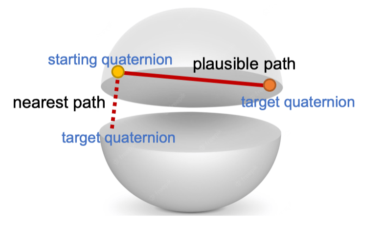

# 05 Vision-and-Grasping-I

## 抓取

**抓取（grasping）**：通过末端执行器（end-effector）对物体施加约束（力和扭矩），以期望的方式限制物体运动的过程。

**抓取合成（grasping synthesis）**：对于夹爪位姿或者关节控制的高维搜索 / 优化问题。

-   **抓握式操作** （Prehensile Manipulation）：通过完全约束物体自由度实现精确控制
-   **非抓握式操作** （Non-prehensile Manipulation）：利用推、滑等接触力学原理调整物体状态，适用于薄片状物体或预处理场景，**不是所有动作都需要抓取**

### 抓取的自由度

**抓取姿势（Grasp Pose）**：手的位置、方向和关节状态

-   **4-DoF 抓取**：仅需平移和绕重力轴旋转，适用于结构化环境、固定位置（如流水线物料分拣）

    $$
    (x, y, z, \theta_z)
    $$

    

    

-   **6-DoF 抓取**：允许任意方向接近，处理非结构化场景（即更复杂的任务如杂乱堆叠物体）
    $$
    (x, y, z, \theta_x, \theta_y, \theta_z)
    $$
-   **手指自由度**

    -   平行夹爪：开 / 关，1 DoF
    -   灵巧手（Dexterous Hand）：21 DoF

## 开环抓取与闭环抓取

开环控制是指 **不使用反馈机制** 的控制系统。

1. 控制命令直接发送给系统，不基于系统当前状态或结果进行调整
2. 输入与输出之间没有信息回路
3. 系统不会根据执行结果来自动修正控制信号

**开环抓取**：基于视觉位姿估计，预测抓取位姿，执行抓取，视觉只会用到一次，如果失败（如掉落、没抓起来），不会尝试修正，“蒙着眼睛做事情”。

**闭环抓取**：基于视觉位姿估计，预测抓取位姿，执行抓取，如果抓取失败，则调整抓取位姿，重新抓取。

### 开环抓取系统

一般处理流程：

1. 视觉感知
2. 位姿估计
3. 运动规划
4. 控制执行

#### 对已知物体的抓取

由于物体信息已知，可以通过对物体的位姿进行预测。也就是在物体自身坐标系下进行抓取标注，然后转换到世界坐标系下。

1. RGB 图像，若满足

    1. 相机内参（将三维空间点投影到二维图像平面的关键参数，包括焦距、主点灯）已知：逆向的关键

    2. 物体大小已知：避免歧义（ambiguity）

        > 
        >
        > 道理我都懂，但是这个鸽子怎么这么大？

    3. 物体无对称性

    那么其可以唯一对应一个位姿

2. 点云（Point Cloud）图像，只需满足物体 **无对称性**，那么就可以唯一对应一个位姿。

##### Iterative Closest Point (ICP) 算法

流程：

1. 初始化变换估计 $T_0 = (R_0, t_0)$

2. 迭代直至收敛：

    1. 数据关联：确立变换后最近邻点对，建立模板点云 $M$ 与场景点云 $S$ 对应关系

        $$
        C = \{ (m_i, s_j) | s_j = \arg \min_{s \in S} \| T_k m_i - s \| \}
        $$

    2. 变换求解：最小化对应点距离
        $$
        T_{k+1} = \arg \min_T \sum_{(m,s) \in C} \| Tm - s \|^2
        $$

问题：比较怕物体被挡住造成 **点云缺失**。

#### 对未知物体的抓取

直接预测抓取位姿。

也有算法可以从见过同一类别物体进行泛化。

## 旋转回归（Rotation Regression）

回归：估计连续变量。

**旋转回归**：一种特殊的回归任务，对于输入信号，经由神经网络估计连续的旋转变量。

其中，表示方式空间 $R$ 可以是四元数、欧拉角等，而 $X$ 是 $\mathbb{SO}(3)$ 群。

回顾一下 $\mathbb{SO}(3)$ 群的定义，$\mathbb{SO}(3)$ 是特殊正交群（Special Orthogonal group），由所有三维旋转矩阵组成。

3D 旋转矩阵 $R$ 是一个 $3\times3$ 矩阵，满足以下条件：

-   $R^{\top}R = I$ （正交性）
-   $\det R = +1$ （保持右手坐标系）

$\mathbb{SO}(2) / \mathbb{SO}(3)$ 具有很好的连续性，没有跳变点的存在。

与普通回归不同，旋转表示在非线性空间、非欧空间中，**所以对于之前所讲过的所有旋转的表达方式，简单地使用 MSE 来作为监督信号都会不够理想。**

这是因为，CNN 理应具有连续性，**对于输入的微小变动，其输出不应当造成很大的改变。**

而如果对于某一旋转表达方式，存在这种 Ground Truth 监督信号的跳变，神经网络为了拟合这种跳变点，就会导致其权重矩阵 $W$ 出现一些很大的参数，造成数值不稳定性的同时，为之消耗大量的注意力，大部分的训练过程都去拟合这种跳变而不是其他占比更多、更泛用的部分，这是非常不好的。并且这一过程是 Loss 无关的，是由于选择了不好的表达方式造成的本质性问题。

所以，理想的表达方式，应当满足：

1. **双射**，表达方式到 $\mathbb{SO}(3)$ 群是一一映射的，否则特定旋转时可能出现多种等价表示，这使得神经网络难以学习
2. **连续**， $\mathbb{SO}(3)$ 群中任何一点附近的连续变化，其对应的表达方式应当也是连续变化，也即不存在性质不好的 **奇点（Singularities）**

### 欧拉角

欧拉角使用三个角度（通常表示为 $\alpha$、$\beta$、$\gamma$）来描述绕三个主轴的连续旋转，完整的旋转矩阵可以通过组合这些基本旋转得到：

$$
R = R_x(\alpha)R_y(\beta)R_z(\gamma)
$$

**问题**：欧拉角的表达方式天然存在非双射、万象节锁的问题

举例：考虑 2D 的情况，此时使用单一自由度 $\theta$ 来代表绕轴旋转的角度。

绕旋转轴转 $0$ 和 $2\pi$ 是一样的，但是在实际的 $\mathbb{SO}(2)$ 中是连续的。

一个解决方法是 **引入冗余维度**，把低维空间中的的不连续改成高维空间中的连续，如 $\theta \to (x,y)$，后者是连续的，且能反向求解出前者。

### 轴角

轴角表示由一个单位向量 $\mathbf{e} = [e_x, e_y, e_z]^{\top}$（表示旋转轴）和一个标量 $\theta$（表示旋转角度）组成：

$$
(\text{axis}, \text{angle}) = (\mathbf{e}, \theta)
$$

可以使用罗德里格旋转公式（Rodrigues' rotation formula）将轴角表示转换为旋转矩阵：

$$
R = I + (\sin\theta)K + (1-\cos\theta)K^2
$$

其中 $K = [\mathbf{e}]_\times$ 是其叉乘矩阵：

$$
K = \begin{bmatrix}
0 & -e_z & e_y \\
e_z & 0 & -e_x \\
-e_y & e_x & 0
\end{bmatrix}
$$

**问题：** 当 $\theta = 0$ 时，任何轴都表示单位旋转（即不旋转）；当 $\theta = \pi$ 时，绕某个轴的旋转 $(\mathbf{e}, \pi)$ 和绕它的反方向 $(-\mathbf{e}, \pi)$ 表示相同的旋转。

### 四元数

四元数是复数的一种推广，形式为：

$$
q = w + xi + yj + zk
$$

其中 $w$ 是实部，向量 $\mathbf{v} = (x, y, z)$ 是虚部，且 $i^2 = j^2 = k^2 = ijk = -1$。

任何一个旋转，即绕某个单位向量 $\hat{\omega}$ 旋转 $\theta$ 角度，对应的四元数可以表示为：

$$
q = \left[\cos\frac{\theta}{2}, \sin\frac{\theta}{2} \hat{\omega}\right]
$$

**问题**：四元数存在 “双重覆盖” 关系。

我们可以很容易地发现：

$$
\begin{aligned}
q &= \left[\cos\frac{\theta}{2}, \sin\frac{\theta}{2} \hat{\omega}\right] \\
-q &= \left[-\cos\frac{\theta}{2}, -\sin\frac{\theta}{2}\hat{\omega}\right] \\
&= \left[\cos(\pi - \frac{\theta}{2}), \sin(\pi - \frac{\theta}{2}) (-\hat{\omega})\right]
\end{aligned}
$$

是等价的（$-q$ 意味着同一旋转轴但是翻转正方向，然后旋转 $2\pi - \theta$）。

为此，我们通常约束四元数位于上半球（即 $w \geq 0$），但这又会引入新的不连续性：

1. 临近球大圆的不连续性

    

2. 球大圆上的不连续性：由于双重覆盖，我们只能取一个半圆，但是在这个切面圆的直径上，我们还是只能选取两个切点中的一个（否则又存在双重覆盖问题，$q = -q$），而这么选取的话，在这个点附近，依旧有类似欧拉角的跳变存在（还是那个原因，在这个点附近的微小变动会引发跳变）

    

### 6D 表示

为了解决不连续性问题，我们放弃了选择上述方法，改为回到旋转矩阵本身。

直接尝试拟合旋转矩阵，会引入 9 个数的自由度，我们还需要映射到 $\mathbb{SO}(3)$，所以引入进行施密特正交化以满足旋转矩阵条件：

1. 第一列标准化
2. 第二列只保留垂直于第一列的分量，然后标准化
3. 第三列通过第一列和第二列的叉乘确定

形式化表示为：

$$
f_{GS}\left(\begin{bmatrix} \mathbf{a}_1 & \mathbf{a}_2 \end{bmatrix}\right) = \begin{bmatrix} \mathbf{b}_1 & \mathbf{b}_2 & \mathbf{b}_3 \end{bmatrix}
$$

其中：

$$
\mathbf{b}_i = \begin{cases}
N(\mathbf{a}_1) & \text{if } i = 1 \\
N(\mathbf{a}_2 - (\mathbf{b}_1 \cdot \mathbf{a}_2)\mathbf{b}_1) & \text{if } i = 2 \\
\mathbf{b}_1 \times \mathbf{b}_2 & \text{if } i = 3
\end{cases}
$$

其中 $N(\mathbf{v})$ 表示向量 $\mathbf{v}$ 的归一化。

这种表示实际上只有 6 个自由度，所以我们叫它 6D 表示方法。

然而，这个方法固然简单，但是他引入了新的问题：**拟合得到的 9 个数彼此并不等价。**

1. 对于第一列，是一等公民，直接归一化
2. 对于第二列，是二等公民，需要移除平行于第一列的分量
3. 对于第三列，甚至完全不考虑它的数值，正交系的三个向量直接由前两个叉乘得到

所以，这种表示方式与传统的 L2 Norm 的损失函数并不协调。

当然我们可以相对应地分优先级，第一列直接算，第二列需要加权，第三列直接排除在损失函数之外，但直觉上就会感觉到不平衡的存在 —— 神经网络输出的各个神经元本应等价，但是你算 Loss 的时候还要排除，哪有这样的道理？

### 9D 表示

9D 表示直接使用完整的旋转矩阵（9 个元素）作为表示。为将神经网络的欧几里得输出映射到 $\mathbb{SO}(3)$，同时满足前述要求：

1. 双射
2. 连续
3. 等价

我们使用奇异值分解（SVD）对之进行正交化：

$$
\hat{R} = U\begin{bmatrix}
1 & 0 & 0 \\
0 & 1 & 0 \\
0 & 0 & \det(UV)
\end{bmatrix}V^{\top}
$$

其中 $U$ 和 $V$ 是对神经网络预测除的矩阵进行 SVD 分解得到的正交矩阵，$\det(UV)$ 项确保结果矩阵的行列式为 +1，满足旋转矩阵的性质。

> **SVD 的基本过程**
>
> 给定任意矩阵 $M \in \mathbb{R}^{3 \times 3}$，其奇异值分解（SVD）为：
>
> $$
> M = U \Sigma V^{\top}
> $$
>
> 其中：
>
> -   $U$ 和 $V$ 是正交矩阵（$U U^{\top} = V V^{\top} = I$）
> -   $\Sigma$ 是对角矩阵，对角线元素为奇异值 $\sigma_1 \geq \sigma_2 \geq \sigma_3 \geq 0$
>
> 对于我们预测的旋转矩阵而言，这里分解得到的奇异值会很接近 1，但不一定就是 1，所以直接换掉它来使之满足正交化条件。

**优势**：CNN Friendly

-   不区分对待矩阵的每一行，实现完全连续、一一映射的表示
-   与神经网络的欧几里得输出空间兼容

### 增量旋转预测

对于预测增量旋转（delta rotation），即 $\mathbb{SO}(3)$ 在单位矩阵 $I$ 附近的小范围旋转，前面几种表示方式实际上都可以，因为此时在这个邻域没有了我们考虑了半天的奇点（Singularities）问题。

而且，此时由于四元数等表示方式需要预测参数更少，学习起来甚至可能更快。

## Rotation Fitting

使用神经网络先预测物体坐标或对应关系，然后解算旋转。具体步骤包括：

1. 对物体表面的每个像素，预测其在物体建模模型上的 3D 坐标
2. 基于这些对应关系拟合旋转矩阵

这种方法建立了模型坐标系（model） $(x_i^M, y_i^M, z_i^M)$ 和相机坐标系（camera） $(x_i^C, y_i^C, z_i^C)$ 两个坐标系之间的对应关系。

我们的目标是找到将模型坐标系转换到相机坐标系的最优变换矩阵（要求物体大小不变）。

这要求物体是见过的、标注过的，不然没法比对（缺乏 $(x_i^M, y_i^M, z_i^M)$ 模型坐标系基础定义）。

-   有 Depth 信息：3d to 3d，$(u,v, d) \to (x_i^M, y_i^M, z_i^M)$
-   没有 Depth 信息：2d to 3d，$(u,v) \to (x_i^M, y_i^M, z_i^M)$

### 正交 Procrustes 问题

给定两组对应的 3D 点集，不考虑位移 $t$ 的纯旋转拟合（求解它们之间的最优旋转矩阵）可以形式化为正交 Procrustes 问题，这是一个矩阵逼近问题。

定义：给定矩阵 $\mathbf{M} \in \mathbb{R}^{n \times p}$ 和 $\mathbf{N} \in \mathbb{R}^{n \times p}$，我们需要求解：

$$
\hat{\mathbf{A}} = \arg\min_{\mathbf{A} \in \mathbb{R}^{p \times p}} \|\mathbf{M}^{\top} - \mathbf{AN}^{\top}\|_F^2 = \arg\min_{\mathbf{A} \in \mathbb{R}^{p \times p}} \|\mathbf{M} - \mathbf{NA}^{\top}\|_F^2 \\
\text{subject to} \quad \mathbf{A}^{\top}\mathbf{A} = \mathbf{I}
$$

其中，$\|\cdot\|_F$ 表示 Frobenius 范数，定义为：

$$
\|X\|_F = \sqrt{\text{trace}(X^{\top}X)} = \sqrt{\sum_{i,j} x_{ij}^2}
$$

这里：

-   $\mathbf{M}$ 可以表示目标坐标系中的点集（例如相机坐标系）

-   $\mathbf{N}$ 表示源坐标系中的对应点集（例如模型坐标系）
-   求解的 $\mathbf{A}$ 即为从 $\mathbf{N}$ 到 $\mathbf{M}$ 的最优旋转矩阵

-   约束条件 $\mathbf{A}^{\top}\mathbf{A} = \mathbf{I}$ 确保 $\mathbf{A}$ 是正交矩阵，保证了纯旋转变换（不包含缩放或剪切）。

正交 Procrustes 问题有一个优雅的解析解，可以通过奇异值分解（SVD）获得。如果我们对矩阵 $\mathbf{M}^{\top}\mathbf{N}$ 进行 SVD 分解：

$$
\mathbf{M}^{\top}\mathbf{N} = \mathbf{UDV}^{\top}
$$

那么最优旋转矩阵为：

$$
\hat{\mathbf{A}} = \mathbf{UV}^{\top}
$$

#### 数学证明

首先回顾迹运算的性质：

1. 线性性质：$\text{tr}(A + B) = \text{tr}(A) + \text{tr}(B)$
2. 循环性质：$\text{tr}(ABC) = \text{tr}(BCA) = \text{tr}(CAB)$
3. 转置性质：$\text{tr}(A^{\top}) = \text{tr}(A)$
4. 标量提取：$\text{tr}(cA) = c·\text{tr}(A)$，其中 $c$ 为标量
5. 与 Frobenius 范数的关系：$\|A\|_F^2 = \text{tr}(A^{\top}A) = \text{tr}(AA^{\top})$

利用迹运算的性质和 $\mathbf{A}$ 是正交矩阵的条件（$\mathbf{A}^{\top}\mathbf{A} = \mathbf{I}$）：

$$
\begin{aligned}
\|\mathbf{M} - \mathbf{NA}^{\top}\|_F^2
&= \text{tr}((\mathbf{M} - \mathbf{NA}^{\top})^{\top}(\mathbf{M} - \mathbf{NA}^{\top}))\\
&= \text{tr}(\mathbf{M}^{\top}\mathbf{M} - \mathbf{M}^{\top}\mathbf{NA}^{\top} - \mathbf{AN}^{\top}\mathbf{M} + \mathbf{AN}^{\top}\mathbf{NA}^{\top}) \\
&= \text{tr}(\mathbf{M}^{\top}\mathbf{M}) - \text{tr}(\mathbf{M}^{\top}\mathbf{NA}^{\top}) - \text{tr}(\mathbf{AN}^{\top}\mathbf{M}) + \text{tr}(\mathbf{AN}^{\top}\mathbf{NA}^{\top}) \\
&= \text{tr}(\mathbf{M}^{\top}\mathbf{M}) - \text{tr}(\mathbf{M}^{\top}\mathbf{NA}^{\top}) - \text{tr}((\mathbf{M}^{\top}\mathbf{NA}^{\top})^{\top}) + \text{tr}(\mathbf{N}^{\top}\mathbf{N}\mathbf{A}^{\top}\mathbf{A}) \\
&= \text{tr}(\mathbf{M}^{\top}\mathbf{M}) - 2\text{tr}(\mathbf{M}^{\top}\mathbf{NA}^{\top}) + \text{tr}(\mathbf{N}^{\top}\mathbf{N})
\end{aligned}
$$

注意到第一项 $\text{tr}(\mathbf{M}^{\top}\mathbf{M})$ 和第三项 $\text{tr}(\mathbf{N}^{\top}\mathbf{N})$ 都不依赖于 $\mathbf{A}$，因此最小化目标函数等价于最大化第二项 $\text{tr}(\mathbf{M}^{\top}\mathbf{NA}^{\top})$。

当我们有 SVD 分解 $\mathbf{M}^{\top}\mathbf{N} = \mathbf{UDV}^{\top}$ 时，可以将迹运算展开：

$$
\begin{aligned}
\text{tr}(\mathbf{M}^{\top}\mathbf{NA}^{\top}) &= \text{tr}(\mathbf{UDV}^{\top}\mathbf{A}^{\top}) \\
&= \text{tr}(\mathbf{UD}(\mathbf{AV})^{\top}) \\
&= \text{tr}((\mathbf{AV})^{\top}\mathbf{UD})  \quad (\text{循环性质，左乘正交矩阵逆，右乘正交矩阵}) \\
&= \sum_{i=1}^{d}[(\mathbf{AV})^{\top}\mathbf{U}]_{ii}d_i
\end{aligned}
$$

其中 $d_i$ 是矩阵 $\mathbf{D}$ 对角线上的第 $i$ 个元素，$d$ 是 $\mathbf{M}^{\top}\mathbf{N}$ 的非零奇异值的数量。

为了最大化上述和式，我们需要使 $(\mathbf{AV})^{\top}\mathbf{U}$ 的对角元素尽可能大。由于 $\mathbf{AV}$ 和 $\mathbf{U}$ 都是正交矩阵，因此 $(\mathbf{AV})^{\top}\mathbf{U}$ 也是正交矩阵，其对角元素的绝对值不能超过 1（否则对应的列 / 行的 $L_2$ 范数会超过 1）。

因此，该和式在所有 $(\mathbf{AV})^{\top}\mathbf{U}$ 的对角元素都等于 1 时达到最大值，即：

$$
\begin{aligned}
(\mathbf{AV})^{\top}\mathbf{U} &= \mathbf{I} \\
\mathbf{AV} &= \mathbf{U} \\
\mathbf{A} &= \mathbf{UV}^{\top}
\end{aligned}
$$

#### 后处理

正交 Procrustes 问题的基本约束 $\mathbf{A}^{\top}\mathbf{A} = \mathbf{I}$ 保证了 $\mathbf{A}$ 是一个正交矩阵。但正交矩阵即可以是旋转（$\det \mathbf{A} = +1$），也可以是 **反射** （改变手性，$\det \mathbf{A} = -1$）

所以，如果计算出的 $\det(\mathbf{UV}^{\top}) = -1$，表明 $\mathbf{UV}^{\top}$ 是一个反射。为了得到最接近的纯旋转，我们通过修改 SVD 中间对角矩阵 $\mathbf{D}$ 的最后一个元素符号来 “翻转” 这个反射。具体做法就是将解修正为：

$$
\hat{\mathbf{A}} = \mathbf{U}\begin{bmatrix} 1 & 0 & 0 \\ 0 & 1 & 0 \\ 0 & 0 & \det(\mathbf{UV}^{\top}) \end{bmatrix}\mathbf{V}^{\top}
$$

直观上，这代表选择翻转关联性最弱的方向，是因为这样做对整体对齐效果（即 Frobenius 范数或等价的迹最大化目标）的影响是最小的。

#### 位移求解

可以想到，一旦旋转矩阵确定，那么位移向量 $t$ 就非常好解了（计算变换前后差值即可）。

将一个变换矩阵转换为刚才说的正交 Procrustes 问题，也只需要对两个原始点集 $\mathbf{M}$ 和 $\mathbf{N}$ 分别减去各自的几何中心即可。

步骤：

1.  中心化

    -   计算两个点集的质心：$\overline{\mathbf{M}}$（M 的均值）, $\overline{\mathbf{N}}$（N 的均值）。
    -   得到中心化后的点集：$\tilde{\mathbf{M}} = \mathbf{M} - \overline{\mathbf{M}}$, $\tilde{\mathbf{N}} = \mathbf{N} - \overline{\mathbf{N}}$。

2.  求解旋转 $\hat{\mathbf{R}}$：对中心化后的点集 $\tilde{\mathbf{M}}$ 和 $\tilde{\mathbf{N}}$ 应用 **带约束的正交 Procrustes 算法** （要求 $\det(\mathbf{R})=+1$），求解最优旋转 $\hat{\mathbf{R}}$，使得 $\tilde{\mathbf{M}}^{\top} \approx \hat{\mathbf{R}}\tilde{\mathbf{N}}^{\top}$。

3.  求解平移 $\hat{\mathbf{T}}$：利用已求得的 $\hat{\mathbf{R}}$ 和原始点集的质心计算最优平移：
    $$
    \hat{\mathbf{T}} = \overline{\mathbf{M}^{\top} - \hat{\mathbf{R}} \mathbf{N}^{\top}}
    $$

#### 问题

> 草，刚上完的计算机视觉导论还在追我！

对于 Outlier 较为敏感，使用 RANSAC 算法即可。

**以下内容直接摘录自 CV 导论笔记，看过的可以直接跳。**

##### 最小二乘法（Least Square Method）

定义：假设有一组数据点 $(x_i, y_i)$，我们希望通过直线 $y = mx + b$ 拟合这些点。

其能量函数（损失函数）为：

$$
E = \sum_{i=1}^n (y_i - mx_i - b)^2
$$

最小二乘法的一个问题是对细微噪声 **鲁棒（robust）**，但是对于 **离群点（Outliers）** 敏感。如图，为了照顾一个离群点，整个直线发生了很大的旋转。

##### RANSAC（RANdom SAmple Consensus，随机抽样一致算法）

**动机**：我们想要一个自动化的算法，可以确定离群点（outliers）并排除之。

**想法**：我们希望找到一条直线，使得这条直线有最多的内点（inliner）。

**RANSAC loop**：假设这条直线需要 2 个点（或选择 $n$ 个点，但选择最少的 2 个点可以保证这些点中没有 outliers 的概率最大）来确定：

1. 随机选择 $k$ 组能确定这条直线的点（即从所有点中选出一个 $k \times 2$ 的矩阵）。
2. 对每一组点计算出一条直线（使用 SVD）。
3. 对每一组点的直线，计算所有点到这条直线的距离；若距离小于阈值，则认为该点是这条直线的内点（inliner）。
4. 找到内点数量最多的直线，若数量超过阈值，则认为这条直线是最优的。
5. 对最优直线，用其所有内点重新计算一次直线。
6. 重复上述步骤，直到内点数量不再增加。

注意：此过程可推广到 $n$ 维空间，只需选择 $\geq n$ 个点来确定一个 $n-1$ 维的超平面。

实际上，从今天的视角来看，此循环（loop）不再必需，因为我们可以并行地提出所有假设（Hypothesis），CV 导论中将此留作作业。

### Instance level

对物体级别的位姿变换预测，要求每个物体都已知（完整建模），典型算法如 PoseCNN，如果结合 ICP 算法可以在位移幅度较小的情况下更快的提升准确率（下节课详细讲）。

### Catagory level

对同一类别物体的位姿变换预测，这类物品通常具有共有结构，如茶杯具有相近的几何形状，可以用于定位（下节课详细讲）。

在同类别物体中进行泛化，但也因此受限，没见过的类别不行。

大小不知道，能给出旋转 Rotation 不能给平移 Translation，因为可能沿着物体光轴走，还是那个鸽子为什么这么大的问题，所以 Catagory level 必须要知道大小。

那么如何在同一类别物体的不同尺寸之间进行泛化呢，答案是类似归一化的想法，把同一类别的东西缩放到一个标准的 1x1x1 box 内，将其几何中心归一化到 box 中心，从而统一他们的尺度。
