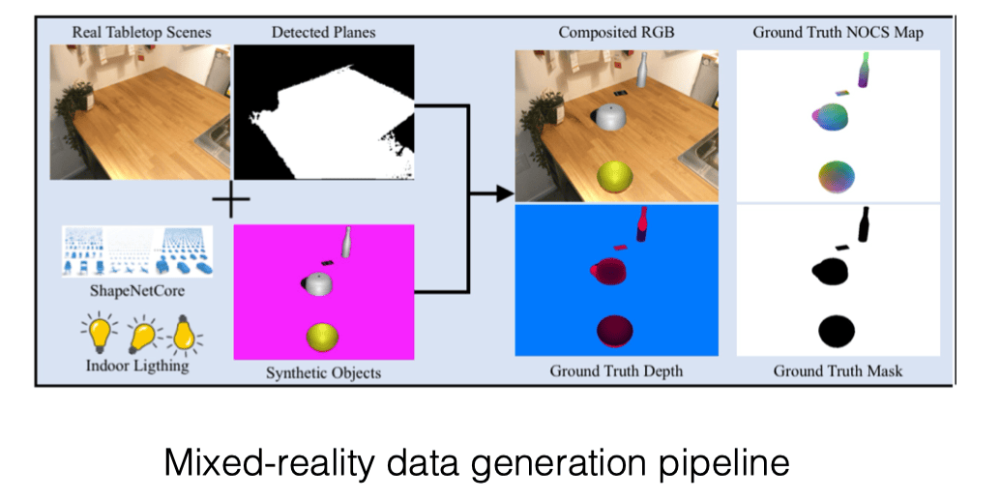

# 06 Vision-and-Grasping-II

## 迭代最近点算法（ICP）

### 动机

在机器人抓取任务中，物体的位姿估计精度直接影响抓取成功率。

以 YCB 数据集为例，当预测位姿的平移误差超过 2cm 时，抓取成功率会显著降低至 60% 以下。对于细长物体（如粉笔、剪刀），即使 2.5mm 的误差也可能导致抓取失败。

这种敏感性源于：

1. 机械臂运动误差：沿特定方向的平移误差可能推翻物体
2. 夹爪闭合策略：夹爪开合宽度需要与物体尺寸精确匹配
3. 旋转容错性：旋转误差（如绕 Z 轴 30°）通常比平移误差更宽容

而对于 PoseCNN，仅 32% 的预测能达到 2cm 内的平移精度。这种误差水平难以满足实际抓取需求，因此需要后续优化。

### 算法原理与流程

ICP 用于优化初始位姿估计，通过迭代优化使源点云和目标点云对齐。

-   **源点云（Source/Moved Data）:** $P = \{p_1, p_2, \dots, p_n\}$，其中每个 $p_i \in \mathbb{R}^3$。点云可以表示为矩阵 $P \in \mathbb{R}^{3 \times n}$。
-   **目标点云（Target/True Data）:** $Q = \{q_1, q_2, \dots, q_m\}$，其中每个 $q_j \in \mathbb{R}^3$。点云可以表示为矩阵 $Q \in \mathbb{R}^{3 \times m}$。

注意：$n$ 和 $m$ 分别是源点云和目标点云中点的数量，它们可以不相等（$n \neq m$）。

ICP 通过迭代优化寻找最佳的旋转矩阵 $\hat{R} \in \mathbb{SO}(3)$ 和平移向量 $\hat{T} \in \mathbb{R}^{3 \times 1}$，使得变换后的源点云 $P$ 与目标点云 $Q$ 尽可能对齐。

算法迭代步骤如下：

1.  **数据中心化（Make data centered）**

    -   计算点云 $P, Q$ 的质心（均值）：$\bar{P} = \frac{1}{n} \sum_{i=1}^n p_i, \bar{Q} = \frac{1}{m} \sum_{j=1}^m q_j$。
    -   将点云中心化：$\tilde{p}_i = p_i - \bar{P}, \tilde{q}_j = q_j - \bar{Q}$。得到中心化后的源点云矩阵 $\tilde{P} = [\tilde{p}_1, \dots, \tilde{p}_n] \in \mathbb{R}^{3 \times n}$ 和目标点云矩阵 $\tilde{Q} = [\tilde{q}_1, \dots, \tilde{q}_m] \in \mathbb{R}^{3 \times m}$。
    -   这一步的目的是先去除位移 $t$ 的影响

2.  **对应点匹配（Correspondence Search）**

    -   对于当前源点云 $P$ 中的每一个点 $p_i$，在目标点云 $Q$ 中找到其最近邻点 $q_{j_i}$：

        $$
        q_{j_i} = \operatorname{argmin}_{q_j \in \tilde{Q}} \| \tilde{q}_j - \tilde{p}_i \|^2_2
        $$

    -   形成一个与 $P$ 点一一对应的目标点子集（correspondences）$P_{corr\_pts} = \{ q_{j_1}, q_{j_2}, \dots, q_{j_n} \}$

    -   得到对应目标点云矩阵 $\tilde{P}_{corr} = [\tilde{q}_{j_1}, \dots, \tilde{q}_{j_n}] \in \mathbb{R}^{3 \times n}$。

3.  **位姿求解（Pose Estimation using Orthogonal Procrustes）**

    -   目标是找到最优旋转 $\hat{R}$，最小化中心化点云之间的距离：

        $$
        \hat{R} = \operatorname{argmin}_{R \in \mathbb{SO}(3)} \|\tilde{P}_{corr} - R\tilde{P}\|_F^2
        $$

    -   计算协方差矩阵 $K = \tilde{P}_{corr} \tilde{P}^\top = \sum_{i=1}^n \tilde{q}_{j_i} \tilde{p}_i^\top$，这是一个 $3 \times 3$ 矩阵。

    -   对 $K$ 进行 SVD 分解：$K = U D V^\top$。

    -   计算最优旋转矩阵 $\hat{R}$ （确保是旋转矩阵，处理可能的反射情况）：

        $$
        \hat{R} = U \begin{bmatrix}
            1 & 0 & 0 \\
            0 & 1 & 0 \\
            0 & 0 & \det(UV^\top)
        \end{bmatrix} V^\top
        $$

    -   计算最优平移向量 $\hat{T}$：
        $$
        \hat{T} = \bar{P}_{corr} - \hat{R} \bar{P}
        $$
    -   这里的详细推导可以参见前一章笔记的正交 Procrustes 问题

4.  **更新与迭代（Update P and Iterate）**

    -   使用求得的 $\hat{R}, \hat{T}$ 更新 **原始** 源点云 $P$ 的位姿：

        $$
        P_{new} = \hat{R} P + \hat{T}
        $$

        （这里 $P$ 是 $3 \times n$ 矩阵，$\hat{T}$ 是 $3 \times 1$ 向量，需要广播加到 $P$ 的每一列）

    -   将 $P_{new}$ 作为下一次迭代的输入源点云。

    -   重复步骤 2-4，直到满足收敛条件（$\hat{R}, \hat{T}$ 变化足够小，或者达到最大迭代次数）。

### ICP 收敛性

由于计算对应点匹配的时候 **可能会导致非一一映射问题（好几个点离同一个点最近）**，此时必然无法找到一个完美的变换（不可能两个不同的点经过仿射变换到了同一个点）。

所以，ICP 并没有收敛保证，可能卡在局部最优（local minimum），但其对于 PoseCNN 的性能表现还是有很强的提升。

### ICP 算法的问题

#### 优点

-   操作简便，无需进行点云分割或特征提取。
-   当初始估计较为准确时，具有不错的精度和收敛性。

#### 缺点

-   寻找最近对应点计算成本高（可通过下采样密集点云或采用小样本匹配以加快迭代速度来降低）。
-   ICP 每次迭代太耗时，还会迭代很多次，所以后来提出了一些算法来加速。
-   仅考虑点对点距离，未充分利用点云结构信息。
-   对初始估计的准确性高度依赖。

## 类别级位姿估计（Category-Level Pose Estimation）

实例级别（Instance-Level）的位姿估计都要求我们知道物体的完整建模，否则我们缺乏目标，无法进行估计。

不过，对于一些有自然定义的 pose，它会具有一个天然的参考性（从而提供一个类别级的参考系），从而可以从 Instance level 延拓到 Category level，直接对这一类别的物体的 pose 进行预测。

这是王鹤老师在 CVPR 2019 Oral 的工作，原始论文可以参见 [这里](https://arxiv.org/abs/1901.02970)。

这是如何做到的？当物体缺乏实例级别的 CAD 模型时，那就建立类别级的统一参考系。

这里的核心思想是 **通过归一化操作定义标准化物体空间 Normalized Object Coordinate Space（NOCS）**：

1. **旋转对齐** （Rotation Alignment）：通过先验，使用物体的方向，对齐坐标系
2. **平移归一化** （Translation Normalization）：计算 Bounding box，将包围盒中心平移至坐标系原点
3. **尺寸归一化** （Scale Normalization）：通过对角线长度限制 Bounding box 的大小（限制对角线长度为 $1$，那么一定能装到 $1\times 1\times 1$ 的 Bounding box 内）

> 举个栗子 🌰
>
> 对于茶杯我们总是知道其大致形状的（先验）。
>
> 1. 然后对齐物品的朝向，如把茶杯手柄的方向统一规定为某一轴的正方向，从而对齐 $R$
> 2. 使用一个正方体的 bounding box 来框起来物体，然后强制把其中心定位在 $(0,0,0)$，从而对齐 $t$
> 3. 归一化 Bounding box 的大小，从而对齐同一类物体的 size

好，现在有了参考系，那怎么用呢？

首先，我们指出一下该算法和 ICP 算法的本质区别：

1. **ICP 算法需要很强的先验知识，我们需要完整的知道物体的本身建模**，然后以 RGBD 或者 RGB 重建得到的点云去与物体本身建模点云配准，由于求位姿的算法需要一个变换前后的坐标对，所以我们需要先进行最近邻匹配（也就是这一步导致了收敛性的缺失以及迭代速度的变慢），然后据此迭代得到物体位姿 $(R,t)$
2. NOCS 算法不再需要完整的知道知道物体的本身建模，而是通过标准化的 NOCS 空间隐式地引入了对于某一类物体的、相较于 ICP 算法更粗粒度的几何先验，降低了对于高精建模的依赖，我们（使用合成数据）训练得到一个神经网络，可以从 RGB 图像直接为每一个像素预测其在 NOCS 中的对应点 $(x,y,z)$，随后将其与 RGBD 重建得到的点云信息进行配准，**这里根据像素关系，可以天然形成数量相同的变换前后的坐标对，所以不再需要找到最近邻（Correspondence）**。而后，我们可以直接用 Umeyama 算法（和 ICP 去除最近邻匹配的后半段类似）来重建得到 7 DoF 物体位姿 $(s,R,t)$

整个 NOCS 过程可以被建模为如下数学形式：

给定两组对应点云：

-   规范空间点 $\mathbf{p}_i \in \mathbb{R}^3$（来自 NOC Map 预测）
-   真实空间点 $\mathbf{q}_i \in \mathbb{R}^3$（来自深度图反投影）

寻找相似变换参数 $(s, R, t)$ 使得：

$$
sR\mathbf{p}_i + t = \mathbf{q}_i \quad \forall i
$$

接着，我们给出算法的过程。

1. 输入 RGBD 图像，提取 RGB 信息，使用 Mask R-CNN（如果没学过，可以参见我在 AI 基础写的 [这篇笔记](https://arthals.ink/blog/application-of-cnn#mask-r-cnn)）获得 ROI（感兴趣区域，Region of Interest），分割物体
2. 对于分割出的物体，对其每个像素预测其对应的 NOCS 空间坐标 $(x,y,z)$，得到 NOCS Map
3. 利用 Depth 图像和相机内参，将 NOCS Map 中的点反投影（Back Projection）到三维空间中，得到点云数据
4. 通过 NOCS Map 和 Depth 图像得到的点云数据，进行 Pose Fitting，利用 Umeyama 算法，计算得出物体的 7DoF 位姿（缩放 + 旋转 + 平移），缩放系数的计算就是简单的用 NOCS Map 的各轴向长度与物体实际点云各轴向作了一个除法。而反过来计算 Bounding Box 的时候，则利用了 NOCS 建模时令物体中心处在原点从而具有的对称性，以预测出的 NOCS Map 各轴向最大绝对值乘 2 再乘缩放系数作为了 Bounding Box 的各轴向尺寸

Umeyama 算法和前文类似，再次不再赘述。

了解了过程之后，一个很自然的问题就是：为什么不能直接用神经网络去根据 RGB 图像和 RGBD 反投影得到的深度图预测 6DoF 位姿？

1. 首先，实验能证明这种方法比直接回归要好；
2. 其次，直观的理解上可以想到，回归是一个从 3D $\to$ 6D 的直接预测，而 NOCS 是首先建立了 2D $\to$ 3D 的对应关系，然后将 6D 的位姿变换成了从 NOCS 3D 到 Depth 3D 的一个几何优化问题，明显后者比前者更符合直觉。
3. 除此之外，**NOCS 方法还充分利用了形状 / 几何先验**，通过规范空间强制同类物体共享几何分布特征，使网络能学习类别级别的形状规律，学习起来会具有协同效应（Synergy），提升了对未见物体的泛化能力。

## 合成数据

刚才介绍过了 NOCS 方法，那么现在最大的问题就在于如何去训练这样一个从二维 RGB 图像重建到 NOCS 空间的神经网络了。

在类别级物体姿态估计任务中，真实数据标注面临两大挑战：

1. 标注成本过高
2. 类别泛化性不足

因此，直接去使用真实数据是很难成功的，所以很自然地，我们想要使用合成数据来进行训练。

但是，模型在合成数据（$\mathcal{D}_{syn}$）和真实数据（$\mathcal{D}_{real}$）上的往往存在差异，也即 **Sim2Real Gap**，这是由于这二者的分布是不同的，直接用真实数据去测试在合成数据上 Work 的方法，往往会导致性能暴跌。

为此，王老师提出了一种新的数据合成办法，也就是 **Mixed Reality Data**。

这种数据中，背景是真实的，而需要分割的前景是合成的（从而我们可以直接获得训练 NOCS 模型所需的监督信号），从而可以很轻易地获取到几十万量级的数据。

但是，在实践过程中，发现简单地使用这个方法还是会存在较大的 Sim2Real Gap，这是由于合成背景和前景照片的时候，**分界太过明显**，从而导致分割的 Mask R-CNN 学习到的经验难以应用到真实世界。

为了解决这个问题，王老师又提出了使用 **Co-Training** 的方案，即同时结合过往 Image Segmentation 领域收集的真实数据集（Coco）与我们的合成数据集来一同对 Mask R-CNN 进行 **混合训练**，但前者不参与后续的 NOCS 映射训练，只为分割提供监督信号。

王老师认为，**这种合成数据的使用在具身智能领域是必不可少的**，因为训练学习所需的真实数据很难大规模、轻易地获取到。

> 王老师还提到，目前 Pose Estimation 领域最 work 的模型（FoundationPose）就是纯合成数据训练出来的，不过他们的合成过程会更加精细
>
> 

对于预测得到的位姿，有时候还需要 Refinement，比如之前介绍的 ICP 算法。

然而，ICP 算法同时需要点云与物体表面 mesh，真实情况下可能两者都没有，所以现在这个问题完全用神经网络来做，而其训练的数据全靠合成。

## 运动规划的层级

$$
\text{pose} \to \text{grasp} \to \text{motion planning} \to \text{control}
$$

1. 一代技术：工业机器人，完全的轨迹重放，无环境感知能力
2. 二代技术：位姿预测，但需要物体预先定义，轨迹通过位姿进行预测规划得到
3. 三代技术：抓取预测
4. 四代技术：动作规划预测，神经网络端到端直接输出动作轨迹 Action / Trajectory，可以进行闭环纠错
5. 五代技术：完全的闭环控制，大语言模型指导进行语义推理

开环控制如果 pose estimation 足够快，也能搞成闭环。

## 抓取（Grasp）

**抓取**：指通过在接触点施加力和力矩，以期望的方式约束物体运动的过程。

### Force Closure

定义：**通过摩擦力** 维持平衡的约束状态，如果施加在摩擦接触点上的一组力足以补偿施加在物体上的任何外部力，则称为力闭合。

> 王鹤老师原话：以某一组力在某一组接触点（Contact Point）抓取起来后，物体需要任意方向的加速度，都可以提供。

Force Closure 是判断抓取质量的一个重要指标。

### Form Closure

定义：仅仅通过 **几何约束** 完全限制刚体运动的状态（ **不依赖摩擦力** ）。

根据定义，不难推知，严苛程度上：**抓起来 ≤ force closure ≤ form closure**。

在规划机器人手的抓取时，力闭合是一个很好的最低要求。形闭合通常过于严格，需要太多接触点。

### 回归与生成

传统的抓取问题可以看作是一个回归问题，即预测唯一的抓取位姿。然而，由于遮挡和对称性，一个物体通常存在多个可行的抓取（多峰分布）。因此，将抓取建模为一个生成问题更为合适。
