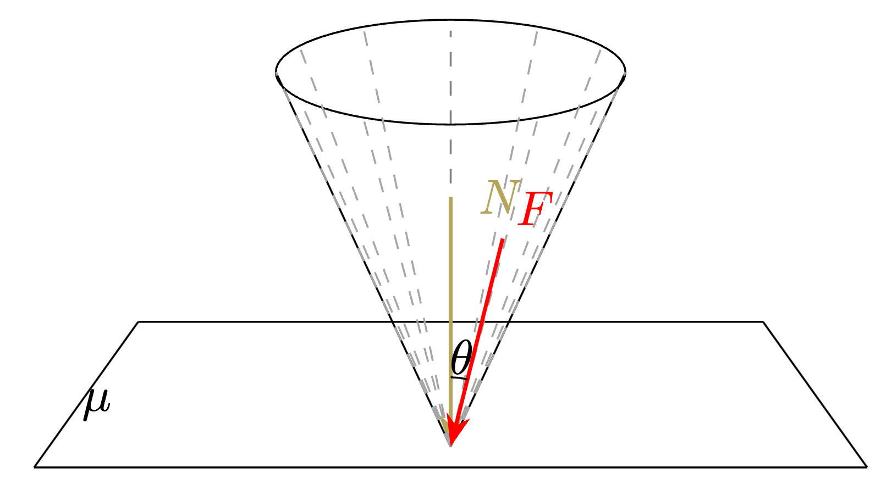

# 07 Vision-and-Grasping-III

## 抓取

### Form Closure 与 Force Closure

-   **Form Closure（形闭合）**：这是一种纯粹基于几何的定义。指的是接触点（contact points）形成了一个 “笼子”，将物体完全包住。在不移动接触点的情况下，物体从几何上无法从这个 “笼子” 中逃逸。可以认为这是一种最理想、最稳固的包裹式抓取接触状态。**其不依赖于摩擦力**。
-   **Force Closure（力闭合）**：这个概念考虑了接触点的力和摩擦力。它指的是，虽然接触点可能没有形成几何上的 “笼子”，但通过在这些接触点上施加适当的力（利用摩擦力），可以抵抗施加在物体上的任意方向的力（force）和力矩（torque）。换句话说，只要夹爪（或手指）能提供足够大的力，理论上就能抵抗任何外来的扰动，或者能让物体产生任意方向的加速度和角加速度。**其依赖于摩擦力**。

它们之间存在一个重要的关系：

$$
\text{Form Closure} \subset \text{Force Closure} \subset \text{Successful Grasp}
$$

也即，严苛程度上：

$$
\text{Successful Grasp} \leq \text{Force Closure} \leq \text{Form Closure}
$$

这意味着：

-   如果一个抓取是 Form Closure，那么它一定也是 Force Closure。
-   如果一个抓取是 Force Closure，那么它在理想情况下（夹爪力量足够）一定能成功抓起物体。
-   但是反过来不一定成立。
    -   一个成功的抓取不一定是 Force Closure，比如轻轻托起一个物体，它只抵抗了垂直方向的力，如果施加一个水平方向的力，它就会滑动
    -   一个 Force Closure 也不一定是 Form Closure，比如用两个手指平行夹住一个方块的两侧，这不是 Form Closure，因为物体可以上下滑动。但如果考虑摩擦力，只要能施加足够的夹紧力，它可能是一个 Force Closure，能够抵抗各个方向的外力。

### 摩擦锥（Friction Cone）

为了理解 Force Closure，我们需要引入摩擦锥的概念。

考虑一个简单的物理场景：一个滑块放在水平面上，两者之间的静摩擦系数为 $\mu$。

显然，如果我们对滑块施加一个法向力（正压力） $N$，就能利用摩擦力将之固定在平面上。

现在考虑如下情形：如果施加一个与法线方向成 $\theta$ 角的力 $F$ 作用在接触点上。

这个力 $F$ 可以分解为法向分量 $F_{\perp} = F \cos \theta$ 和切向分量 $F_{\parallel} = F \sin \theta$。

为了使滑块不发生滑动，切向力必须小于等于最大静摩擦力，即：

$$
F_{\parallel} \le \mu F_{\perp}
$$

代入分解后的力，得到：

$$
F \sin \theta \le \mu (F \cos \theta)
$$

假设 $F \cos \theta > 0$，我们可以得到：

$$
\tan \theta \le \mu
$$

令摩擦角 $\alpha = \arctan \mu$。这意味着，只要施加的力 $F$ 与接触面法线方向的夹角 $\theta$ 不超过 $\alpha$，无论这个力 $F$ 有多大（在理想情况下，假设物体和接触面都是刚体且不会被破坏），滑块都不会发生滑动。这种情况称为 **自锁（self-locking）**。

在三维空间中，所有满足这个条件的力 $F$ 的方向构成了一个圆锥，称为 **摩擦锥（Friction Cone）**。这个锥体的轴线是接触点的法线方向，其半顶角就是摩擦角 $\alpha = \arctan \mu$。

任何作用在接触点且方向向量位于此摩擦锥内部（或边界上）的力，都不会导致该接触点发生滑动（不会有滑动摩擦，都是静摩擦）。

### Force Closure 的数学定义

定义：一组摩擦接触实现 **力闭合（force closure）**，如果其 **力旋量锥（wrench cones）** 的 **正向张成（positive span）** 是整个 **力旋量空间（wrench space）** 。

思考一下，作用在一个刚体上的力的效果，它不仅会使物体 **平移（力）**，还会使物体 **旋转（力矩）**，而这就引入了六个自由度。

而为了同时描述作用在刚体上的力和力矩的 **整体效果**，我们将力和力矩组合成一个单一的向量，称为 **力旋量（Wrench）**。

-   在二维平面中，物体有 2 个平移自由度（在平面内）和 1 个旋转自由度（绕垂直于平面的轴）。因此，力旋量是一个 3 维向量：

    $$
    \mathcal{F} = \begin{bmatrix} f_x \\ f_y \\ \tau_z \end{bmatrix} \in \mathbb{R}^3
    $$

    前两个分量是平面内的力，最后一个分量是绕垂直轴的力矩。

-   在三维空间中，物体有 3 个平移自由度和 3 个旋转自由度。因此，力旋量是一个 6 维向量：
    $$
    \mathcal{F} = \begin{bmatrix} \mathbf{f} \\ \boldsymbol{\tau} \end{bmatrix} = \begin{bmatrix} f_x \\ f_y \\ f_z \\ \tau_x \\ \tau_y \\ \tau_z \end{bmatrix} \in \mathbb{R}^6
    $$
    前三个分量是力，后三个分量是力矩。

现在，我们可以更精确地定义 Force Closure。一个抓取被称为 Force Closure，是指所有接触点的摩擦锥组合起来，能够产生抵抗任意施加于物体的 **力旋量（Wrench）** 的能力（和最初那个定义等价）。

我们将空间中的每个摩擦锥用一定数量（记为 $k$，课中选择为 $k = 6$）的力旋量组成的多面体锥来近似，从而摩擦锥可以表示为这 $k$ 个力旋量的线性组合。

> 接触点决定力，方向决定力矩

如此考虑所有的摩擦锥，我们定义 **抓取矩阵 F（Grasp Matrix F）**：

$$
F = \begin{bmatrix} \mathcal{F}_1 & \cdots & \mathcal{F}_j \end{bmatrix} \in \mathbb{R}^{n \times j},\ n = 3 \text{ or } 6,\ j = k \times C
$$

其中，$C$ 是接触点（摩擦锥）的数量，$k$ 是为了近似每个摩擦锥所使用的力旋量数量（也即用多少面体锥来近似摩擦锥）。

那么，力闭合的数学化表达（充要条件）就是：

$$
\text{rank}(F) = n \text{ (3 or 6)} \\
Fk = 0 \text{ for some } k \in \mathbb{R}^j, k_i \ge \epsilon > 0 \text{ for all } i
$$

#### 第一个条件

$$
\text{rank}(F) = n \text{ (3 or 6)}
$$

这个条件意味着 $F$ 的 $j$ 个列向量 $\mathcal{F}_1, \dots, \mathcal{F}_j$ 能够张成整个 $n$ 维的任务空间 $\mathbb{R}^n$。

**物理意义**：为了能够抵抗任意方向的外部扰动（力 / 力矩），我们施加的接触力 / 力旋量的组合必须能够产生任意方向的合力 / 合力旋量。如果 $\mathrm{rank}(F) < n$，那么 $F$ 的列向量只能张成 $\mathbb{R}^n$ 的一个子空间。这意味着存在某些方向的外部扰动，无论我们如何调整接触力的大小（即对 $\mathcal{F}_i$ 进行线性组合），都无法产生一个能够与之平衡的合力 / 合力旋量。

#### 第二个条件

$$
Fk = 0 \text{ for some } k \in \mathbb{R}^j, k_i \ge \epsilon > 0 \text{ for all } i
$$

这个条件意味着存在一个线性组合，使得合力 / 合力矩为零，并且这个组合中的 **所有系数 $k_i$ 都必须是严格正的** （大于某个很小的正常数 $\epsilon$）。这意味着我们可以通过同时施加正向的力（或在摩擦锥内的力）来实现力的平衡。

> 为什么需要严格大于零（$>\epsilon$）？这保证了原点不在凸锥的边界上。如果原点在边界上，可能存在某些方向的扰动，虽然理论上可以被平衡，但在实际中（考虑到力的限制、接触的不确定性等）可能无法稳定地抵抗。严格大于零提供了鲁棒性，使得抓取更加稳定，并且能够抵抗微小的扰动。

**物理 / 几何意义**：这个条件与凸包（Convex Hull）或锥组合（Conic Combination）的概念紧密相关。具体来说，它等价于零向量（原点）严格位于由接触力旋量向量 $\{\mathcal{F}_1, \dots, \mathcal{F}_j\}$ 生成的凸锥（Convex Cone）的内部。

#### 合并条件

如果这两个条件都满足，那么对于施加在物体上的任何外部力旋量 $w_{ext}$（或者等价地，对于想要让物体产生的任何加速度 $a$ 和角加速度 $\alpha$，它们对应一个需要施加的力旋量 $w_{req}$），我们都能找到一组非负的系数 $k' = [k'_1, k'_2, \ldots, k'_J]^\top$ ($k'_i \ge 0$)，使得 $Fk' = -w_{ext}$ （或 $Fk' = w_{req}$）。

因为所有 $k'_i \ge 0$，这意味着所需的接触力都在各自（近似的）摩擦锥内，因此不会发生滑动。

> 不过，这个理论推导假设接触点可以施加任意大的力。在实际机器人中，执行器（电机）的力 / 力矩是有限的。所以，即使一个抓取满足 Force Closure 条件，如果需要抵抗的外力过大或需要产生的加速度过大，超出了机器人的能力范围，抓取仍然会失败。

### Force Closure 应用

Force Closure 的概念是合成大规模抓取标注数据集（Grasp Data Synthesis）的关键技术之一。

合成抓取数据集的两个经典方法：

-   利用 Force Closure 大量生成抓取标签
-   在 Simulater 中设置不同的重力方向（$x,y,z,-x,-y,-z$），看会不会掉出来，来近似判断

### GraspNet-1B 数据集

GraspNet-1B 数据集的生成流程大致如下：

1.  **获取物体模型**：通过 3D 扫描收集一批物体的三维模型。
2.  **物体上抓取姿态采样**：对每个物体模型，在其表面采样大量的候选抓取位姿（gripper pose），包括位置和朝向。例如，可以在物体表面均匀采样点（FPS 算法），然后将夹爪中心对准采样点，朝向可以基于表面法线并加入随机旋转。
3.  **Force Closure 筛选**：对每个采样得到的抓取姿态，给定一个摩擦系数 $\mu$（例如 $\mu=0.8$），使用前面所述的数学条件判断它是否满足 Force Closure。只保留满足条件的抓取姿态作为该物体的有效抓取标签。
4.  **场景生成与物体位姿标注**：创建包含多个物体的三维场景（例如，将物体随机摆放在桌面上）。需要知道场景中每个物体的精确 6D 位姿。GraspNet 最初通过将真实物体摆放在桌面上，然后使用 RGB-D 传感器数据和物体模型进行匹配来标注位姿。（现在可以完全在仿真环境中生成场景和物体的精确位姿）。
5.  **抓取标签转换与碰撞检测**：将步骤 3 中得到的物体中心坐标系下的有效抓取标签，利用步骤 4 中得到的物体位姿，转换到场景坐标系下。然后，检查在这个场景中，当夹爪移动到抓取位置（以及接近过程）时，是否会与场景中的其他物体发生碰撞。去除会发生碰撞的抓取标签。
6.  **多视角渲染**：对于每个生成好的带有有效、无碰撞抓取标签的场景，从多个不同的虚拟相机视角进行渲染，生成 RGB 图像、深度图、点云等数据，从而在人工参与恒定的情况下扩大数据集。每一个数据点就构成了一个（输入数据，有效抓取标签）的配对。

#### 关于摩擦系数的讨论

GraspNet 数据集实际上为不同的 $\mu$ 值（如从 0.8 到 0.1）都进行了筛选并存储了标签。

$\mu$ 值越低，对抓取的要求越高（更接近 Form Closure），这样的抓取在低摩擦表面上更可能成功。

训练时，有时会选择使用在较低 $\mu$（如 0.1）下仍然满足 Force Closure 的标签，认为这些是更高质量、更鲁棒的抓取，在真实世界中会拥有最好的泛化性，尽管这会大大减少标签数量（从 10 亿减少到几百万）。

这是一个标签数量和质量之间的权衡（Trade-off）。

#### 意义

GraspNet-1B 的生成流程在当时是开创性的，但也有其局限性。例如，它依赖于扫描的真实物体和在真实桌面上进行的位姿标注，限制了物体种类和场景背景的多样性。

如今，随着高质量三维模型库（如 ObjectVerse XL 包含千万级模型）和逼真渲染技术的发展，完全可以在仿真环境中生成更大规模、更多样化的抓取数据集。物体模型、场景布局、纹理、光照等都可以程序化生成，无需依赖真实扫描和物理摆放，这大大提高了效率和数据的泛化潜力（还是王老师一直强调的观点，**合成数据的潜力是巨大的** ）。

尽管 GraspNet-1B 的物体和背景多样性有限，但它证明了使用基于三维几何信息（如点云）作为输入的模型，即使只在相对有限的数据上训练，也能学到在杂乱场景中进行抓取的有效策略。**这说明三维几何本身提供了强大的先验信息。** 然而，若要训练能直接从二维图像（RGB 或 RGB-D）输入的模型，并使其泛化到未见过的物体和环境，就需要更大规模、更多样性的合成数据。

## 抓取检测问题（Grasp Detection）

将抓取问题形式化（Formulate）为一个检测问题，是解决机器人抓取的一种常用方法。

**目标**：给定场景的某种表示（如点云、RGB-D 图像、体素网格），算法需要输出一系列候选的抓取姿态（Grasp Poses）。每个姿态通常包含位置（3 DoF）、朝向（3 DoF）和夹爪宽度（1 DoF），并附带一个质量评分（Quality Score）或成功概率。

### 输入模态

#### 三维几何表示

举例：点云（Point Cloud）、体素网格（Voxel Grid）、截断符号距离场（TSDF - Truncated Signed Distance Function）。

-   **点云**：最直接的表示方式，每个点包含位置和法线信息。
-   **体素网格**：体素就是三维空间中的像素（小方格），通过将空间均匀划分，就得到体素网格。
-   **TSDF**：一种常见的体素网格表示。每个体素存储一个值，表示该体素中心到最近物体表面的有符号距离，并且这个距离值通常会被截断在一个范围内（例如 -10cm 到 +10cm）。正值表示在表面外，负值表示在表面内，0 表示在表面上。

由于抓取的物理稳定性主要取决于物体的局部几何形状（决定了接触点、法线、曲率等），而不是颜色或纹理，**所以直接使用几何信息作为输入被认为更直接、更有效**，尤其是在 GraspNet-1B 这类几何信息丰富但视觉外观多样性有限的数据集上（意思就是 3D 比 2D 信息更好，不需要用 RGB 反推几何信息，而是直接就是和任务密切相关的几何信息）。

这里老师还提到了一个 Partical / Complete 的说法挺有意思的，就是说你想建模完整的三维场景，那就需要多视角的数据，否则单视角会因为重叠而导致信息缺失。

#### 二维图像表示

举例：RGB 图像、深度图像（Depth Image）。

2D 信息往往隐式包含几何信息。

## 基于 TSDF 的抓取（VGN）

**VGN 直接在三维体素空间中对抓取位姿进行预测。**

输入：一个表示了场景几何的 3D 体素网格，例如一个 40x40x40 的 TSDF 网格。

网络结构：通常采用类似 U-Net 的 3D 全卷积网络结构。

输出：总体预测三个体素网格，即对于输出网格中的每一个体素，网络预测：

1.  **抓取质量（Grasp Quality/Score）**：一个标量值，表示以该体素为中心的抓取成功的概率或质量。

2.  **抓取朝向（Grasp Orientation）**：描述夹爪应该如何旋转。通常采用四元数格式。

3.  **抓取宽度（Grasp Width）**：一个标量值，表示执行抓取时夹爪需要张开的宽度

    预测宽度的主要目的是防止夹爪过宽向外碰撞，而不是为了确定要多宽才能夹，实际操作都是直接夹到不能继续为止（工程 Trick）。

### 抓取任务评估

常用任务：清理桌面（Table Clearing）或箱中取物（Bin Picking）。这类任务的目标是将一个杂乱堆叠的物体集合逐一抓取并移除。

评估指标：

-   **抓取成功率（Success Rate）**：成功抓取次数 / 总尝试抓取次数。
-   **清理率（Percentage Cleard）**：成功移除的物体数量 / 场景中总物体数量。
-   **规划时间（Planning Time）**：接收输入与返回抓取之间的时间间隔

特点：

-   **非特定对象（Object Agnostic）**：算法通常不区分物体身份，哪个物体看起来最好抓（预测得分最高）就先抓哪个。
-   **非任务导向（Non-Task-Oriented）**：不关心抓取物体后的具体用途（即无语义信息，不关心是递给别人、是用来倒水、还是装配），只关心能否稳定地把物体 “提起来”。
-   **过程简化**：评估时，抓取后的放置阶段可能被简化，例如直接移动到一个固定区域放下，甚至允许在移动过程中发生碰撞，只要物体被成功从初始位置拿起就算成功。

### 后处理

-   通过 **高斯平滑** 提升预测的鲁棒性和区域一致性。

-   通过 **距离掩膜** 保证抓取的物理和运动学可行性，如果 TSDF 值高过阈值，那就认为距离表面太深了手指不可达，将其 Mask 掉。

-   通过 **NMS** 以抓取质量分数指标去除冗余预测，得到精简且有代表性的抓取候选集。

    但这里老师也说了，仅仅这样不够好，因为光看 Grasp Quality 的话，没考虑 Orientation / Width，即使前面这个准了后面不准也没用，所以光靠前面抑制其实也不太好

### 损失函数

VGN 的损失函数通常是针对前文所述三个输出分别计算，然后加权求和。

-   质量损失：通常使用二元交叉熵损失（Binary Cross-Entropy Loss），因为这里是一个 0/1 二分类变量

    但老师后面又说了这个抓取质量的指标显然不是一个阶跃的，而是 **具有一定平滑性** 的，在一个点能抓起来，其附近也应当能抓起来，这就是为什么要进行高斯核平滑后处理

-   方向损失：L2，但只对那些真实抓取标签为正的体素（就是真的能抓起来的地方）计算。

-   宽度损失：同上

### Sim2Real Gap

VGN 使用了大量合成数据进行训练，但能够在真实机器人上较好地工作（Sim2Real Transfer），**关键原因在于其依赖的是几何表征**，它不考虑颜色、纹理等视觉信息，只关注物体的形状和抓取器的几何匹配。

Sim2Real 的工作都会有 Gap，但是否 Work 要看 Gap 重不重要，影响大不大。

-   合成数据中的深度信息是完美的，而真实传感器采集的深度图存在噪声
-   VGN 使用的 TSDF 表征，特别是当体素分辨率不高时（例如，40x40x40 的格子，每个格子边长可能达到厘米级），对几毫米级别的深度噪声不敏感。小的表面凹凸或噪声在体素化后会被平滑掉，不会显著改变 TSDF 的值。
-   因此，即使训练于完美深度数据，模型在面对带噪声的真实深度时，性能下降有限。

对于夹爪式抓取，**现实中的成功率往往不低于甚至高于仿真（Sim2Real Gap 甚至可以是负的！）**。

-   力闭合与变形：夹爪在闭合时通常会持续施力直至完全闭合或达到力 / 行程限制。这个过程可以轻微移动物体、压紧物体，甚至使软性物体发生形变，从而形成更稳固的接触面。这些物理效应在标准仿真中可能未被完全模拟，但在现实中是有利的。
-   摩擦力问题：如果担心仿真中摩擦系数不准（如仿真中认为能抓住，现实中太滑抓不住），可以通过简单的工程手段解决，例如在夹爪指尖贴上高摩擦系数的材料（如橡胶垫）。
-   仿真中的 Artifacts：有时仿真环境自身的问题（如碰撞检测不准、物理模拟不稳定）反而会导致仿真中抓不住，而现实中没问题。

**机器人学是一个应用学科，最终目标是解决问题，真机表现是最终检验标准。**

### VGN 的局限性

-   **多视角依赖**：对于相互遮挡严重的场景（cluttered scene），单视角可能无法看到被遮挡物体的完整几何形状，导致 TSDF 不准确，进而无法规划出好的抓取。VGN 需要较好的多视角观测来构建完整的场景 TSDF。
-   **精度限制**：由于使用体素表示，其抓取位姿（特别是平移）的精度受限于体素大小。理论上的最高平移精度约为半个体素边长。这对于需要高精度操作的任务可能是个问题。
-   **计算 / 内存与精度的权衡**：提高体素分辨率可以提升精度，但会导致内存和计算量急剧增加（通常是分辨率的三次方）。

## 基于点云的抓取（GSN / GraspNet）

点云是另一种重要的三维表示。

-   **轻量级 / 高效性**：点云只表示物体表面，不像体素需要表示整个空间（包括空白区域）。对于同样场景，点云的点数通常远少于体素数（几万点 vs 几十万体素）。
-   **高分辨率 / 精度**：理论上，点云中每个点的坐标可以是连续值，可以达到很高的空间分辨率，只要相机 / LiDAR 精度足够。

### GraspNet 架构

GraspNet 将复杂的六自由度抓取姿态预测分解为一系列更简单的问题。

先大致说一下方法：

1. 在表面选择接触点
2. 在接触点为中心的一个半球面上均匀采样 256 个方向，得到一个旋转轴
3. 绕旋转轴旋转夹爪
4. 沿旋转轴深入夹爪

整个过程将原本抓取位姿的 6 DoF 自由度进行了多阶段划分

1. 位移的 3 DoF
    1. 接触点的选择带来了 2 DoF
    2. 深入夹爪带来了 1 DoF
2. 旋转的 3 DoF
    1. 旋转轴的轴向带来了 2 DoF
    2. 夹爪绕旋转轴旋转角度带来了 1 DoF

真实操作流程：

1.  网络首先在输入点云的每个点上预测一个 “可抓取性” 分数（Graspness Score），表示该点作为抓取接触点的优劣程度。

2.  保留分数高的点作为候选抓取中心点（从 N 个点降到 M 个点）。

3.  对于每个候选点，预测最佳的抓取器接近方向（Approach Vector / View）。这通常是在以该点为中心的半球面上采样多个方向进行评估。

4.  对于选定的 “点 - 方向” 对，需要确定绕着接近方向的旋转角（In-plane Rotation Angle）以及夹爪最终的张开宽度或深入深度（Depth）。

    **Cylinder Grouping**：在候选点附近，沿着接近方向定义一个圆柱体区域，聚合该区域内所有点的特征。这个聚合后的特征被用来预测最佳的旋转角和深度 / 宽度。

### GraspNet 成功的本质

1. 点云的优良性质：准确、轻量、效率高、精度高
2. 架构：**端到端网络**，多阶段设计，每个阶段都有监督信号，稳定
3. **泛化性**：局部性与平移等变性
    1. **局部性**：Cylinder Grouping 聚合，依赖候选点周围的局部几何信息判断，而不太关心场景中其他远处的物体。
    2. **平移等变性（Translation Equivariance）**：类似二维情形，模型学习到的几何模式识别能力不随物体在空间中的位置变化而失效。

GraspNet 的核心在于学习 **局部几何特征（Local Geometric Features）** 与抓取成功的关系。

> 例如，一对平行的小平面、一个合适的边缘或角落，这些局部形状无论出现在哪个物体上，都可能指示一个好的抓取点。当模型在训练数据（如 GraspNet-1B 的数百个物体）中见识了足够多样的局部几何模式后，就能泛化到包含相似局部几何的新物体上，即使整体形状从未见过。

**这个局部泛化是非常本质的，因为它对某一位置是否适合抓进行了深入学习。**

## 抓取的条件生成模型

无论是 VGN 还是 GraspNet，它们本质上是 **检测（Detection）** 方法。它们从场景中预测（检测）出一系列离散的、得分较高的抓取候选。最后通常还需要进行非极大值抑制（NMS）来去除冗余的候选。然而，理论上一个物体可能有无限多种抓取方式，检测式方法只能给出有限的几个解。

随着生成模型（如 GANs、VAEs、Diffusion Models）的发展，研究者开始探索直接生成抓取姿态的方法。目标是学习抓取姿态的 **分布（Distribution）**，然后从中采样。

**动机**：对于具有高自由度（如 20+ DOF）的灵巧手（Dexterous Hand），抓取姿态空间巨大，传统的采样 + 评估或检测方法变得非常困难。生成模型提供了一种直接建模和采样高维复杂分布的途径。

不过，训练强大的生成模型通常需要极大规模的数据集（DexGraphNet 使用了一个包含 10 亿级别抓取样本的数据集）。生成如此规模的灵巧手抓取数据本身就是一个挑战，需要专门设计的抓取规划与优化管线。

该工作采用 **条件扩散模型**：

1.  首先，类似 GraspNet，在点云上识别出潜在的、适合抓取的接触点
2.  在选定的接触点周围（用一个球形区域） **提取局部几何特征** $F$。这个特征 $F$ 编码了该点附近的形状信息
3.  条件扩散，逐步去噪，学习出条件概率分布

如果你对扩散模型 / 条件扩散模型 / DDIM 的推导感兴趣，笔者推荐如下内容：

-   [Hammour Yue / 概率视角下的生成模型](https://zhuanlan.zhihu.com/p/611466195)
-   [走遍山水路 / DDIM 原理和直观数学推导](https://zhuanlan.zhihu.com/p/675505247)
