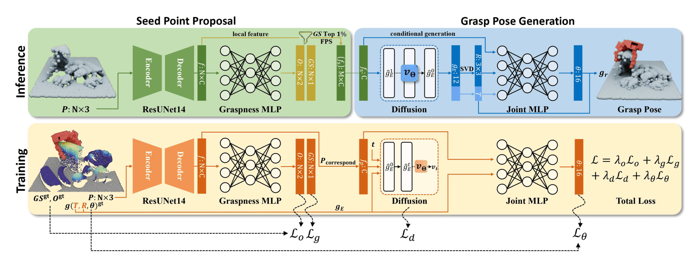
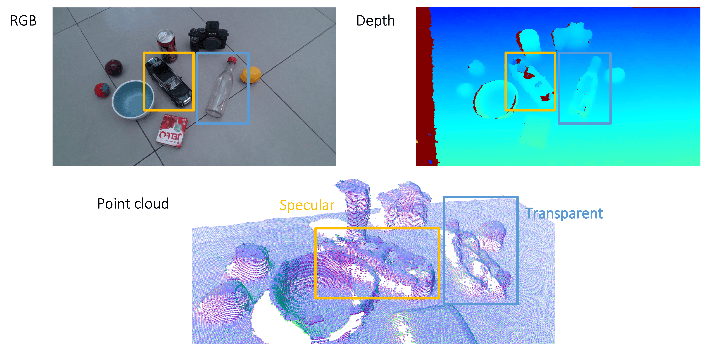
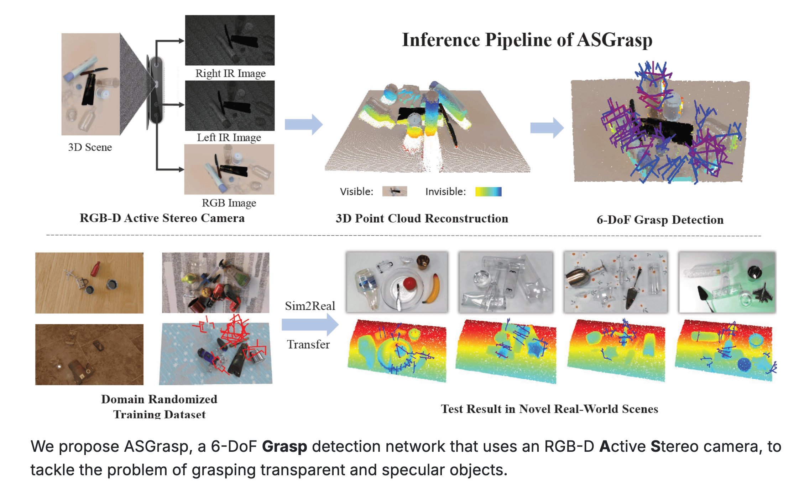
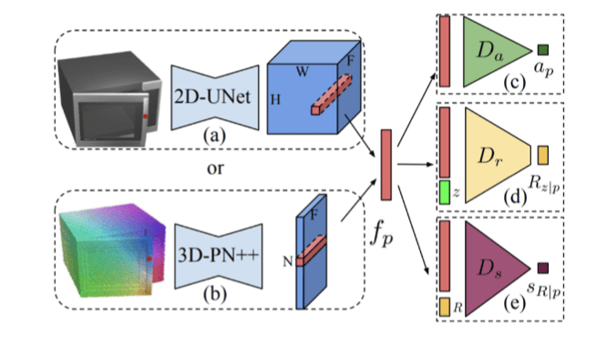
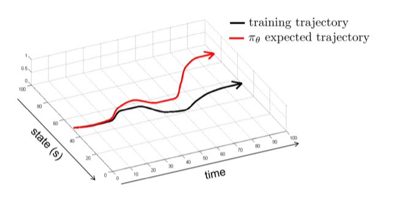
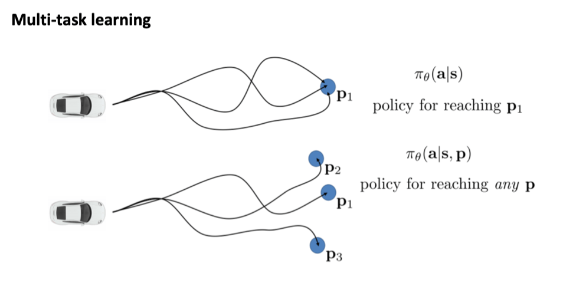
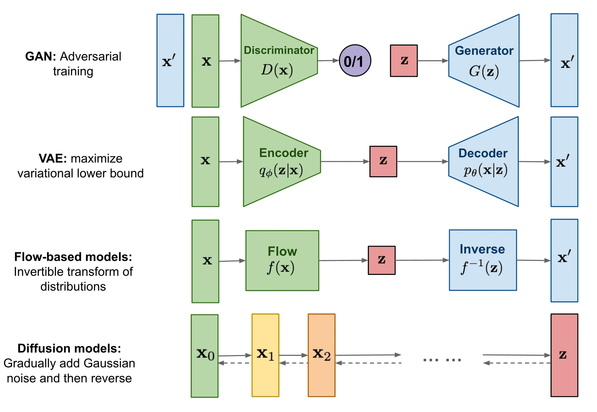
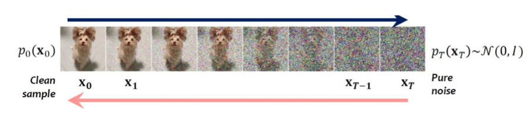

# 08 Policy I

## 条件抓取生成模型（Conditional Grasp Generative Model）

### 问题定义与挑战

目标：在一个包含多个物体的杂乱场景（例如，一个箱子里的物品）中，规划灵巧手的抓取动作。

核心挑战：

1.  **避免碰撞**：抓取目标物体的同时，要尽量避免与场景中的其他物体或环境发生不必要的碰撞。
2.  **泛化性**：模型需要能够泛化到新的物体（不同的几何形状）和新的场景布局（不同的物体分布）。

与单物体抓取的区别：相比于抓取一个孤立的物体，杂乱场景中的抓取规划要复杂得多，因为它需要同时考虑物体间的相互作用和潜在的碰撞。

进阶问题：有些研究会先通过 **非抓握操作（Non-prehensile Manipulation，如推、拨）** 将目标物体分离出来，简化后续抓取。

### DexGraspNet

核心是利用大规模 **合成数据（Synthetic Data）** 进行训练，并通过深度学习模型来学习抓取策略。

#### 场景理解模块（Scene Understanding）

输入：场景的点云数据。

任务：

-   预测场景中每个点的 **抓取可能性（Graspness）**：哪些区域适合进行抓取。
-   区分前景 **物体（Objectness）** 与背景（如桌面）。

方法：使用一个点云处理网络（如基于稀疏卷积的网络）进行监督学习，标签（Graspness, Objectness）从合成数据中自动生成（由合成数据提供监督信号）。

#### 局部区域提议与特征提取（Local Region Proposal & Feature Extraction）

动机：**直接使用整个场景的全局特征（Global Feature）来指导抓取生成存在困难**

-   **弱关联性**：全局特征与特定位置的抓取动作之间的关联可能不够强，导致以之为条件的条件生成模型学习效果不佳，**甚至退化为无条件生成**。

    老师提到，**conditon 最好要和输出结果有很强的 correlation**，这样效果更好，且更好建模、泛化。

-   **泛化性差**：新场景的全局特征可能与训练数据差异巨大，导致模型难以迁移。

方法：

-   **根据第一步预测的 Graspness Score，选择得分最高的点** （例如 Top 1%）。
-   围绕这些高分点，提取局部区域（Local Region）的点云。
-   从这些局部点云区域中提取局部特征（Local Feature）。这些局部特征（如平坦表面、边缘、角落等 **几何信息** ）在不同场景中更可能重复出现，有助于提升泛化性。

#### 条件抓取生成模块（Conditional Grasp Generation）

输入：上一步提取的局部特征。

任务：生成有效的抓取位姿，包括末端执行器的 6D 位姿（位置 $T$ 和姿态 $R$）以及手的形态（手指配置 $\theta$）。

面临的挑战：抓取的 **多模态性（Multi-modality）**。对于同一个物体或区域，通常存在多种有效的抓取方式（多峰分布）。如果直接使用回归（Regression）预测单一抓取，**模型倾向于输出所有可能抓取的 “平均值”**，而这个平均抓取往往是无效的（Mode Average 问题）。

> 开车避障时，你可以选择左打方向盘或者右打方向盘，但模型为了降低 Loss，会输出平均值 —— 啥都不动，直直撞上去。

解决方案：**解耦建模**，将抓取生成分解为两个步骤。

1.  **建模末端 6D 位姿的分布**：认为末端位姿 $(T, R)$ 的选择具有明显的 **多模态特性**。

    所以，使用一个 **条件生成模型** （如 Diffusion Model）来学习在给定局部特征条件下的 **位姿分布** $p(T, R | \text{local\_feature})$，**并从中采样得到 $(T,R)$**

2.  预测手型：假设当末端位姿 $(T, R)$ 固定后，最优的手指形态 $\theta$ 的不确定性大大降低（近似单峰分布）。

    因此，可以使用一个 **回归模型**，根据采样得到的 $(T, R)$ 和局部特征来预测手型 $\theta = f(T, R, \text{local\_feature})$。

生成过程：先从学习到的分布 $p(T, R | \text{local\_feature})$ 中采样一个或多个候选的末端位姿 $(T, R)$，然后对每个采样出的位姿预测对应的手型 $\theta$。

#### 实验结果与分析

消融实验证实，**使用局部特征作为条件相比于使用全局特征，抓取成功率有显著提升**，这验证了局部特征在增强关联性和泛化性方面的关键作用。

Scaling Law：抓取性能与训练数据的规模（抓取样本数量和场景多样性）显著相关，使用合成数据可以大幅提升成功率（10 万～ 1000 万），但存在边界收益递减的问题。

#### 优点

1. 有效的数据合成管线
2. 设计了一个 **端到端** 的框架

#### 局限性

1. 抓取类型：仅处理包覆式抓取（Power Grasp），没处理指尖抓取（Precision Grasp），如用指尖捏取小物体
2. 抓取闭合类型：主要使用力封闭抓取（Force-Closure Grasp），但是存在非力封闭的场景（如托起物体）

## 透明与高反光物体

### 问题概述

尽管像 GraspNet 这样的方法在许多物体上表现良好，但它们在处理透明（Transparent）或高反光（Highly Specular/Shiny）物体时会遇到巨大挑战。

主要原因在于，目前商用的深度传感器（Commercial Depth Sensor），如基于飞行时间（Time-of-Flight, ToF）或结构光（Structured Light）的传感器，其工作原理依赖于对光线传播的特定假设，例如：

-   它们假设光线照射到物体表面后会直接反射回来。
-   结构光方法假设投射的特定光图案（Pattern）在物体表面会发生可预测的漫反射（Diffuse Reflection），通过观察反射图案的变形来推算深度。

然而，对于透明物体，大部分光线会发生折射（Refraction）并穿透物体，而不是反射。对于高反光物体，光线会发生镜面反射（Specular Reflection），形成高光区域，这与传感器通常假设的漫反射模型不符。

这些问题会 **导致点云的质量（quality）变差**，所以在深度传感器看来，透明或高反光物体的几何结构往往是残缺不全的。

由于输入的点云质量低下，依赖于几何信息进行抓取规划的方法自然难以有效工作。

### ASGrasp

核心目标：**深度修复**，获得高质量的深度信息。

ASGrasp 采用基于学习的深度感知（Learning-based Depth Sensing）方法，而不依赖固定物理模型的传统方法。

1.  **合成数据驱动**：利用图形学渲染技术生成大量的合成数据。每条数据包含一个渲染出的场景图像（RGB Image）和与之对应的 “完美” 深度图或点云（Ground Truth Depth/Point Cloud）。
2.  **监督学习**：将（图像，真实深度）作为 **配对的监督信号**，训练一个深度学习网络。这个网络学习从输入的（可能有问题的）传感器图像直接预测出准确的深度信息 $f: \text{Image} \rightarrow \text{Depth}$。

显然，依赖于合成数据的方法主要挑战在 **泛化性（Generalization）** 问题。

为了解决泛化性问题，合成数据必须具有足够的 **多样性（Diversity）**。

**域随机化（Domain Randomization）**：在生成合成数据时，尽可能地随机化各种环境和物体参数，使得训练数据覆盖足够广泛的分布，防止对特定条件产生过拟合（overfit），从而让模型对真实世界中未曾见过的变化更具鲁棒性。

域随机化的方面包括：

1.  物体和布局（Objects and Layout）
2.  材质（Materials）
3.  背景（Backgrounds）
4.  **光照（Illumination）**
5.  相机视角（Camera Viewpoints）

除了使用多样化合成数据进行训练。ASGrasp 另一核心是 **多模态立体视觉** （Multi-modal Stereo Vision）方案，**它同时利用了红外图像（Infrared，IR）和彩色图像（RGB）来估计深度**。且其中使用了类似双目视觉的 **立体匹配（Stereo Matching）** 方法来得到深度信息。

ASGrasp 的独特之处在于其 **混合匹配策略**：

1.  它首先利用 **红外图像对（IR Image Pair）** 进行双目立体匹配，红外成像对于某些在可见光下难以处理的材质（如透明、高反光）可能提供更稳定的特征。
2.  同时，它将 **彩色图像（RGB Image）** 作为 **额外的上下文信息（Additional Context）** 融入匹配过程。RGB 图像提供了丰富的颜色和纹理信息，可以帮助消除歧义（disambiguate），或者在 IR 信息不足时提供补充。

在网络结构层面，ASGrasp 采用了在立体匹配领域常见的技术：

1.  **相关性金字塔 / 代价体（Correlation Pyramid / Cost Volume）**：编码不同视差下的匹配代价。
2.  **由粗到精（Coarse-to-Fine）的优化策略**：逐步细化深度图，提高精度。

通过这种方式，ASGrasp 能够生成高质量的深度图，尤其是在处理传统方法难以应对的透明和高反光物体时表现出色。

而拥有了更准确的深度图后，就可以将其输入到后续的抓取规划块中，能够为这些原本难以感知的物体生成有效的抓取位姿。

## 可供性（Affordance）

前面的讨论主要集中在如何通过视觉感知来抓取物体。然而，机器人的能力不应仅限于抓取，更进一步需要执行各种 **操作（Manipulation / Operation）**。

**可供性（Affordance）**：指一个物体所能支持或提供的交互方式或操作可能性。

它描述了环境或物体向交互者（人或机器人）提供的潜在行动可能性。

> 例如：
>
> -   一个抽屉的可供性是它可以被拉出（Pullable）或推入（Pushable）。
> -   一扇门的可供性在于它的门把手可以被抓住（Graspable），并且门可以被打开（Openable）。
> -   一把刀作用于一个水果时，水果的可供性在于它可以在某些区域被切割（Cuttable）。

在机器人学中，我们关注的可供性通常是指：为了让机器人完成某个特定的操作任务，它应该与物体的 **哪个区域（Where）** 进行交互，以及应该 **以何种方式（How）** 进行交互。

可供性通常被表示为热力图，也称 **可供性图（Affordance Map）**。对于不同的动作会有不同的可供性图，指示那个地方适合此类动作。

因此，通过预测这样的可供性地图，机器人就能知道哪些区域是执行特定操作的有效接触点。

### Where2Act

利用学习方法来预测物体可供性的工作。

1.  **数据收集**：让机器人在仿真或真实环境中对各种物体（尤其是带有可活动部件的铰接物体，articulated objects）进行大量的随机交互尝试（推、拉、拽等）。
2.  **标注**：记录下哪些尝试成功了（如成功打开抽屉），哪些失败了。成功的交互区域和方式就构成了正样本训练数据。
3.  **模型训练**：训练一个深度学习模型，输入物体的视觉信息（如图像和 / 或点云），输出其可供性图。

#### Pipeline

输入：2D / 3D

特征融合：将 2D 和 3D 特征进行融合，得到每个点的综合特征 $f_p$。

输出预测：基于融合后的特征 $f_p$，模型会预测多个信息：

-   交互点（Contact Point）：预测哪些点适合进行交互（输出表示可交互性的分数 $a_p$，affordance）。
-   交互方向（Interaction Direction）：预测在某个点上，应该沿着哪个方向进行交互（输出方向 $R_{z|p}$）。这可能需要对方向进行离散化或直接回归。
-   成功置信度（Success Confidence）：预测在该点以预测方向进行交互的成功概率或置信度（输出成功得分 $s_{R|p}$）。

### VAT-Mart

VAT-Mart 进一步扩展了可供性的概念，认为仅仅预测交互点和初始方向可能不足以完成复杂的、需要遵循特定路径的操作。

> 例如，打开一个旋转门，如果只是沿着一个固定方向拉门把手，很快就会因为运动轨迹不匹配而失败。正确的操作需要沿着门转动的弧线运动。

VAT-Mart 不仅预测可供性区域（affordance），还预测出一整条 **操作轨迹（trajectory）**。

## 视觉驱动的开环方法总结

### 应用

利用视觉输入进行预测：

-   预测 **物体位姿（Object Pose）**：通常需要物体的 CAD 模型和抓取标注。
-   预测 **抓取位姿（Grasp Pose）**：可以直接预测抓取点和姿态，无需 CAD 模型或预定义抓取。
-   预测 **可供性（Affordance）**：超越简单抓取，指导更广泛的交互操作。

**运动规划（Motion Planning）**：利用预测出的目标（如抓取位姿或交互点 / 轨迹），结合环境信息（避障），规划出机器人手臂的运动路径。

实际执行中，运动规划往往需要结合一些启发式（heuristics）规则或技巧（tricks）来提高成功率和鲁棒性。例如 **预抓取（Pre-grasp）位置**，先移动到目标抓取点附近的一个安全位置，再直线接近并闭合夹爪，可以避免不必要的碰撞。

### 局限性

**操作复杂度有限**：通常只能处理一些预定义好的、相对简单的操作（如开抽屉、开柜门）。更复杂的操作（如转笔）超出了当前基于可供性预测和运动规划的框架能力。**主要瓶颈在于启发式规则的设计。**

**开环执行**：规划一次，执行到底。系统根据初始的视觉观测进行规划（抓取位姿、运动轨迹等），然后执行这个预先计算好的计划，在执行过程中 **不再接收新的视觉反馈** 来调整动作。**就像闭着眼睛做事一样。**

显然，对于开环来说，一旦执行过程中出现预期之外的情况，例如物体被意外碰到、滑动，或者初始感知 / 规划存在误差，整个任务很可能失败，因为系统无法根据实时变化进行调整。

但是，通过 **高频率地重复 “感知 - 规划 - 执行”** 的循环，将开环系统近似转化为闭环系统。

## 策略学习

**策略学习（Policy Learning）** 旨在解决开环抓取和规划中动态特性不足、无法及时根据环境状态调整的问题。

策略学习的核心在于构建一个能够根据环境状态变化采取合理策略的方案，本质上就是一个 Policy。**Policy 拥有闭环执行的潜力**，能够更好地适应场景状态的变化，从而使机器人操作更加鲁棒和高动态。

### 基础约定

-   **状态（State）$s_t$**：环境的状态，这些状态通常隐藏在观测之下
-   **观测（Observation）$o_t$**：对环境的观测，例如点云或图像。观测蕴含状态的信息，但通常是局部的、片面的。**观测是状态的体现，状态是观测的本质**
-   **动作（Action）$a_t$**：在特定状态或观测下采取的策略，Policy 的目标就是根据场景中的状态变化动态地做出响应
-   **策略（Policy）$\pi(a_t|s_t)$ / $\pi(a_t|o_t)$**：Policy 定义了在特定状态 / 观测下应该采取什么样的动作。通常用参数 $\theta$ 来参数化 Policy，记作 $\pi_\theta$

如果 Policy 基于状态 $s_t$ 来决定动作 $a_t$，则称该 Policy 为 **Fully Observed** 的策略。这意味着所有环境状态都是可观测的，虽然在现实中，我们通常只能获得部分观测。

我们的目标即为学习到这个策略。

## 模仿学习（Imitation Learning）

策略学习中最简单的方法就是监督学习，即模仿专家的行为。专家在每个状态或观测下给出正确的动作，然后通过监督学习训练 Policy。

### 示例：Point Goal Navigation

目标：在场景中导航到一个目标点。

传统方法（如 A\* 算法）：在已知地图的情况下可以找到最短路径。

策略学习：**将传统路径规划算法作为老师（提供监督信号）**，指导 Policy 在每一步应该如何走才能更快到达目标点。

与传统方法的区别：即使没有地图，也可以通过训练一个基于视觉观测的 Policy，从而将策略应用到未建立地图的新场景中。

这是一种典型的模仿学习策略。

### 模仿学习的执行过程

策略执行过程可以概括如下：

1.  **观测（Observation）$o_t$**：观测环境，可能蕴含环境状态的描述。
2.  **策略（Policy）$\pi(a_t|o_t)$**：根据观测，Policy 决定采取的动作。
3.  **状态转移（State Transition）**：采取动作后，环境状态发生改变。

通过这样的方式，逐步迭代执行。

#### Markov 假设

**定义**：在任何状态下做判断时，只需根据当前状态来决定接下来应该采取什么动作，无需考虑过去经历了哪些状态。**当前状态已经包含了过去历史的充分信息。**

**Markov 假设并非总是成立。** 例如，司机超车时会根据自己的一些历史信息（如右后方是否有车辆）来决定是否变道。

### Behavior Cloning

Behavior Cloning (BC) 是一种基本的模仿学习方案。根据观测，数据集包含专家在特定状态下采取的动作。**通过监督学习，建立从观测到动作的映射关系**，并使用动作层面的监督信号进行梯度回传，从而训练 Policy。

BC 将模仿学习问题视为一个监督学习问题。给定专家在状态 $s$ 下采取的动作 $a$ 的数据集 $D = \{(s_i, a_i)\}_{i=1}^N$，行为克隆的目标是学习一个策略 $\pi_\theta(a|s)$，使得在给定状态 $s$ 时，策略输出的动作 $a$ 尽可能接近专家动作 $a^*$。通常通过最小化预测动作与专家动作之间的差异来实现，例如使用均方误差损失：

$$
\theta^* = \arg \min_\theta \sum_{(s_i, a_i^*) \in D} || \pi_\theta(s_i) - a_i^* ||^2
$$

#### BC 历史

1989 年，研究人员使用神经网络处理视觉输入，并将其映射到车辆的行为（方向盘转动角度、油门、刹车等）。这是 Behavior Cloning 的雏形。

2016 年，研究人员尝试使用深度学习方案改进 Behavior Cloning，用于自动驾驶。相比于早期的思路，这些改进包括更深的网络、更多的数据，以及更好的校正机制。即使使用基本的 Behavior Cloning，也能展示出不错的自动驾驶能力。

#### Distribution Shift

**定义**：模仿学习依赖于训练数据和测试数据具有较好的分布一致性。当这种分布一致性被打破时，**模型很难泛化到测试集**。而且，随着时间的推移，偏差会不断增大，尤其是在长序列任务中。一开始可能与训练分布一致，但执行步数越多，偏差越大，最终完全不可回头。

这是因为：

1.  专家演示数据通常只覆盖了状态空间中很小的一部分，即专家成功执行任务时所经历的状态。
2.  学习到的策略 $\pi_\theta$ 不可能完美复制专家策略 $\pi^*$。即使是很小的误差，也会导致智能体在执行过程中逐渐偏离专家的状态分布。
3.  一旦智能体进入训练数据中未曾出现过的状态，行为克隆训练出的策略可能无法做出正确的决策，导致错误累积，最终可能完全失败。

就像在一个陌生的环境中，有人带路，但之后开始乱走，走到一个完全陌生的环境，就会迷路。除非有专家重新指导，否则无法回到正确的轨迹。

#### BC 的实际应用

尽管有局限性，但当数据足够大时，Behavior Cloning 仍然可以表现出不错的性能。

遥操作可以通过动捕或机器人主从同步等方式获取专家数据。有了这些数据，就可以通过 BC 进行学习。

-   **合成数据**：量大，但可能存在外观（Appearance）和物理（Physics）方面的差异，导致从虚拟环境学习的技能难以迁移到真实场景。需要进行充分的 **域随机化（Domain Randomization）**
-   **遥操作数据**：在真实 / 虚拟场景（虚拟场景中便于数据增强）中采集，可以减少 Appearance 和 Physics 的差异。但代价高昂，且仍然可能存在泛化问题

### 解决 Distribution Shift 的思路

既然 Distribution Shift 来自于分布的不同，那么解决 Distribution Shift 的核心在于让这两个分布更加对齐（Alignment）。

有两种主要思路：

1.  **改变 $p_{\text{data}}(o_t)$**：扩充专家数据的轨迹，使其能够覆盖策略执行过程中可能出现的状态空间。
2.  **改变 $p_{\pi}(o_t)$**：给定专家轨迹，更好地拟合专家的轨迹，避免偏离专家的路线。

#### Dataset Aggregation

Dataset Aggregation（DAgger）是一种改变 $p_{\text{data}}(o_t)$ 的方法，旨在扩充训练数据，使其能够覆盖策略执行过程中可能出现的状态空间。

其核心思想是在训练过程中主动收集策略在执行时遇到的状态，并向专家请教这些状态下的正确动作，然后将这些新的数据加入训练集中。

1.  **初始化**：使用初始的专家数据集 $D$ 训练一个初始策略 $\pi_1$。
2.  **迭代执行** （对于 $i = 1, 2, ..., N$）：
    1. **执行策略**：让当前的策略 $\pi_i$ 在环境中执行，收集遇到的状态序列 $s_1, s_2, ...$ **（Rollout）**
    2. **专家标注**：对于收集到的状态 $s_t$，查询专家策略 $\pi^*$，得到专家会采取的动作 $a_t^* = \pi^*(s_t)$
    3. **数据聚合**：将新的状态 - 动作对 $(s_t, a_t^*)$ 加入到数据集 $D$ 中，即 $D \leftarrow D \cup \{(s_t, a_t^*)\}$
    4. **重新训练**：使用聚合后的数据集 $D$ 重新训练策略，得到 $\pi_{i+1}$
3.  **输出**：最终得到的策略 $\pi_N$。

通过这种方式，监督数据集不断增长，覆盖实际执行过程中可能看到的各种状态，从而使 Policy 更加可控。

**问题**：出错了再标注的话，可能会对策略的准确性有所伤害（因为这种情况下你学到的不是完美的 Policy），但通常因为看到新的状态带来的学习经验收益更大。

#### 从最优解中获取（From optimal solution）

利用传统算法，来构建一个传统的最优求解器（如 A\* 搜索）。当学习的策略偏离最优路径时，可以使用这个求解器来提供完美的纠正动作，指导策略回到正轨。

#### 从教师策略中学习（From a teacher solution）

我们可以假设存在一个 **教师策略**，它拥有比 **学生策略** 更多的 **特权信息（Privileged Knowledge）**，例如仿真环境中的真实状态、物体精确的姿态或物理属性等。

利用这些特权信息，教师策略可以更容易地规划出最优动作。然后，让只能看到部分观测（如图像、点云）的学生策略去模仿教师策略的行为。

这样，即使学生策略偏离了，教师策略也能根据当前状态（利用其特权信息）给出在线的、正确的指导动作。这与仅提供固定的专家轨迹不同，教师策略具有在线适应和纠错能力。

### 非马尔可夫性与历史信息

传统的行为克隆通常假设环境满足马尔可夫性（Markov Property），即当前动作仅依赖于当前观测状态 $o_t$。然而，在现实世界中，我们通常只能获得 **部分观测（Partial Observation）** $o_t$，它并不包含环境的完整状态 $s_t$。

> 例如，一个经验丰富的司机在超车时，其决策可能依赖于几秒前看到的后视镜信息（即历史观测），即使当前观测 $o_t$ 中并没有显示那辆车。在这种情况下，仅根据当前观测 $o_t$ 学习动作 $a_t$ 的策略 $\pi(a_t|o_t)$ 会遇到困难：对于相同的观测 $o_t$，由于历史信息的不同，专家可能采取不同的动作（例如有时超车，有时不超车）。模型试图拟合这种一对多的映射关系，可能会学到一个无效的 “平均” 行为。

一个自然的解决方案是 **引入历史信息**，即将过去的观测序列 $(o_{t-k}, ..., o_t)$ 作为策略的输入，学习 $\pi(a_t | o_{t-k}, ..., o_t)$。这通常可以通过循环神经网络（RNN）或 Transformer 等序列模型实现。

然而，引入历史信息也带来了新的问题：

1.  **过拟合（Overfitting）**：输入维度大大增加，模型更容易在训练数据上过拟合，学到一些 spurious correlations（虚假关联），导致泛化能力下降。

2.  **因果混淆（Causal Confusion）**：模型在学习时，可能错误地将相关性当成了因果关系。

    > 例如，在自动驾驶数据中，每次踩刹车（action）都伴随着前方出现行人（cause）和刹车灯亮起（effect/correlation）。模型如果只学习到了 “观测到刹车灯亮起” 与 “踩刹车” 之间的关联，而忽略了 “看到行人” 这个真正的原因，就会做出错误的决策。它可能会认为只要刹车灯没亮，就不需要刹车，即使前方有行人。引入历史信息会使得输入维度更高，潜在的虚假关联更多，从而加剧因果混淆的风险。

### 多峰行为

和之前 DexGrapsNet 提到的一样，专家在面对同一个状态时，可能会有多种同样合理的行为选择。例如，在避障时，专家可能有时选择从左边绕过障碍物，有时选择从右边绕过。这种行为被称为 **多峰行为**。

如果使用标准的行为克隆（例如，一个简单的多层感知机 MLP 直接回归动作），模型会试图拟合所有这些不同的专家动作。

-   对于离散动作，这可能导致模型在不同动作间犹豫不决

-   对于连续动作（如方向盘角度），模型可能会输出所有专家动作的平均值。

在上面的避障例子中，如果专家演示中左右绕行的概率各半，模型的平均输出可能是 “直行”，直接撞上障碍物。

### 多峰行为解决方案：对动作分布进行建模

为了解决多峰行为问题，我们需要使用更强大的模型来显式地建模动作的 **分布** $\pi(a|s)$，而不是仅仅预测一个单一的确定性动作。

#### 高斯混合模型（Gaussian Mixture Models, GMM）

假设动作分布可以由多个高斯分布的加权和来表示。策略网络输出每个高斯分量的均值（mean）、方差（variance）以及它们的权重（weight）。

$$
p(a|s) = \sum_{k=1}^K w_k(s) \mathcal{N}(a | \mu_k(s), \Sigma_k(s))
$$

其中 $K$ 是预先设定的模式（mode）数量。这种方法的优点是简单直观，但难点在于如何预先确定合适的 $K$ 值。

#### 基于隐变量的模型（Latent Variable Models）

例如变分自编码器（Variational Autoencoder, VAE）。

将动作的生成过程建模为一个包含随机隐变量 $z$ 的条件生成模型 $p(a|s, z)$。通过从隐空间 $z$ 中采样，可以生成多样的动作。

例如，ALOHA 工作就使用了条件 VAE（CVAE）来建模动作分布，其策略 $\pi(a|s)$ 通过先从一个条件先验 $p(z|s)$ 中采样隐变量 $z$，再通过解码器 $p(a|s, z)$ 生成动作。训练时通过最大化证据下界（ELBO）来学习。

$$
\log p(a|s) \ge \mathbb{E}_{q(z|s,a)}[\log p(a|s,z)] - D_{KL}(q(z|s,a) || p(z|s))
$$

#### 扩散模型（Diffusion Models）

扩散模型可以用来建模复杂的动作分布。

其核心思想是通过一个逐步去噪的过程从纯噪声中生成目标数据（这里是动作）。Diffusion Policy 这项工作就是将扩散模型应用于模仿学习。给定状态 $s$，模型学习一个去噪网络，该网络可以迭代地将一个随机噪声向量转化为符合专家行为分布的动作 $a$。

#### 自回归建模（Autoregressive Modeling）

对于高维度的动作空间（例如，机械臂的多个关节角度），可以将动作 $a = (a_1, a_2, ..., a_d)$ 的联合分布分解为一系列条件概率的乘积：

$$
p(a|s) = p(a_1|s) p(a_2|s, a_1) \cdots p(a_d|s, a_1, ..., a_{d-1})
$$

然后，对每一维的条件概率 $p(a_i | s, a_1, ..., a_{i-1})$ 进行建模。

一个常用的技巧是先将每一维的连续动作 $a_i$ 进行 **离散化（Discretization）**，将其值域划分为若干个区间（bins）。然后，将建模问题转化为预测在给定条件（状态 $s$ 和之前的动作维度 $a_1, ..., a_{i-1}$）下，当前动作维度 $a_i$ 属于哪个离散区间的概率分布。这变成了一个分类问题，可以用神经网络输出每个区间的概率。通过这种自回归和离散化的方式，可以将复杂的高维连续动作分布建模问题，转化为一系列相对简单的、一维离散概率分布的建模问题。在生成动作时，按顺序依次对每一维进行采样。

### 多任务学习（Multi-task Learning）

在许多实际场景中，我们收集到的专家数据可能包含执行不同任务（或同一任务的不同目标）的轨迹。例如，导航数据可能包含去往不同目的地的轨迹。

与其为每个任务单独训练一个策略（这会减少每个任务可用的数据量），不如采用 **多任务学习** 的思路。我们可以训练一个 **目标条件化（Goal-conditioned）** 的策略 $\pi(a|s, g)$，该策略不仅依赖当前状态 $s$，还依赖于当前要完成的目标 $g$。

这样做的好处是：

1.  **数据效率**：所有任务的数据可以一起用来训练一个共享的模型，增加了有效训练数据量。
2.  **知识共享**：不同任务之间可能存在共享的子结构或技能（例如，从北大无论开车去哪里，都得先开出北大东门）。多任务学习使得模型可以学习这些共享的知识，并互相促进，可能比单任务学习效果更好。

然而，多任务学习也引入了 **目标空间的分布偏移**：除了状态空间 $s$ 可能存在分布偏移外，目标空间 $g$ 也可能存在分布偏移。如果在测试时遇到一个训练时从未见过的目标 $g$，策略的泛化能力就面临考验。

### 模仿学习的局限性

尽管模仿学习（尤其是结合了 DAgger 和先进模型结构后）非常强大，甚至催生了许多成功的应用（如一些基于大模型的机器人控制），但它仍然有其局限性：

1.  **依赖专家数据**：需要大量高质量的专家演示数据，获取成本可能很高。
2.  **无法超越专家**：策略的性能上限受限于专家的水平。
3.  **不适用于高度动态或不稳定的任务**：对于那些需要精确反馈和快速调整的任务（例如，让机器人用指尖转笔），微小的误差就可能导致失败。在这种情况下，仅仅模仿轨迹可能不足以学习到鲁棒的策略，因为系统对状态扰动非常敏感，而专家数据可能无法覆盖所有可能的微小扰动及其纠正措施。

## 强化学习

> 懒得详细写了，当年学过强化学习课程已经被狠狠摧残过一遍了。
>
> 推荐参照 [动手学强化学习](https://hrl.boyuai.com/) 自学。

### 马尔可夫决策过程（Markov Decision Process，MDP）

$$
\mathcal{M} = \{S, \mathcal{A}, \mathcal{T}, r\}
$$

其中：

-   $\mathcal{A}$：动作空间 (Action Space)，智能体可以采取的动作。
-   $\mathcal{T}$：状态转移算子 (Transition Operator)，现在依赖于状态和动作，$p(s_{t+1}|s_t, a_t)$。
-   $r$：奖励函数 (Reward Function)，$r：S \times \mathcal{A} \to \mathbb{R}$，表示在状态 $s_t$ 执行动作 $a_t$ 后获得的即时奖励 $r(s_t, a_t)$。

### 部分可观测马尔可夫决策过程（POMDP）

部分可观测马尔可夫决策过程（Partially Observable Markov Decision Process, POMDP）是 MDP 的扩展，其中智能体只能观测到部分状态。

$$
\mathcal{M} = \{S, \mathcal{A}, \mathcal{O}, \mathcal{T}, \mathcal{E}, r\}
$$

其中：

-   $\mathcal{O}$：观测空间 (Observation Space)，智能体可以观测到的状态
-   $\mathcal{E}$：观测概率 (Observation Probability)，$p(o_t|s_t, a_t)$，描述在真实状态 $s_t$ 下，观测到 $o_t$ 的概率 $p(o_t|s_t)$
-   $\mathcal{T}$：状态转移算子 (Transition Operator)，$p(s_{t+1}|s_t, a_t)$

此时，智能体 **无法直接知道** 当前的真实状态 $s_t$，只能得到一个与 $s_t$ 相关的观测 $o_t$。

### 强化学习的目标

**强化学习**：学习一个策略（policy） $\pi_\theta(a|s)$ （由参数 $\theta$ 决定），使得在一个轨迹（trajectory） $\tau =(s_1, a_1, s_2, a_2, ...)$ 上的累积奖励期望最大化。

$$
\begin{aligned}
\theta^* &= \arg\max_\theta \mathbb{E}_{\tau \sim p_\theta(\tau)} \left[ \sum_t r(s_t, a_t) \right] \\
&= \arg\max_\theta \mathbb{E}_{(s_t, a_t) \sim p_\theta(s_t, a_t)} \left[ r(s_t, a_t) \right]
\end{aligned}
$$

其中，$p_\theta(\tau) = p(s_1) \prod_{t=1}^T \pi_\theta(a_t|s_t) p(s_{t+1}|s_t, a_t)$ 是轨迹 $\tau$ 出现的概率。

注意这个式子暗含了马尔可夫性，因为状态转移概率 $p(s_{t+1}|s_t, a_t)$ 只依赖于 $s_t$ 和 $a_t$）。

**有限时间界（Finite Horizon）**：最大化固定步数 $T$ （有限时间）内的总奖励期望。

$$
\theta^* = \arg\max_\theta \sum_{t=1}^T \mathbb{E}_{(s_t, a_t) \sim p_\theta(s_t, a_t)} [r(s_t, a_t)]
$$

其中 $p_\theta(s_t, a_t)$ 是在 $t$ 时刻访问状态 - 动作对 $(s_t, a_t)$ 的概率（边际分布）。

**RL 优化的是期望奖励**：即使奖励函数本身不平滑，期望奖励 $\mathbb{E}_{\pi_\theta}[r(x)]$ 通常是关于策略参数 $\theta$ 平滑的，这使得基于梯度的优化方法成为可能。
