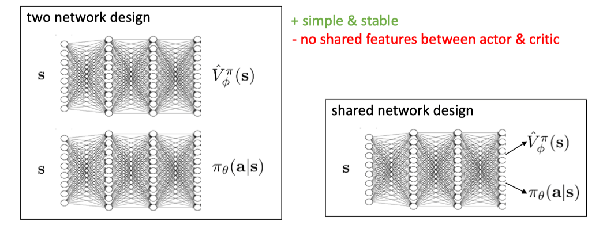
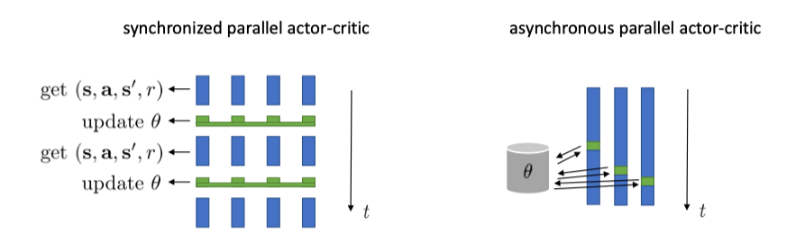

# 09 Policy II

## 从模仿学习到强化学习

模仿学习（IL）使用固定的专家数据进行离线学习（Offline Learning），通过行为克隆（BC）等方式模仿专家策略。**其主要局限在于难以处理专家数据未覆盖的状态（OOD）**。

> 如果专家演示也有对错误状态或偏离专家轨迹情况的处理，那也能学的不错。

强化学习（RL）允许智能体与环境在线交互，通过试错和环境反馈（奖励）学习。这使得 RL 能够探索更广泛的状态空间并学习处理未知情况。

**离线学习（Offline Learning）**：指学习过程无法干预数据的产生过程。我们只能使用一个预先收集好的、固定的数据集进行学习。模仿学习中的 BC 就是典型的离线学习。

**在线学习（Online Learning）**：指智能体在学习过程中可以主动与环境交互，实时产生新的数据，并利用这些新数据更新自己的策略。强化学习通常可以在线进行。

与 BC 不同，RL 允许智能体与环境进行交互（从而可以探索到状态空间中更广泛的区域），可以做 Online 学习（但不是所有的 RL 算法都是 Online 的）。

## 强化学习基础与目标

强化学习的目标是找到一个最优策略参数 $\theta^*$，使得在该策略下产生的轨迹的期望回报最大化。即优化目标函数 $J(\theta)$：

$$
J(\theta) = \mathbb{E}_{\tau \sim p_\theta(\tau)} [R(\tau)] = \mathbb{E}_{\tau \sim p_\theta(\tau)} \left[ \sum_{t=0}^{T} r(s_t, a_t) \right]
$$

这里，$p_\theta(\tau)$ 表示由策略 $\pi_\theta$ 与环境交互产生的轨迹 $\tau$ 的概率分布，这个分布由策略 $\pi_\theta$ 和环境共同决定。

由于策略和环境都可能具有随机性，单次轨迹的回报 $R(\tau)$ 可能不同。因此，我们的目标是在所有可能轨迹的分布上，最大化期望回报。我们主要关注 **有限时间步（finite horizon）** 的情况，即任务在 $T$ 步内完成。

## 策略梯度（Policy Gradient）

直接优化 $J(\theta)$ 通常很困难，因为期望的计算涉及到对所有可能轨迹的积分或求和，这在连续或高维状态动作空间中是难以处理的。

### 蒙特卡洛近似（Monte Carlo Approximation）

**蒙特卡洛（Monte Carlo）**：多次采样求平均，从而近似地计算期望。

使用当前的策略 $\pi_\theta$ 与环境交互，生成 $N$ 条轨迹 $\tau^{(1)}, \tau^{(2)}, \ldots, \tau^{(N)}$。然后用这些样本的平均回报来近似期望回报：

$$
J(\theta) \approx \frac{1}{N} \sum_{i=1}^{N} R(\tau^{(i)}) = \frac{1}{N} \sum_{i=1}^{N} \sum_{t=0}^{T} r(s_t^{(i)}, a_t^{(i)})
$$

虽然我们可以近似 $J(\theta)$ 的值，但为了使用梯度上升（Gradient Ascent）方法来优化 $\theta$，我们需要计算目标函数关于参数 $\theta$ 的梯度 $\nabla_\theta J(\theta)$。

直接对蒙特卡洛近似形式求梯度是困难的，因为轨迹的生成过程 $\tau \sim p_\theta(\tau)$ 本身就依赖于 $\theta$。

### 策略梯度定理（Policy Gradient Theorem）

从期望的定义出发：

$$
J(\theta) = \int p_\theta(\tau) R(\tau) \mathrm{d}\tau
$$

对其求梯度：

$$
\nabla_\theta J(\theta) = \nabla_\theta \int p_\theta(\tau) R(\tau) \mathrm{d}\tau = \int \nabla_\theta p_\theta(\tau) R(\tau) \mathrm{d}\tau
$$

这里用到了梯度和积分可以交换顺序的假设。

**引理（对数导数技巧）**：对于任何概率密度函数 $p_\theta(x)$，有 $\nabla_\theta p_\theta(x) = p_\theta(x) \nabla_\theta \log p_\theta(x)$。

> 证明：
>
> 应用链式法则于 $\log p_\theta(x)$：
>
> $$
> \begin{aligned}
> \nabla_\theta \log p_\theta(x) &= \left( \frac{\mathrm{d}}{\mathrm{d} p_\theta(x)} \log p_\theta(x) \right) \nabla_\theta p_\theta(x) \\
> &= \frac{1}{p_\theta(x)} \nabla_\theta p_\theta(x)
> \end{aligned}
> $$
>
> 这个等式成立的前提是 $p_\theta(x) > 0$。因为我们通常在概率密度函数的支撑集（support）上进行计算，这些地方的概率值是正的，所以这个假设通常是合理的。
>
> 现在，我们只需要将上式两边同时乘以 $p_\theta(x)$ 即可得到我们想要证明的公式：
>
> $$
> \begin{aligned}
> p_\theta(x) \nabla_\theta \log p_\theta(x) &= p_\theta(x) \left( \frac{1}{p_\theta(x)} \nabla_\theta p_\theta(x) \right) \\
> &= \nabla_\theta p_\theta(x)
> \end{aligned}
> $$
>
> 也即：
>
> $$
> \nabla_\theta p_\theta(x) = p_\theta(x) \nabla_\theta \log p_\theta(x)
> $$

将这个技巧应用于 $p_\theta(\tau)$：

$$
\nabla_\theta p_\theta(\tau) = p_\theta(\tau) \nabla_\theta \log p_\theta(\tau)
$$

代入梯度表达式：

$$
\begin{aligned}
\nabla_\theta J(\theta) &= \int \nabla_\theta p_\theta(\tau) R(\tau) \mathrm{d}\tau \\
&= \int p_\theta(\tau) \nabla_\theta \log p_\theta(\tau) R(\tau) \mathrm{d}\tau \\
&= \mathbb{E}_{\tau \sim p_\theta(\tau)} [\nabla_\theta \log p_\theta(\tau) R(\tau)]
\end{aligned}
$$

这个结果非常重要，它表明，**目标函数的梯度可以表示为一个期望** （蒙特卡洛：来了嗷！）。

这意味着我们可以再次使用蒙特卡洛方法来估计这个梯度：采样 $N$ 条轨迹 $\tau^{(i)} \sim p_\theta(\tau)$，然后计算：

$$
\nabla_\theta J(\theta) \approx \frac{1}{N} \sum_{i=1}^{N} \nabla_\theta \log p_\theta(\tau^{(i)}) R(\tau^{(i)})
$$

**请注意，这个梯度表达式中并没有出现奖励函数 $R(\tau)$ 关于 $\theta$ 的梯度 $\nabla_\theta R(\tau)$。**

梯度是通过 $\nabla_\theta \log p_\theta(\tau)$ 传入的。**这意味着强化学习不需要奖励函数本身是可导的（极其重要！！！）**，甚至不需要知道奖励函数的具体形式。我们只需要能够从环境中获得每个时间步的奖励值 $r(s_t, a_t)$ 即可。

这极大地扩展了强化学习的应用范围，**可以处理奖励是稀疏的、非连续的** （例如，任务成功为 1，失败为 0）等复杂情况。

利用马尔科夫性：

$$
p_\theta(\tau) = p(s_0) \prod_{t=0}^{T-1} \pi_\theta(a_t | s_t) p(s_{t+1} | s_t, a_t)
$$

其中：

-   $p(s_0)$ 是初始状态分布的概率
-   $\pi_\theta(a_t | s_t)$ 是策略在状态 $s_t$ 选择动作 $a_t$ 的概率
-   $p(s_{t+1} | s_t, a_t)$ 是环境的状态转移概率，即在状态 $s_t$ 执行动作 $a_t$ 后转移到状态 $s_{t+1}$ 的概率

取对数：

$$
\log p_\theta(\tau) = \log p(s_0) + \sum_{t=0}^{T-1} \left( \log \pi_\theta(a_t | s_t) + \log p(s_{t+1} | s_t, a_t) \right)
$$

现在对 $\theta$ 求梯度 $\nabla_\theta$：

$$
\nabla_\theta \log p_\theta(\tau) = \nabla_\theta \log p(s_0) + \sum_{t=0}^{T-1} \left( \nabla_\theta \log \pi_\theta(a_t | s_t) + \nabla_\theta \log p(s_{t+1} | s_t, a_t) \right)
$$

注意到：

1.  初始状态分布 $p(s_0)$ 通常与策略参数 $\theta$ 无关，所以 $\nabla_\theta \log p(s_0) = 0$
2.  环境的动态 $p(s_{t+1} | s_t, a_t)$ 描述的是环境模型中的状态转移概率，它也不依赖于我们正在学习的策略参数 $\theta$，因此 $\nabla_\theta \log p(s_{t+1} | s_t, a_t) = 0$

**环境模型**：包括状态转移概率 $p(s_{t+1} | s_t, a_t)$ 和奖励函数 $r(s_t, a_t)$，真实世界一般都拿不到。

-   **Model-Free**：我们不需要知道（甚至不需要学习）环境的模型。我们只需要能够与环境交互并从中采样即可（本课程主要是这个，在模拟器里可以随便模拟，也不需要显式建模）
-   **Model-Based**：会尝试利用神经网络去学习环境的模型，并利用模型进行规划或生成模拟数据（真实世界的 RL 一般需要用这个）

由此，梯度表达式简化为：

$$
\nabla_\theta \log p_\theta(\tau) = \sum_{t=0}^{T-1} \nabla_\theta \log \pi_\theta(a_t | s_t)
$$

所以：

$$
\begin{aligned}
\nabla_\theta J(\theta) &= \mathbb{E}_{\tau \sim p_\theta(\tau)} [\nabla_\theta \log p_\theta(\tau) R(\tau)] \\
&= \mathbb{E}_{\tau \sim p_\theta(\tau)} \left[ \left( \sum_{t=0}^{T-1} \nabla_\theta \log \pi_\theta(a_t | s_t) \right) R(\tau) \right]
\end{aligned}
$$

由此，我们得到 **最终的蒙特卡洛策略梯度估计**：

使用 $N$ 条采样轨迹 $\tau^{(1)}, \ldots, \tau^{(N)}$，其中 $\tau^{(i)} = (s_0^{(i)}, a_0^{(i)}, \ldots, s_T^{(i)}, a_T^{(i)})$ 且 $R(\tau^{(i)}) = \sum_{t=0}^{T} r(s_t^{(i)}, a_t^{(i)})$，策略梯度可以近似为：

$$
\hat{g} = \frac{1}{N} \sum_{i=1}^{N} \left[ \left( \sum_{t=0}^{T-1} \nabla_\theta \log \pi_\theta(a_t^{(i)} | s_t^{(i)}) \right) R(\tau^{(i)}) \right]
$$

这个估计值 $\hat{g}$ 就是我们用来更新策略参数 $\theta$ 的梯度方向。

### 基础策略梯度算法（REINFORCE）

基于上述推导，我们可以得到一个基础的策略梯度算法流程（REINFORCE 算法）：

1.  初始化策略参数 $\theta$（例如，随机初始化神经网络的权重）。
2.  循环以下步骤：
    1. 使用当前的策略 $\pi_\theta$ 与环境交互，采样 $N$ 条轨迹 $\{\tau^{(i)}\}_{i=1}^N$。
    2. 对于每条轨迹 $\tau^{(i)}$，计算其总回报 $R(\tau^{(i)}) = \sum_{t=0}^{T} r(s_t^{(i)}, a_t^{(i)})$。
    3. 计算策略梯度估计值 $\hat{g} = \frac{1}{N} \sum_{i=1}^{N} \left[ \left( \sum_{t=0}^{T-1} \nabla_\theta \log \pi_\theta(a_t^{(i)} | s_t^{(i)}) \right) R(\tau^{(i)}) \right]$。
    4. 使用梯度上升更新策略参数：$\theta \leftarrow \theta + \alpha \hat{g}$，其中 $\alpha$ 是学习率。

这个算法的直观意义是：

-   对于回报 $R(\tau^{(i)})$ 较高的轨迹，我们会增大该轨迹中采取的动作 $a_t^{(i)}$ 在对应状态 $s_t^{(i)}$ 下被选中的概率（通过增大 $\log \pi_\theta(a_t^{(i)} | s_t^{(i)})$）
-   对于回报较低的轨迹，则会减小其中动作被选中的概率。
-   更新的幅度由整条轨迹的总回报 $R(\tau^{(i)})$ 来加权。

**同策略（On-Policy）**：用于计算梯度 $\hat{g}$ 的轨迹 $\{\tau^{(i)}\}$ 必须是由当前正在优化的策略 $\pi_\theta$ 生成的。一旦策略参数 $\theta$ 被更新（步骤 d），之前采样得到的轨迹就不能再用于下一次的梯度计算了，因为它们是由旧策略生成的，不再符合新策略 $\pi_{\theta_{new}}$ 下的轨迹分布 $p_{\theta_{new}}(\tau)$。因此，在每次迭代中，我们都需要重新采样一批新的轨迹。

这种 On-Policy 的特性导致了策略梯度方法通常具有较高的 **样本复杂度** （Sample Complexity），即需要大量的与环境交互的样本才能学习好策略，因为每次更新后数据就被丢弃了。这也是后续算法（如 PPO）试图改进的一个重要方面。

**试错学习（Trial-and-Error）**：REINFORCE 体现了强化学习的核心思想 —— **试错**。智能体尝试不同的动作，环境根据结果给出奖励。算法通过梯度更新，使得带来高奖励的动作（“好的尝试”）在未来更有可能被选中，而带来低奖励或惩罚的动作（“坏的尝试” 或 “错误”）则被抑制。

> 这个过程就像学习骑自行车，通过不断尝试和调整，逐渐学会保持平衡（获得 “不摔倒” 这个隐含的高奖励）。

### 策略梯度与行为克隆的对比

策略梯度（Policy Gradient, PG）方法和行为克隆（Behavior Cloning, BC）都是学习一个从状态 $s$ 到动作 $a$ 的映射（策略 $\pi_\theta(a|s)$），通常使用神经网络作为参数化模型 $\theta$。然而，它们的学习目标和更新规则有本质区别。

行为克隆的目标是最大化专家演示数据 $D_{expert} = \{(s_i, a_i)\}$ 的对数似然，可以通过蒙特卡洛估计来近似：

$$
\begin{aligned}
\arg \max_\theta J_{BC}(\theta) &= \sum_{(s, a) \in D_{expert}} \log \pi_\theta(a|s) \\
&\approx  \arg \max_\theta \frac{1}{N} \sum_{i=1}^{N} \left[ \sum_{t=0}^{T-1} \log \pi_\theta(a_i^{(t)}|s_i^{(t)}) \right]
\end{aligned}
$$

其梯度为：

$$
\begin{aligned}
\nabla_\theta J_{BC}(\theta) &= \sum_{(s, a) \in D_{expert}} \nabla_\theta \log \pi_\theta(a|s) \\
& \approx \frac{1}{N} \sum_{i=1}^{N} \left[ \sum_{t=0}^{T-1} \nabla_\theta \log \pi_\theta(a_i^{(t)}|s_i^{(t)}) \right]
\end{aligned}
$$

行为克隆试图让策略网络在专家访问过的状态 $s$ 下，输出专家采取的动作 $a$ 的概率尽可能高。**它假设专家演示中的所有状态 - 动作对都是最优且等价重要的**。

策略梯度的目标是最大化期望回报 $J(\theta) = \mathbb{E}_{\tau \sim p_\theta(\tau)} [R(\tau)]$，其梯度（使用蒙特卡洛估计）为：

$$
\nabla_\theta J(\theta) \approx \hat{g} = \frac{1}{N} \sum_{i=1}^{N} \left[ \left( \sum_{t=0}^{T-1} \nabla_\theta \log \pi_\theta(a_t^{(i)} | s_t^{(i)}) \right) R(\tau^{(i)}) \right]
$$

策略梯度也通过 $\nabla_\theta \log \pi_\theta(a_t | s_t)$ 项来调整动作的概率，**但它引入了一个关键的权重因子：整条轨迹的回报 $R(\tau^{(i)})$**。

行为克隆可以看作是策略梯度的一种特殊情况，即假设所有演示轨迹的回报 $R(\tau)$ 都等于 1（或者某个常数）。它平等地对待演示数据中的每一个动作，试图无差别地模仿。

策略梯度则根据动作实际带来的结果也即 $R(\tau)$ 来调整策略。

-   回报高的轨迹中的 $(s_t, a_t)$ 对会被赋予更大的权重，使得这些 “好” 动作的概率增加
-   回报低的（甚至可能是负回报的）轨迹中的 $(s_t, a_t)$ 对会被赋予较小的（或负的）权重，使得这些 “坏” 动作的概率降低。

**行为克隆的问题**：由于无差别模仿，行为克隆会学习演示数据中的所有行为，包括专家可能存在的噪声、次优动作或不必要的习惯（例如演示者操作时手部的轻微抖动）。它无法区分哪些动作对于完成任务是关键的，哪些是无关紧要甚至有害的。

此外，如果演示数据过于 “完美”，只包含最优轨迹，那么策略在遇到训练时从未见过的、略微偏离的状态时，可能会因为缺乏相应的纠错经验而表现很差（Distribution Shift）。

如果你想让 BC 足够好：

1. 正确覆盖所有的完美轨迹，且你训练的模型能够正确地 follow 这些轨迹
2. 对各种 error 的 corner case 都有拽回来的部分覆盖，但不要有导致 error 发生的部分
3. 省流就是尽最大可能避免与真实世界的 Distribution Shift

显然这比较困难。

-   BC：不断调 Demenstration，尝试满足上述条件
-   RL：不断地在环境中尝试

### 策略梯度（REINFORCE）的挑战

基础的策略梯度算法（REINFORCE）虽然原理简洁且不依赖模型和可导奖励，但在实际应用中面临严峻挑战：

#### 高方差（High Variance）/ 嘈杂（Noisy）

蒙特卡洛方法通过采样 $N$ 条轨迹来估计梯度 $\nabla_\theta J(\theta)$。然而，由于环境和策略的随机性，单条轨迹的回报 $R(\tau^{(i)})$ 可能有很大波动。尤其是在复杂任务和长时序（large $T$）问题中，轨迹空间极其巨大，有限的 $N$ 条样本可能远不足以精确估计期望梯度。

这导致每次计算出的梯度估计值 $\hat{g}$ 噪声很大，围绕真实梯度方向剧烈波动。虽然理论上这个估计是 **无偏** 的（当 $N \to \infty$ 时收敛到真值），但在 $N$ 有限时，**高方差会使得训练过程不稳定，收敛缓慢，甚至可能发散。**

更直白的讲，梯度估计的随机性大，会导致即使使用相同的超参数，仅因采样轨迹不同，多次训练的结果（性能、学习曲线）也可能差异巨大，缺乏稳定性。这与结果通常更一致的监督学习不同，导致需要进行大 Batch Size 以及对超参数的充分试错。

#### 样本效率低下（Low Sample Efficiency）

REINFORCE 是 **On-Policy** （同策略）算法。一旦策略参数 $\theta$ 更新，之前采集的数据就 “过时” 了，不能用于下一次梯度计算。这导致算法需要大量的交互样本才能学习，尤其对于交互成本高昂的环境（如真实机器人），这种样本效率是难以接受的。

### On-Policy 与 Off-Policy 学习

**On-Policy 和 Off-Policy 都属于 Online Learning**，因为你需要持续地和环境交互，然后根据交互数据来更新策略。

-   **On-Policy（同策略）**：学习算法使用的数据必须由当前正在优化的策略产生。每次策略更新后，旧数据失效。
    -   例如：REINFORCE、SARSA
    -   通常效果更好，直接优化当前策略的表现
    -   **样本效率低** （贵）
-   **Off-Policy（异策略）**：学习算法可以使用由不同策略（例如过去的策略、专家策略或其他探索策略）产生的数据。通常会使用重要性采样（Importance Sampling）等技术来修正数据分布不匹配的问题。
    -   例如：Q-Learning、DDPG、SAC
    -   **样本效率高**，可以利用历史数据（通常存储在 Replay Buffer 中）
    -   缺点是效果不一定好，优化目标与数据生成分布不一致可能导致问题（老是去学以前已经改正的）

### 高斯策略（Gaussian Policy）

**随机策略（stochastic policy）**：输出的是一个概率分布而不是一个确定的动作。

高斯策略：实际执行的动作 $a_t$ 则从一个以 $\mu_\theta(s_t) = f(s_t)$ 为均值、协方差矩阵为 $\Sigma$ 的高斯分布中采样得到：

$$
\pi_\theta(a_t|s_t) = \mathcal{N}(\mu_\theta(s_t); \Sigma) = \mathcal{N}(f(s_t); \Sigma)
$$

我们约定，$k$ 是动作空间的维度，$p$ 是参数的维度。

对于多元高斯分布，其概率密度函数的对数为：

$$
\begin{aligned}
\log \pi_\theta(a_t|s_t) &= -\frac{1}{2} (a_t - \mu_\theta(s_t))^\top \Sigma^{-1} (a_t - \mu_\theta(s_t)) - \frac{k}{2}\log(2\pi) - \frac{1}{2}\log|\det(\Sigma)| \\
&= -\frac{1}{2} \| \mu_\theta(s_t) - a_t \|^2_{\Sigma} + \text{const}
\end{aligned}
$$

$$
\nabla_\theta \log \pi_\theta(a_t|s_t) = \left(\frac{\partial \mu_\theta(s_t)}{\partial \theta}\right)^\top \Sigma^{-1} (a_t - \mu_\theta(s_t))
$$

其中，$\| \mathbf{x} \|^2_{\Sigma} = \mathbf{x}^\top \Sigma^{-1} \mathbf{x}$。如果协方差矩阵 $\Sigma$ 是一个对角矩阵，并且所有对角线元素都相等，即 $\Sigma = \sigma^2 I$，那结果就是 L2。

> 证明：
>
> 引理：
>
> 1. 链式法则：令 $\mathbf{y}(\theta) = f(\mathbf{s}_t) - \mathbf{a}_t$，$g(\mathbf{y}) = \mathbf{y}^\top \Sigma^{-1} \mathbf{y}$，则 $\nabla_\theta g(\mathbf{y}(\theta)) = \left(\frac{\partial \mathbf{y}}{\partial \theta}\right)^\top \nabla_\mathbf{y} g(\mathbf{y})$
> 2. 对于对称矩阵 $A$，$\nabla_\mathbf{x} (\mathbf{x}^\top A \mathbf{x}) = 2 A \mathbf{x}$。
>
> 所以，
>
> $$
> \begin{aligned}
> \nabla_\theta \log \pi_\theta(a_t|s_t) &= \nabla_\theta \left( -\frac{1}{2} (a_t - \mu_\theta(s_t))^\top \Sigma^{-1} (a_t - \mu_\theta(s_t)) \right) \\
> &= -\frac{1}{2} \nabla_\theta \left( (\mu_\theta(s_t) - a_t)^\top \Sigma^{-1} (\mu_\theta(s_t) - a_t) \right) \\
> &= -\frac{1}{2} \nabla_\theta \left( \mathbf{y}(\theta)^\top \Sigma^{-1} \mathbf{y}(\theta) \right) \quad (\text{令 } \mathbf{y}(\theta) = \mu_\theta(s_t) - a_t) \\
> &= -\frac{1}{2} \left(\frac{\partial \mathbf{y}}{\partial \theta}\right)^\top (\nabla_\mathbf{y} (\mathbf{y}^\top \Sigma^{-1} \mathbf{y})) \quad (\text{应用链式法则}) \\
> &= -\frac{1}{2} \left(\frac{\partial (\mu_\theta(s_t) - a_t)}{\partial \theta}\right)^\top (2 \Sigma^{-1} \mathbf{y}) \quad (\text{应用引理 2}) \\
> &= -\frac{1}{2} \left(\frac{\partial \mu_\theta(s_t)}{\partial \theta}\right)^\top (2 \Sigma^{-1} (\mu_\theta(s_t) - a_t)) \\
> &= - \left(\frac{\partial \mu_\theta(s_t)}{\partial \theta}\right)^\top \Sigma^{-1} (\mu_\theta(s_t) - a_t) \\
> &= \left(\frac{\partial \mu_\theta(s_t)}{\partial \theta}\right)^\top \Sigma^{-1} (a_t - \mu_\theta(s_t))
> \end{aligned}
> $$

## 部分可观测性（Partial Observability）

在许多现实场景中，智能体无法获取环境的完整状态 $s_t$，只能得到一个观测值 $o_t$（例如，来自摄像头的图像）。这种情况被称为部分可观测马尔可夫决策过程（Partially Observable Markov Decision Process, POMDP）。此时，策略变为基于观测值的 $\pi_\theta(a_t|o_t)$。

一个重要的结论是：**即使在部分可观测的情况下，策略梯度的基本形式依然成立**。我们可以将推导过程中的 $s_t$ 替换为 $o_t$，得到：

$$
\nabla_\theta J(\theta) = \mathbb{E}_{\tau \sim p_\theta(\tau)} \left[ \left( \sum_{t=0}^{T-1} \nabla_\theta \log \pi_\theta(a_t | o_t) \right) R(\tau) \right]
$$

其中 $\tau = (o_0, a_0, o_1, a_1, \ldots)$。这是因为策略梯度的推导并不依赖于状态的马尔可夫性质。

**注意**：虽然公式形式不变，但策略的学习效果现在受限于观测 $o_t$ 所包含的信息量。如果 $o_t$ 缺失了做出最优决策所必需的关键状态信息，那么即使使用策略梯度，**也无法学到最优策略**。

在这种情况下，一种常用的方法是 **利用历史信息**，例如使用循环神经网络（RNN）作为策略网络，输入 $o_t$ 和之前的隐藏状态，以捕捉时间上的依赖关系。

## 降低策略梯度方差的技术

为了缓解 REINFORCE 的高方差问题，可以采用以下技巧：

### 奖励转置（Reward-to-Go）

原始的 REINFORCE 算法中，在计算 $t$ 时刻的梯度项 $\nabla_\theta \log \pi_\theta(a_t | s_t)$ 时，使用了整条轨迹的总回报 $R(\tau) = \sum_{t'=0}^{T} r_{t'}$ 作为权重。

**思考**：在 $t$ 时刻采取的动作 $a_t$ 只能影响从 $t$ 时刻及之后获得的奖励 $(r_t, r_{t+1}, \ldots, r_T)$，而无法影响 $t$ 时刻之前的奖励 $(r_0, \ldots, r_{t-1})$。因此，将过去的奖励也包含在权重中，引入了与当前决策无关的噪声。

**改进**：只使用从当前时刻 $t$ 开始到轨迹结束的累积奖励，即 **奖励转置（Reward-to-Go）**，作为权重：

$$
\hat{Q}(s_t, a_t) = \sum_{t'=t}^{T} r(s_{t'}, a_{t'})
$$

修改后的策略梯度估计变为：

$$
\hat{g}_{rtg} = \frac{1}{N} \sum_{i=1}^{N} \sum_{t=0}^{T-1} \nabla_\theta \log \pi_\theta(a_t^{(i)} | s_t^{(i)}) \hat{Q}(s_t^{(i)}, a_t^{(i)})
$$

**这种方法考虑了动作的因果影响，即一个动作只对未来的奖励负责**。

理论上可以证明，使用 Reward-to-Go 仍然是 $\nabla_\theta J(\theta)$ 的无偏估计，并且通常具有比使用总回报 $R(\tau)$ 更低的方差。

### 基线（Baseline）

另一个问题是，策略梯度对奖励的绝对值敏感。如果所有轨迹的回报都是正的（即使有好有坏），那么所有动作都会在一定程度上被 “鼓励”（梯度项为正）。我们更希望的是：比平均水平好的动作被鼓励，比平均水平差的动作被抑制。这可以同时降低方差，增强训练稳定性。

**思路**：从回报项中减去一个只依赖于状态 $s_t$ 的基线 $b(s_t)$。这个基线不依赖于具体采取的动作 $a_t$。

$$
\nabla_\theta J(\theta) = \mathbb{E}_{\tau \sim p_\theta(\tau)} \left[ \sum_{t=0}^{T-1} \nabla_\theta \log \pi_\theta(a_t | s_t) (\hat{Q}(s_t, a_t) - b(s_t)) \right]
$$

**可以证明，只要基线 $b(s_t)$ 不依赖于动作 $a_t$，减去它不会改变梯度的期望值（即估计仍然是无偏的）**，也即：

$$
\mathbb{E}_{a_t \sim \pi_\theta(\cdot|s_t)}[\nabla_\theta \log \pi_\theta(a_t|s_t) b(s_t)] = 0
$$

> 证明：
>
> $$
> \begin{aligned}
> \mathbb{E}_{a_t \sim \pi_\theta(\cdot|s_t)}[\nabla_\theta \log \pi_\theta(a_t|s_t) b(s_t)] &= b(s_t) \mathbb{E}_{a_t \sim \pi_\theta(\cdot|s_t)}[\nabla_\theta \log \pi_\theta(a_t|s_t)]  \\
> &= b(s_t) \int \pi_\theta(a_t|s_t) \nabla_\theta \log \pi_\theta(a_t|s_t) \mathrm{d}a_t & & \text{(期望定义)} \\
> &= b(s_t) \int \pi_\theta(a_t|s_t) \frac{\nabla_\theta \pi_\theta(a_t|s_t)}{\pi_\theta(a_t|s_t)} \mathrm{d}a_t & & \text{(对数导数技巧)} \\
> &= b(s_t) \int \nabla_\theta \pi_\theta(a_t|s_t) \mathrm{d}a_t  \\
> &= b(s_t) \nabla_\theta \int \pi_\theta(a_t|s_t) \mathrm{d}a_t  \\
> &= b(s_t) \nabla_\theta (1) & & \text{(概率密度积分为 1)} \\
> &= b(s_t) \times 0 \\
> &= 0
> \end{aligned}
> $$

**目标**：选择合适的基线 $b(s_t)$ 来最小化梯度估计的方差。

**最优基线**：虽然减去任何有效的基线都不会引入偏差，但不同的基线对降低方差的效果不同。最优的基线通常难以计算。

> 证明：我们可以分析梯度估计的方差。
>
> 令 $g(\tau, b) = \nabla_\theta \log p_\theta(\tau) (R(\tau) - b)$。
>
> $$
> \mathrm{Var}[g(\tau, b)] = \mathbb{E}[g(\tau, b)^2] - (\mathbb{E}[g(\tau, b)])^2
> $$
>
> 由于 $\mathbb{E}[g(\tau, b)] = \mathbb{E}[\nabla_\theta \log p_\theta(\tau) R(\tau)]$（因为基线项期望为 0），它不依赖于 $b$。因此，最小化方差等价于最小化 $\mathbb{E}[g(\tau, b)^2]$：
>
> $$
> \mathbb{E}[g(\tau, b)^2] = \mathbb{E}[(\nabla_\theta \log p_\theta(\tau))^2 (R(\tau) - b)^2]
> $$
>
> 对 $b$ 求导并令其为 0：
>
> $$
> \frac{\mathrm{d}}{\mathrm{d}b} \mathbb{E}[(\nabla_\theta \log p_\theta(\tau))^2 (R(\tau) - b)^2] = \mathbb{E}[(\nabla_\theta \log p_\theta(\tau))^2 \times 2(R(\tau) - b) \times (-1)] = 0
> $$
>
> $$
> \mathbb{E}[(\nabla_\theta \log p_\theta(\tau))^2 (R(\tau) - b)] = 0
> $$
>
> $$
> \mathbb{E}[(\nabla_\theta \log p_\theta(\tau))^2 R(\tau)] = b \, \mathbb{E}[(\nabla_\theta \log p_\theta(\tau))^2]
> $$
>
> 解出最优基线 $b^*$：
>
> $$
> b^* = \frac{\mathbb{E}[(\nabla_\theta \log p_\theta(\tau))^2 R(\tau)]}{\mathbb{E}[(\nabla_\theta \log p_\theta(\tau))^2]}
> $$
>
> 这个最优基线 $b^*$ 可以看作是回报 $R(\tau)$ 的期望，但使用梯度幅度的平方 $(\nabla_\theta \log p_\theta(\tau))^2$ 进行了加权。

#### 采样均值基线

$$
b = \frac{1}{N} \sum_{i=1}^N R(\tau^{(i)})
$$

这里也可以使用平均 Reward-to-Go 作为基线。

这虽然不是最优的，但通常也能提供不错的方差降低效果。

注意，如果使用蒙特卡洛算法，不同的 $b$ 的选择的确会影响采样计算出的 $\nabla_\theta J(\theta)$ 近似值，但是这是由于采样不足，$N$ 不够大造成的。

#### 状态价值函数基线

**状态价值函数 $V^{\pi_\theta}(s_t)$**：表示从状态 $s_t$ 开始，遵循策略 $\pi_\theta$ 之后所能获得的期望（折扣）Reward-to-Go 回报，它只依赖于状态 $s_t$ 和策略 $\pi_\theta$。

$$
V^{\pi_\theta}(s_t) = \mathbb{E}_{\tau \sim p_\theta(\tau)} \left[ \sum_{t'=t}^{T} \gamma^{t'-t} r_{t'} \middle| s_t \right] = \mathbb{E}_{a_t \sim \pi_\theta(\cdot|s_t)} [Q^{\pi_\theta}(s_t, a_t)]
$$

**动作价值函数 $Q^{\pi_\theta}(s_t, a_t)$**：表示在状态 $s_t$ 采取动作 $a_t$ 后，再遵循策略 $\pi_\theta$ 所能获得的期望（折扣）Reward-to-Go 回报，它依赖于状态 $s_t$、动作 $a_t$ 和策略 $\pi_\theta$。

$$
Q^{\pi_\theta}(s_t, a_t) = \mathbb{E}_{\tau \sim p_\theta(\tau)} \left[ \sum_{t'=t}^{T} \gamma^{t'-t} r_{t'} \middle| s_t, a_t \right] = r(s_t, a_t) + \gamma \mathbb{E}_{s_{t+1} \sim P(\cdot|s_t, a_t)} [V^{\pi_\theta}(s_{t+1})]
$$

**优势函数（Advantage Function） $A^{\pi_\theta}(s_t, a_t)$**：在状态 $s_t$ 采取特定动作 $a_t$ 相对于平均动作（也就是 $V^{\pi_\theta}(s_t)$ 作为基线）的好坏程度

$$
\begin{aligned}
A^{\pi_\theta}(s_t, a_t) &= Q^{\pi_\theta}(s_t, a_t) - V^{\pi_\theta}(s_t) \\
&= r(s_t, a_t) + \gamma \mathbb{E}_{s_{t+1} \sim P(\cdot|s_t, a_t)} [V^{\pi_\theta}(s_{t+1})] - V^{\pi_\theta}(s_t)
\end{aligned}
$$

这里引入了折扣因子 $\gamma \in [0, 1)$，它的作用是：

1.  确保在无限时间步长问题中，累积回报是有限的。
2.  表示对未来奖励的不确定性或对即时奖励的偏好。$\gamma$ 越小，越看重眼前的奖励。
3.  **隐式地鼓励尽早完成任务**：因为越往后的奖励会被 $\gamma$ 折扣得越多，所以总回报最高的方式通常是尽快获得奖励。

现在，策略梯度现在可以写为：

$$
\nabla_\theta J(\theta) = \mathbb{E}_{(s_t, a_t) \sim \pi_\theta} [ \nabla_\theta \log \pi_\theta(a_t | s_t) A^{\pi_\theta}(s_t, a_t) ]
$$

使用 $V(s_t)$ 作为基线后，权重项变为：

$$
\begin{aligned}
\hat{A}(s_t, a_t) &= \hat{Q}(s_t, a_t) - \hat{V}(s_t) \\
&= r(s_t, a_t) + \gamma \hat{V}(s_{t+1}) - \hat{V}(s_t) \\
\end{aligned}
$$

这里直接暴力地对期望 $\mathbb{E}_{s_{t+1} \sim P(\cdot|s_t, a_t)} [V^{\pi_\theta}(s_{t+1})]$ 进行蒙特卡洛估计。

$\hat{A}(s_t, a_t)$ 是优势函数的估计值。

-   $\hat{A}(s_t, a_t) > 0$：动作 $a_t$ 比平均表现要好，应该增加其概率
-   $\hat{A}(s_t, a_t) < 0$：动作 $a_t$ 比平均表现要差，应该降低其概率

#### 估计 $V(s_t)$ 的方法

##### 蒙特卡洛

计算在所有 $N$ 条轨迹中经过状态 $s_t$ 的样本的平均 Reward-to-Go 回报：

$$
\hat{V}(s_t) = \frac{1}{N} \sum_{i=1}^{N} \sum_{t'=t}^{T} \gamma^{t' - t} r(s_{t'}, a_{t'})
$$

##### 神经网络

使用另一个神经网络（称为 Critic）来学习并预测 $V(s_t)$：

$$
\hat{V}(s) = \hat{V}_{\phi}(s)
$$

不要被形式迷惑，这里就是要设法学一个 $s_t$ 的值函数。

所以，我们可以准备数据集：

$$
\mathcal{D} = \{ (s_{i,t}, \underbrace{r(s_{i,t}, a_{i,t}) + \gamma \hat{V}_{\phi}^{\pi}(s_{i,t+1})}_{y_{i,t}}) \}
$$

其中，$s_{i,t}$ 是在第 $i$ 条轨迹、时刻 $t$ 遇到的状态。

然后，使用神经网络来监督学习就行。

**自举（Bootstrap）**：使用了一个基于当前函数估计的值 $\hat{V}_{\phi}^{\pi}(s_{i,t+1})$ 来更新同一个函数在另一个点 $s_{i,t}$ 的估计 $\hat{V}_{\phi}^{\pi}(s_{i,t})$。

> 关于自举有一个很形象的例子：在河里拽自己的鞋带把自己拽起来。

## Actor-Critic

重新回顾 “基线” 这一概念，再结合使用神经网络来估计 $V(s_t)$ 的方法以及策略梯度的公式：

$$
\nabla_\theta J(\theta) = \mathbb{E}_{(s_t, a_t) \sim \pi_\theta} [ \nabla_\theta \log \pi_\theta(a_t | s_t) A^{\pi_\theta}(s_t, a_t) ]
$$

我们就可以很自然的想到 Actor-Critic 方法。

-   **Actor（演员）**：指策略网络 $\pi_\theta(a_t|s_t)$，负责根据状态 $s_t$ 做出动作决策，决定此步的 $r(s_t, a_t)$ 进而影响 $A(s_t, a_t)$
-   **Critic（评论家）**：指价值网络（$V_{\phi}(s_t)$ 或者 $Q_{\phi}(s_t, a_t)$，$\phi$ 表示其参数），负责评估 Actor 所处的状态 $s_t$ 或采取的动作 $a_t$ 的好坏（即估计 $V$ 值或 $Q$ 值，进而计算优势 $A$ 值）

在训练完成后，真正推理（干活）的时候，不用 Critic，只用 Actor。

### Batch Actor-Critic

循环：

1.  收集一批完整的轨迹数据
2.  用这批数据一次性或多次迭代地更新 Critic $\hat{V}_\phi^\pi$（拟合蒙特卡洛回报或 TD 目标）
3.  用更新后的 Critic 计算整批数据的优势：
    $$
    \hat{A}^\pi(s_t, a_t) = r(s_t, a_t) + \gamma \hat{V}_\phi^\pi(s_{t+1}) - \hat{V}_\phi^\pi(s_t)
    $$
4.  计算整批数据的平均策略梯度：
    $$
    \nabla_\theta J(\theta) = \mathbb{E}_{(s_t, a_t) \sim \pi_\theta} [ \nabla_\theta \log \pi_\theta(a_t | s_t) \hat{A}^\pi(s_t, a_t) ]
    $$
5.  更新 Actor：
    $$
    \theta \leftarrow \theta + \alpha \nabla_\theta J(\theta)
    $$

### Online Actor-Critic

循环：

1.  在当前状态 $s$，根据策略选择动作 $a \sim \pi_\theta(a|s)$
2.  执行动作 $a$，观察到奖励 $r$ 和下一个状态 $s'$ 获得一个转换 $(s, a, r, s')$
3.  立即使用这个转换来更新 Critic $\hat{V}_\phi^\pi$（通常使用 TD 目标 $\delta$）
    $$
    \delta = r + \gamma \hat{V}_\phi^\pi(s') - \hat{V}_\phi^\pi(s) \\
    L(\phi) \doteq \frac{1}{2} \delta^2 = \frac{1}{2} \left( (r + \gamma \hat{V}_\phi^\pi(s')) - \hat{V}_\phi^\pi(s) \right)^2 \\
    \nabla_\phi L(\phi) = \frac{\partial L(\phi)}{\partial \delta} \frac{\partial \delta}{\partial \hat{V}_\phi^\pi(s)} \nabla_\phi \hat{V}_\phi^\pi(s) = - \delta \nabla_\phi \hat{V}_\phi^\pi(s) \\
    \hat{V}_\phi^\pi(s) \leftarrow \hat{V}_\phi^\pi(s) + \beta \nabla_\phi L(\phi)
    $$
4.  立即计算优势函数的估计值，通常就是 TD 误差本身：
    $$
    \hat{A}^\pi(s, a) = \delta = r + \gamma \hat{V}_\phi^\pi(s') - \hat{V}_\phi^\pi(s)
    $$
5.  立即更新 Actor：
    $$
    \theta \leftarrow \theta + \alpha \nabla_\theta J(\theta) \approx \theta + \alpha \nabla_\theta \log \pi_\theta(a|s) \hat{A}^\pi(s, a)
    $$

### Online vs. Batch

-   **Online**：更新更频繁（每一步都可能更新），数据利用率可能更高（效率高），能适应非平稳环境但单步更新可能带来高方差
-   **Batch**：更新基于更多数据（如走完一整条轨迹才更新），梯度估计更稳定（方差较低）但需要存储更多数据，更新频率较低

### 网络架构

-   **分离网络**：Actor 和 Critic 使用独立的神经网络。简单稳定，但无特征共享。
-   **共享网络**：Actor 和 Critic 共享部分底层网络。参数效率高，但训练可能更复杂。

### 同步 / 异步

即使在 Online AC 中，也常常收集一个小批量数据来更新 Critic $\hat{V}_\phi^\pi$ 和 Actor $\theta$，因为这有助于稳定学习过程，降低梯度估计的方差。

**并行化（Parallelization）**：使用多个并行的 Actor（workers）同时在环境中收集经验，可以显著提高数据采集速度和多样性，进一步稳定训练。

并行又可分为同步（Synchronous）和异步（Asynchronous）。同步并行存在同步点，整体速度受限于最慢的 worker。异步并行则没有同步点，会更快。
